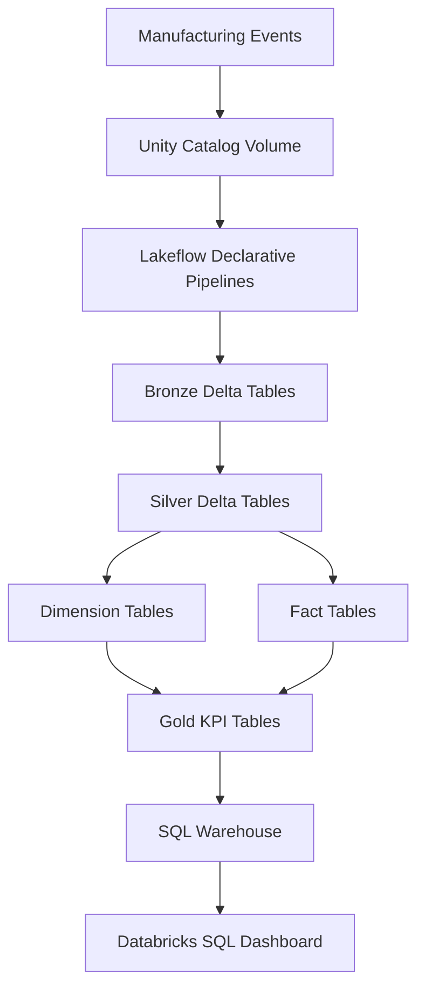

# 02 — Lakehouse Architecture

## Introduction

The Smart Manufacturing Intelligence Platform (SMIP) V2 is implemented using the **Databricks Data Intelligence Platform**, leveraging a modern Lakehouse architecture to process manufacturing events from raw ingestion through business intelligence.

Unlike traditional data warehouse architectures that separate data lakes and analytical warehouses, the Lakehouse architecture combines scalable data storage, reliable data processing, centralized governance, and high-performance analytics within a single unified platform.

SMIP V2 adopts this architecture to provide a scalable, maintainable, and analytics-ready solution for manufacturing data.

---

# Purpose

The purpose of the Lakehouse Architecture is to explain how Databricks services work together to support the complete manufacturing analytics lifecycle.

This document describes:

- The major Databricks components
- The role of Unity Catalog
- Delta Lake storage
- Lakeflow Declarative Pipelines
- SQL analytics
- Data governance
- End-to-end manufacturing data processing

---

# Lakehouse Architecture



---

# Lakehouse Components

The architecture is composed of several tightly integrated services.

| Component | Purpose |
|------------|----------|
| Unity Catalog | Centralized governance and metadata management |
| Unity Catalog Volumes | Storage for raw manufacturing JSON files |
| Delta Lake | Reliable ACID-compliant storage layer |
| Lakeflow Declarative Pipelines | Automated data ingestion and transformation |
| SQL Warehouse | High-performance SQL query engine |
| Databricks SQL Dashboard | Executive reporting and visualization |

---

# Unity Catalog

Unity Catalog provides centralized governance across the entire manufacturing data platform.

It manages:

- Catalogs
- Schemas
- Tables
- Views
- Permissions
- Metadata
- Data lineage

Within SMIP V2, Unity Catalog organizes every dataset generated throughout the Medallion Architecture while ensuring consistent naming, governance, and discoverability.

---

# Unity Catalog Volumes

Raw manufacturing events are stored inside a Unity Catalog Volume.

```
Manufacturing Events

↓

Unity Catalog Volume

↓

Bronze Pipeline
```

The Volume acts as the landing zone for incoming JSON event files before they enter the Lakeflow pipeline.

Benefits include:

- Centralized storage
- Secure access
- Native Databricks integration
- Simplified data ingestion

---

# Delta Lake

Every layer of the platform is implemented using **Delta Lake** tables.

Delta Lake provides:

- ACID transactions
- Reliable streaming
- Schema enforcement
- Schema evolution
- Time travel
- High-performance analytics

Using Delta Lake ensures that manufacturing datasets remain consistent while supporting incremental processing and future scalability.

---

# Lakeflow Declarative Pipelines

Lakeflow Declarative Pipelines orchestrate the complete manufacturing data pipeline.

The pipeline performs:

- Raw data ingestion
- Event parsing
- Data validation
- Dimension construction
- Fact table creation
- KPI calculation

Rather than manually orchestrating notebooks, Lakeflow automatically manages dependencies between datasets.

For example:

```
Bronze

↓

Parsed Events

↓

Silver Events

↓

Dimensions

↓

Facts

↓

Gold KPIs
```

This declarative approach improves maintainability while reducing operational complexity.

---

# SQL Warehouse

The SQL Warehouse provides a dedicated compute layer optimized for analytical queries.

Its responsibilities include:

- Query execution
- Dashboard support
- Interactive analysis
- Business reporting

Separating analytical workloads from data engineering workloads improves both performance and resource utilization.

---

# Databricks SQL Dashboard

The final analytical layer consists of an executive manufacturing dashboard.

The dashboard consumes Gold KPI tables to provide operational insights such as:

- Machine Performance
- Production Performance
- Quality Metrics
- Material Traceability
- Packaging Readiness
- Factory Summary

Business users interact exclusively with the dashboard without requiring direct access to engineering datasets.

---

# Data Lifecycle

Manufacturing data progresses through several stages.


Each stage progressively increases data quality and business value.

---

# Why a Lakehouse?

The Lakehouse architecture offers several advantages over traditional architectures.

| Traditional Architecture | Lakehouse Architecture |
|---------------------------|------------------------|
| Separate storage and warehouse | Unified platform |
| Multiple data copies | Single source of truth |
| Complex ETL processes | Declarative pipelines |
| Limited governance | Centralized governance |
| Higher operational complexity | Simplified architecture |

For manufacturing analytics, these capabilities enable reliable, scalable, and maintainable data processing.

---

# Design Decisions

Several architectural decisions influenced the implementation of SMIP V2.

## Unity Catalog

Selected to provide centralized governance and simplify data management across all layers.

---

## Delta Lake

Chosen to ensure reliable storage with ACID guarantees and support for streaming workloads.

---

## Lakeflow Declarative Pipelines

Used to simplify pipeline orchestration through dependency-based execution instead of manually scheduling notebook execution.

---

## SQL Warehouse

Dedicated analytical compute separates reporting workloads from pipeline execution, improving overall system performance.

---

# Benefits

The Lakehouse implementation provides:

- Unified manufacturing data platform
- Centralized governance
- Reliable data storage
- Scalable pipeline execution
- Reusable analytical datasets
- Simplified maintenance
- High-performance SQL analytics

These capabilities establish a robust foundation for the Medallion Architecture implemented in SMIP V2.

---

# Summary

The Databricks Lakehouse Platform provides the technological foundation of the Smart Manufacturing Intelligence Platform.

By combining Unity Catalog, Delta Lake, Lakeflow Declarative Pipelines, SQL Warehouse, and Databricks SQL Dashboards, the platform delivers an end-to-end manufacturing analytics solution that is scalable, governed, and optimized for business intelligence.

---

# Next Section

## 03 — Medallion Architecture

The next document explains how manufacturing events are progressively transformed through the Bronze, Silver, Dimension, Fact, and Gold layers, illustrating the core data engineering workflow implemented in SMIP V2.# 02 — Lakehouse Architecture

## Introduction

The Smart Manufacturing Intelligence Platform (SMIP) V2 is implemented using the **Databricks Data Intelligence Platform**, leveraging a modern Lakehouse architecture to process manufacturing events from raw ingestion through business intelligence.

Unlike traditional data warehouse architectures that separate data lakes and analytical warehouses, the Lakehouse architecture combines scalable data storage, reliable data processing, centralized governance, and high-performance analytics within a single unified platform.

SMIP V2 adopts this architecture to provide a scalable, maintainable, and analytics-ready solution for manufacturing data.

---

# Purpose

The purpose of the Lakehouse Architecture is to explain how Databricks services work together to support the complete manufacturing analytics lifecycle.

This document describes:

- The major Databricks components
- The role of Unity Catalog
- Delta Lake storage
- Lakeflow Declarative Pipelines
- SQL analytics
- Data governance
- End-to-end manufacturing data processing

---

# Lakehouse Architecture


---

# Lakehouse Components

The architecture is composed of several tightly integrated services.

| Component | Purpose |
|------------|----------|
| Unity Catalog | Centralized governance and metadata management |
| Unity Catalog Volumes | Storage for raw manufacturing JSON files |
| Delta Lake | Reliable ACID-compliant storage layer |
| Lakeflow Declarative Pipelines | Automated data ingestion and transformation |
| SQL Warehouse | High-performance SQL query engine |
| Databricks SQL Dashboard | Executive reporting and visualization |

---

# Unity Catalog

Unity Catalog provides centralized governance across the entire manufacturing data platform.

It manages:

- Catalogs
- Schemas
- Tables
- Views
- Permissions
- Metadata
- Data lineage

Within SMIP V2, Unity Catalog organizes every dataset generated throughout the Medallion Architecture while ensuring consistent naming, governance, and discoverability.

---

# Unity Catalog Volumes

Raw manufacturing events are stored inside a Unity Catalog Volume.

```
Manufacturing Events

↓

Unity Catalog Volume

↓

Bronze Pipeline
```

The Volume acts as the landing zone for incoming JSON event files before they enter the Lakeflow pipeline.

Benefits include:

- Centralized storage
- Secure access
- Native Databricks integration
- Simplified data ingestion

---

# Delta Lake

Every layer of the platform is implemented using **Delta Lake** tables.

Delta Lake provides:

- ACID transactions
- Reliable streaming
- Schema enforcement
- Schema evolution
- Time travel
- High-performance analytics

Using Delta Lake ensures that manufacturing datasets remain consistent while supporting incremental processing and future scalability.

---

# Lakeflow Declarative Pipelines

Lakeflow Declarative Pipelines orchestrate the complete manufacturing data pipeline.

The pipeline performs:

- Raw data ingestion
- Event parsing
- Data validation
- Dimension construction
- Fact table creation
- KPI calculation

Rather than manually orchestrating notebooks, Lakeflow automatically manages dependencies between datasets.

For example:

```
Bronze

↓

Parsed Events

↓

Silver Events

↓

Dimensions

↓

Facts

↓

Gold KPIs
```

This declarative approach improves maintainability while reducing operational complexity.

---

# SQL Warehouse

The SQL Warehouse provides a dedicated compute layer optimized for analytical queries.

Its responsibilities include:

- Query execution
- Dashboard support
- Interactive analysis
- Business reporting

Separating analytical workloads from data engineering workloads improves both performance and resource utilization.

---

# Databricks SQL Dashboard

The final analytical layer consists of an executive manufacturing dashboard.

The dashboard consumes Gold KPI tables to provide operational insights such as:

- Machine Performance
- Production Performance
- Quality Metrics
- Material Traceability
- Packaging Readiness
- Factory Summary

Business users interact exclusively with the dashboard without requiring direct access to engineering datasets.

---

# Data Lifecycle

Manufacturing data progresses through several stages.


Each stage progressively increases data quality and business value.

---

# Why a Lakehouse?

The Lakehouse architecture offers several advantages over traditional architectures.

| Traditional Architecture | Lakehouse Architecture |
|---------------------------|------------------------|
| Separate storage and warehouse | Unified platform |
| Multiple data copies | Single source of truth |
| Complex ETL processes | Declarative pipelines |
| Limited governance | Centralized governance |
| Higher operational complexity | Simplified architecture |

For manufacturing analytics, these capabilities enable reliable, scalable, and maintainable data processing.

---

# Design Decisions

Several architectural decisions influenced the implementation of SMIP V2.

## Unity Catalog

Selected to provide centralized governance and simplify data management across all layers.

---

## Delta Lake

Chosen to ensure reliable storage with ACID guarantees and support for streaming workloads.

---

## Lakeflow Declarative Pipelines

Used to simplify pipeline orchestration through dependency-based execution instead of manually scheduling notebook execution.

---

## SQL Warehouse

Dedicated analytical compute separates reporting workloads from pipeline execution, improving overall system performance.

---

# Benefits

The Lakehouse implementation provides:

- Unified manufacturing data platform
- Centralized governance
- Reliable data storage
- Scalable pipeline execution
- Reusable analytical datasets
- Simplified maintenance
- High-performance SQL analytics

These capabilities establish a robust foundation for the Medallion Architecture implemented in SMIP V2.

---

# Summary

The Databricks Lakehouse Platform provides the technological foundation of the Smart Manufacturing Intelligence Platform.

By combining Unity Catalog, Delta Lake, Lakeflow Declarative Pipelines, SQL Warehouse, and Databricks SQL Dashboards, the platform delivers an end-to-end manufacturing analytics solution that is scalable, governed, and optimized for business intelligence.

---

# Next Section

## 03 — Medallion Architecture

The next document explains how manufacturing events are progressively transformed through the Bronze, Silver, Dimension, Fact, and Gold layers, illustrating the core data engineering workflow implemented in SMIP V2.# 02 — Lakehouse Architecture

## Introduction

The Smart Manufacturing Intelligence Platform (SMIP) V2 is implemented using the **Databricks Data Intelligence Platform**, leveraging a modern Lakehouse architecture to process manufacturing events from raw ingestion through business intelligence.

Unlike traditional data warehouse architectures that separate data lakes and analytical warehouses, the Lakehouse architecture combines scalable data storage, reliable data processing, centralized governance, and high-performance analytics within a single unified platform.

SMIP V2 adopts this architecture to provide a scalable, maintainable, and analytics-ready solution for manufacturing data.

---

# Purpose

The purpose of the Lakehouse Architecture is to explain how Databricks services work together to support the complete manufacturing analytics lifecycle.

This document describes:

- The major Databricks components
- The role of Unity Catalog
- Delta Lake storage
- Lakeflow Declarative Pipelines
- SQL analytics
- Data governance
- End-to-end manufacturing data processing

---

# Lakehouse Architecture


---

# Lakehouse Components

The architecture is composed of several tightly integrated services.

| Component | Purpose |
|------------|----------|
| Unity Catalog | Centralized governance and metadata management |
| Unity Catalog Volumes | Storage for raw manufacturing JSON files |
| Delta Lake | Reliable ACID-compliant storage layer |
| Lakeflow Declarative Pipelines | Automated data ingestion and transformation |
| SQL Warehouse | High-performance SQL query engine |
| Databricks SQL Dashboard | Executive reporting and visualization |

---

# Unity Catalog

Unity Catalog provides centralized governance across the entire manufacturing data platform.

It manages:

- Catalogs
- Schemas
- Tables
- Views
- Permissions
- Metadata
- Data lineage

Within SMIP V2, Unity Catalog organizes every dataset generated throughout the Medallion Architecture while ensuring consistent naming, governance, and discoverability.

---

# Unity Catalog Volumes

Raw manufacturing events are stored inside a Unity Catalog Volume.

```
Manufacturing Events

↓

Unity Catalog Volume

↓

Bronze Pipeline
```

The Volume acts as the landing zone for incoming JSON event files before they enter the Lakeflow pipeline.

Benefits include:

- Centralized storage
- Secure access
- Native Databricks integration
- Simplified data ingestion

---

# Delta Lake

Every layer of the platform is implemented using **Delta Lake** tables.

Delta Lake provides:

- ACID transactions
- Reliable streaming
- Schema enforcement
- Schema evolution
- Time travel
- High-performance analytics

Using Delta Lake ensures that manufacturing datasets remain consistent while supporting incremental processing and future scalability.

---

# Lakeflow Declarative Pipelines

Lakeflow Declarative Pipelines orchestrate the complete manufacturing data pipeline.

The pipeline performs:

- Raw data ingestion
- Event parsing
- Data validation
- Dimension construction
- Fact table creation
- KPI calculation

Rather than manually orchestrating notebooks, Lakeflow automatically manages dependencies between datasets.

For example:

```
Bronze

↓

Parsed Events

↓

Silver Events

↓

Dimensions

↓

Facts

↓

Gold KPIs
```

This declarative approach improves maintainability while reducing operational complexity.

---

# SQL Warehouse

The SQL Warehouse provides a dedicated compute layer optimized for analytical queries.

Its responsibilities include:

- Query execution
- Dashboard support
- Interactive analysis
- Business reporting

Separating analytical workloads from data engineering workloads improves both performance and resource utilization.

---

# Databricks SQL Dashboard

The final analytical layer consists of an executive manufacturing dashboard.

The dashboard consumes Gold KPI tables to provide operational insights such as:

- Machine Performance
- Production Performance
- Quality Metrics
- Material Traceability
- Packaging Readiness
- Factory Summary

Business users interact exclusively with the dashboard without requiring direct access to engineering datasets.

---

# Data Lifecycle

Manufacturing data progresses through several stages.


Each stage progressively increases data quality and business value.

---

# Why a Lakehouse?

The Lakehouse architecture offers several advantages over traditional architectures.

| Traditional Architecture | Lakehouse Architecture |
|---------------------------|------------------------|
| Separate storage and warehouse | Unified platform |
| Multiple data copies | Single source of truth |
| Complex ETL processes | Declarative pipelines |
| Limited governance | Centralized governance |
| Higher operational complexity | Simplified architecture |

For manufacturing analytics, these capabilities enable reliable, scalable, and maintainable data processing.

---

# Design Decisions

Several architectural decisions influenced the implementation of SMIP V2.

## Unity Catalog

Selected to provide centralized governance and simplify data management across all layers.

---

## Delta Lake

Chosen to ensure reliable storage with ACID guarantees and support for streaming workloads.

---

## Lakeflow Declarative Pipelines

Used to simplify pipeline orchestration through dependency-based execution instead of manually scheduling notebook execution.

---

## SQL Warehouse

Dedicated analytical compute separates reporting workloads from pipeline execution, improving overall system performance.

---

# Benefits

The Lakehouse implementation provides:

- Unified manufacturing data platform
- Centralized governance
- Reliable data storage
- Scalable pipeline execution
- Reusable analytical datasets
- Simplified maintenance
- High-performance SQL analytics

These capabilities establish a robust foundation for the Medallion Architecture implemented in SMIP V2.

---

# Summary

The Databricks Lakehouse Platform provides the technological foundation of the Smart Manufacturing Intelligence Platform.

By combining Unity Catalog, Delta Lake, Lakeflow Declarative Pipelines, SQL Warehouse, and Databricks SQL Dashboards, the platform delivers an end-to-end manufacturing analytics solution that is scalable, governed, and optimized for business intelligence.

---

# Next Section

## 03 — Medallion Architecture

The next document explains how manufacturing events are progressively transformed through the Bronze, Silver, Dimension, Fact, and Gold layers, illustrating the core data engineering workflow implemented in SMIP V2.# 02 — Lakehouse Architecture

## Introduction

The Smart Manufacturing Intelligence Platform (SMIP) V2 is implemented using the **Databricks Data Intelligence Platform**, leveraging a modern Lakehouse architecture to process manufacturing events from raw ingestion through business intelligence.

Unlike traditional data warehouse architectures that separate data lakes and analytical warehouses, the Lakehouse architecture combines scalable data storage, reliable data processing, centralized governance, and high-performance analytics within a single unified platform.

SMIP V2 adopts this architecture to provide a scalable, maintainable, and analytics-ready solution for manufacturing data.

---

# Purpose

The purpose of the Lakehouse Architecture is to explain how Databricks services work together to support the complete manufacturing analytics lifecycle.

This document describes:

- The major Databricks components
- The role of Unity Catalog
- Delta Lake storage
- Lakeflow Declarative Pipelines
- SQL analytics
- Data governance
- End-to-end manufacturing data processing

---

# Lakehouse Architecture


---

# Lakehouse Components

The architecture is composed of several tightly integrated services.

| Component | Purpose |
|------------|----------|
| Unity Catalog | Centralized governance and metadata management |
| Unity Catalog Volumes | Storage for raw manufacturing JSON files |
| Delta Lake | Reliable ACID-compliant storage layer |
| Lakeflow Declarative Pipelines | Automated data ingestion and transformation |
| SQL Warehouse | High-performance SQL query engine |
| Databricks SQL Dashboard | Executive reporting and visualization |

---

# Unity Catalog

Unity Catalog provides centralized governance across the entire manufacturing data platform.

It manages:

- Catalogs
- Schemas
- Tables
- Views
- Permissions
- Metadata
- Data lineage

Within SMIP V2, Unity Catalog organizes every dataset generated throughout the Medallion Architecture while ensuring consistent naming, governance, and discoverability.

---

# Unity Catalog Volumes

Raw manufacturing events are stored inside a Unity Catalog Volume.

```
Manufacturing Events

↓

Unity Catalog Volume

↓

Bronze Pipeline
```

The Volume acts as the landing zone for incoming JSON event files before they enter the Lakeflow pipeline.

Benefits include:

- Centralized storage
- Secure access
- Native Databricks integration
- Simplified data ingestion

---

# Delta Lake

Every layer of the platform is implemented using **Delta Lake** tables.

Delta Lake provides:

- ACID transactions
- Reliable streaming
- Schema enforcement
- Schema evolution
- Time travel
- High-performance analytics

Using Delta Lake ensures that manufacturing datasets remain consistent while supporting incremental processing and future scalability.

---

# Lakeflow Declarative Pipelines

Lakeflow Declarative Pipelines orchestrate the complete manufacturing data pipeline.

The pipeline performs:

- Raw data ingestion
- Event parsing
- Data validation
- Dimension construction
- Fact table creation
- KPI calculation

Rather than manually orchestrating notebooks, Lakeflow automatically manages dependencies between datasets.

For example:

```
Bronze

↓

Parsed Events

↓

Silver Events

↓

Dimensions

↓

Facts

↓

Gold KPIs
```

This declarative approach improves maintainability while reducing operational complexity.

---

# SQL Warehouse

The SQL Warehouse provides a dedicated compute layer optimized for analytical queries.

Its responsibilities include:

- Query execution
- Dashboard support
- Interactive analysis
- Business reporting

Separating analytical workloads from data engineering workloads improves both performance and resource utilization.

---

# Databricks SQL Dashboard

The final analytical layer consists of an executive manufacturing dashboard.

The dashboard consumes Gold KPI tables to provide operational insights such as:

- Machine Performance
- Production Performance
- Quality Metrics
- Material Traceability
- Packaging Readiness
- Factory Summary

Business users interact exclusively with the dashboard without requiring direct access to engineering datasets.

---

# Data Lifecycle

Manufacturing data progresses through several stages.


Each stage progressively increases data quality and business value.

---

# Why a Lakehouse?

The Lakehouse architecture offers several advantages over traditional architectures.

| Traditional Architecture | Lakehouse Architecture |
|---------------------------|------------------------|
| Separate storage and warehouse | Unified platform |
| Multiple data copies | Single source of truth |
| Complex ETL processes | Declarative pipelines |
| Limited governance | Centralized governance |
| Higher operational complexity | Simplified architecture |

For manufacturing analytics, these capabilities enable reliable, scalable, and maintainable data processing.

---

# Design Decisions

Several architectural decisions influenced the implementation of SMIP V2.

## Unity Catalog

Selected to provide centralized governance and simplify data management across all layers.

---

## Delta Lake

Chosen to ensure reliable storage with ACID guarantees and support for streaming workloads.

---

## Lakeflow Declarative Pipelines

Used to simplify pipeline orchestration through dependency-based execution instead of manually scheduling notebook execution.

---

## SQL Warehouse

Dedicated analytical compute separates reporting workloads from pipeline execution, improving overall system performance.

---

# Benefits

The Lakehouse implementation provides:

- Unified manufacturing data platform
- Centralized governance
- Reliable data storage
- Scalable pipeline execution
- Reusable analytical datasets
- Simplified maintenance
- High-performance SQL analytics

These capabilities establish a robust foundation for the Medallion Architecture implemented in SMIP V2.

---

# Summary

The Databricks Lakehouse Platform provides the technological foundation of the Smart Manufacturing Intelligence Platform.

By combining Unity Catalog, Delta Lake, Lakeflow Declarative Pipelines, SQL Warehouse, and Databricks SQL Dashboards, the platform delivers an end-to-end manufacturing analytics solution that is scalable, governed, and optimized for business intelligence.

---

# Next Section

## 03 — Medallion Architecture

The next document explains how manufacturing events are progressively transformed through the Bronze, Silver, Dimension, Fact, and Gold layers, illustrating the core data engineering workflow implemented in SMIP V2.# 02 — Lakehouse Architecture

## Introduction

The Smart Manufacturing Intelligence Platform (SMIP) V2 is implemented using the **Databricks Data Intelligence Platform**, leveraging a modern Lakehouse architecture to process manufacturing events from raw ingestion through business intelligence.

Unlike traditional data warehouse architectures that separate data lakes and analytical warehouses, the Lakehouse architecture combines scalable data storage, reliable data processing, centralized governance, and high-performance analytics within a single unified platform.

SMIP V2 adopts this architecture to provide a scalable, maintainable, and analytics-ready solution for manufacturing data.

---

# Purpose

The purpose of the Lakehouse Architecture is to explain how Databricks services work together to support the complete manufacturing analytics lifecycle.

This document describes:

- The major Databricks components
- The role of Unity Catalog
- Delta Lake storage
- Lakeflow Declarative Pipelines
- SQL analytics
- Data governance
- End-to-end manufacturing data processing

---

# Lakehouse Architecture


---

# Lakehouse Components

The architecture is composed of several tightly integrated services.

| Component | Purpose |
|------------|----------|
| Unity Catalog | Centralized governance and metadata management |
| Unity Catalog Volumes | Storage for raw manufacturing JSON files |
| Delta Lake | Reliable ACID-compliant storage layer |
| Lakeflow Declarative Pipelines | Automated data ingestion and transformation |
| SQL Warehouse | High-performance SQL query engine |
| Databricks SQL Dashboard | Executive reporting and visualization |

---

# Unity Catalog

Unity Catalog provides centralized governance across the entire manufacturing data platform.

It manages:

- Catalogs
- Schemas
- Tables
- Views
- Permissions
- Metadata
- Data lineage

Within SMIP V2, Unity Catalog organizes every dataset generated throughout the Medallion Architecture while ensuring consistent naming, governance, and discoverability.

---

# Unity Catalog Volumes

Raw manufacturing events are stored inside a Unity Catalog Volume.

```
Manufacturing Events

↓

Unity Catalog Volume

↓

Bronze Pipeline
```

The Volume acts as the landing zone for incoming JSON event files before they enter the Lakeflow pipeline.

Benefits include:

- Centralized storage
- Secure access
- Native Databricks integration
- Simplified data ingestion

---

# Delta Lake

Every layer of the platform is implemented using **Delta Lake** tables.

Delta Lake provides:

- ACID transactions
- Reliable streaming
- Schema enforcement
- Schema evolution
- Time travel
- High-performance analytics

Using Delta Lake ensures that manufacturing datasets remain consistent while supporting incremental processing and future scalability.

---

# Lakeflow Declarative Pipelines

Lakeflow Declarative Pipelines orchestrate the complete manufacturing data pipeline.

The pipeline performs:

- Raw data ingestion
- Event parsing
- Data validation
- Dimension construction
- Fact table creation
- KPI calculation

Rather than manually orchestrating notebooks, Lakeflow automatically manages dependencies between datasets.

For example:

```
Bronze

↓

Parsed Events

↓

Silver Events

↓

Dimensions

↓

Facts

↓

Gold KPIs
```

This declarative approach improves maintainability while reducing operational complexity.

---

# SQL Warehouse

The SQL Warehouse provides a dedicated compute layer optimized for analytical queries.

Its responsibilities include:

- Query execution
- Dashboard support
- Interactive analysis
- Business reporting

Separating analytical workloads from data engineering workloads improves both performance and resource utilization.

---

# Databricks SQL Dashboard

The final analytical layer consists of an executive manufacturing dashboard.

The dashboard consumes Gold KPI tables to provide operational insights such as:

- Machine Performance
- Production Performance
- Quality Metrics
- Material Traceability
- Packaging Readiness
- Factory Summary

Business users interact exclusively with the dashboard without requiring direct access to engineering datasets.

---

# Data Lifecycle

Manufacturing data progresses through several stages.


Each stage progressively increases data quality and business value.

---

# Why a Lakehouse?

The Lakehouse architecture offers several advantages over traditional architectures.

| Traditional Architecture | Lakehouse Architecture |
|---------------------------|------------------------|
| Separate storage and warehouse | Unified platform |
| Multiple data copies | Single source of truth |
| Complex ETL processes | Declarative pipelines |
| Limited governance | Centralized governance |
| Higher operational complexity | Simplified architecture |

For manufacturing analytics, these capabilities enable reliable, scalable, and maintainable data processing.

---

# Design Decisions

Several architectural decisions influenced the implementation of SMIP V2.

## Unity Catalog

Selected to provide centralized governance and simplify data management across all layers.

---

## Delta Lake

Chosen to ensure reliable storage with ACID guarantees and support for streaming workloads.

---

## Lakeflow Declarative Pipelines

Used to simplify pipeline orchestration through dependency-based execution instead of manually scheduling notebook execution.

---

## SQL Warehouse

Dedicated analytical compute separates reporting workloads from pipeline execution, improving overall system performance.

---

# Benefits

The Lakehouse implementation provides:

- Unified manufacturing data platform
- Centralized governance
- Reliable data storage
- Scalable pipeline execution
- Reusable analytical datasets
- Simplified maintenance
- High-performance SQL analytics

These capabilities establish a robust foundation for the Medallion Architecture implemented in SMIP V2.

---

# Summary

The Databricks Lakehouse Platform provides the technological foundation of the Smart Manufacturing Intelligence Platform.

By combining Unity Catalog, Delta Lake, Lakeflow Declarative Pipelines, SQL Warehouse, and Databricks SQL Dashboards, the platform delivers an end-to-end manufacturing analytics solution that is scalable, governed, and optimized for business intelligence.

---

# Next Section

## 03 — Medallion Architecture

The next document explains how manufacturing events are progressively transformed through the Bronze, Silver, Dimension, Fact, and Gold layers, illustrating the core data engineering workflow implemented in SMIP V2.# 02 — Lakehouse Architecture

## Introduction

The Smart Manufacturing Intelligence Platform (SMIP) V2 is implemented using the **Databricks Data Intelligence Platform**, leveraging a modern Lakehouse architecture to process manufacturing events from raw ingestion through business intelligence.

Unlike traditional data warehouse architectures that separate data lakes and analytical warehouses, the Lakehouse architecture combines scalable data storage, reliable data processing, centralized governance, and high-performance analytics within a single unified platform.

SMIP V2 adopts this architecture to provide a scalable, maintainable, and analytics-ready solution for manufacturing data.

---

# Purpose

The purpose of the Lakehouse Architecture is to explain how Databricks services work together to support the complete manufacturing analytics lifecycle.

This document describes:

- The major Databricks components
- The role of Unity Catalog
- Delta Lake storage
- Lakeflow Declarative Pipelines
- SQL analytics
- Data governance
- End-to-end manufacturing data processing

---

# Lakehouse Architecture


---

# Lakehouse Components

The architecture is composed of several tightly integrated services.

| Component | Purpose |
|------------|----------|
| Unity Catalog | Centralized governance and metadata management |
| Unity Catalog Volumes | Storage for raw manufacturing JSON files |
| Delta Lake | Reliable ACID-compliant storage layer |
| Lakeflow Declarative Pipelines | Automated data ingestion and transformation |
| SQL Warehouse | High-performance SQL query engine |
| Databricks SQL Dashboard | Executive reporting and visualization |

---

# Unity Catalog

Unity Catalog provides centralized governance across the entire manufacturing data platform.

It manages:

- Catalogs
- Schemas
- Tables
- Views
- Permissions
- Metadata
- Data lineage

Within SMIP V2, Unity Catalog organizes every dataset generated throughout the Medallion Architecture while ensuring consistent naming, governance, and discoverability.

---

# Unity Catalog Volumes

Raw manufacturing events are stored inside a Unity Catalog Volume.

```
Manufacturing Events

↓

Unity Catalog Volume

↓

Bronze Pipeline
```

The Volume acts as the landing zone for incoming JSON event files before they enter the Lakeflow pipeline.

Benefits include:

- Centralized storage
- Secure access
- Native Databricks integration
- Simplified data ingestion

---

# Delta Lake

Every layer of the platform is implemented using **Delta Lake** tables.

Delta Lake provides:

- ACID transactions
- Reliable streaming
- Schema enforcement
- Schema evolution
- Time travel
- High-performance analytics

Using Delta Lake ensures that manufacturing datasets remain consistent while supporting incremental processing and future scalability.

---

# Lakeflow Declarative Pipelines

Lakeflow Declarative Pipelines orchestrate the complete manufacturing data pipeline.

The pipeline performs:

- Raw data ingestion
- Event parsing
- Data validation
- Dimension construction
- Fact table creation
- KPI calculation

Rather than manually orchestrating notebooks, Lakeflow automatically manages dependencies between datasets.

For example:

```
Bronze

↓

Parsed Events

↓

Silver Events

↓

Dimensions

↓

Facts

↓

Gold KPIs
```

This declarative approach improves maintainability while reducing operational complexity.

---

# SQL Warehouse

The SQL Warehouse provides a dedicated compute layer optimized for analytical queries.

Its responsibilities include:

- Query execution
- Dashboard support
- Interactive analysis
- Business reporting

Separating analytical workloads from data engineering workloads improves both performance and resource utilization.

---

# Databricks SQL Dashboard

The final analytical layer consists of an executive manufacturing dashboard.

The dashboard consumes Gold KPI tables to provide operational insights such as:

- Machine Performance
- Production Performance
- Quality Metrics
- Material Traceability
- Packaging Readiness
- Factory Summary

Business users interact exclusively with the dashboard without requiring direct access to engineering datasets.

---

# Data Lifecycle

Manufacturing data progresses through several stages.


Each stage progressively increases data quality and business value.

---

# Why a Lakehouse?

The Lakehouse architecture offers several advantages over traditional architectures.

| Traditional Architecture | Lakehouse Architecture |
|---------------------------|------------------------|
| Separate storage and warehouse | Unified platform |
| Multiple data copies | Single source of truth |
| Complex ETL processes | Declarative pipelines |
| Limited governance | Centralized governance |
| Higher operational complexity | Simplified architecture |

For manufacturing analytics, these capabilities enable reliable, scalable, and maintainable data processing.

---

# Design Decisions

Several architectural decisions influenced the implementation of SMIP V2.

## Unity Catalog

Selected to provide centralized governance and simplify data management across all layers.

---

## Delta Lake

Chosen to ensure reliable storage with ACID guarantees and support for streaming workloads.

---

## Lakeflow Declarative Pipelines

Used to simplify pipeline orchestration through dependency-based execution instead of manually scheduling notebook execution.

---

## SQL Warehouse

Dedicated analytical compute separates reporting workloads from pipeline execution, improving overall system performance.

---

# Benefits

The Lakehouse implementation provides:

- Unified manufacturing data platform
- Centralized governance
- Reliable data storage
- Scalable pipeline execution
- Reusable analytical datasets
- Simplified maintenance
- High-performance SQL analytics

These capabilities establish a robust foundation for the Medallion Architecture implemented in SMIP V2.

---

# Summary

The Databricks Lakehouse Platform provides the technological foundation of the Smart Manufacturing Intelligence Platform.

By combining Unity Catalog, Delta Lake, Lakeflow Declarative Pipelines, SQL Warehouse, and Databricks SQL Dashboards, the platform delivers an end-to-end manufacturing analytics solution that is scalable, governed, and optimized for business intelligence.

---

# Next Section

## 03 — Medallion Architecture

The next document explains how manufacturing events are progressively transformed through the Bronze, Silver, Dimension, Fact, and Gold layers, illustrating the core data engineering workflow implemented in SMIP V2.# 02 — Lakehouse Architecture

## Introduction

The Smart Manufacturing Intelligence Platform (SMIP) V2 is implemented using the **Databricks Data Intelligence Platform**, leveraging a modern Lakehouse architecture to process manufacturing events from raw ingestion through business intelligence.

Unlike traditional data warehouse architectures that separate data lakes and analytical warehouses, the Lakehouse architecture combines scalable data storage, reliable data processing, centralized governance, and high-performance analytics within a single unified platform.

SMIP V2 adopts this architecture to provide a scalable, maintainable, and analytics-ready solution for manufacturing data.

---

# Purpose

The purpose of the Lakehouse Architecture is to explain how Databricks services work together to support the complete manufacturing analytics lifecycle.

This document describes:

- The major Databricks components
- The role of Unity Catalog
- Delta Lake storage
- Lakeflow Declarative Pipelines
- SQL analytics
- Data governance
- End-to-end manufacturing data processing

---

# Lakehouse Architecture


---

# Lakehouse Components

The architecture is composed of several tightly integrated services.

| Component | Purpose |
|------------|----------|
| Unity Catalog | Centralized governance and metadata management |
| Unity Catalog Volumes | Storage for raw manufacturing JSON files |
| Delta Lake | Reliable ACID-compliant storage layer |
| Lakeflow Declarative Pipelines | Automated data ingestion and transformation |
| SQL Warehouse | High-performance SQL query engine |
| Databricks SQL Dashboard | Executive reporting and visualization |

---

# Unity Catalog

Unity Catalog provides centralized governance across the entire manufacturing data platform.

It manages:

- Catalogs
- Schemas
- Tables
- Views
- Permissions
- Metadata
- Data lineage

Within SMIP V2, Unity Catalog organizes every dataset generated throughout the Medallion Architecture while ensuring consistent naming, governance, and discoverability.

---

# Unity Catalog Volumes

Raw manufacturing events are stored inside a Unity Catalog Volume.

```
Manufacturing Events

↓

Unity Catalog Volume

↓

Bronze Pipeline
```

The Volume acts as the landing zone for incoming JSON event files before they enter the Lakeflow pipeline.

Benefits include:

- Centralized storage
- Secure access
- Native Databricks integration
- Simplified data ingestion

---

# Delta Lake

Every layer of the platform is implemented using **Delta Lake** tables.

Delta Lake provides:

- ACID transactions
- Reliable streaming
- Schema enforcement
- Schema evolution
- Time travel
- High-performance analytics

Using Delta Lake ensures that manufacturing datasets remain consistent while supporting incremental processing and future scalability.

---

# Lakeflow Declarative Pipelines

Lakeflow Declarative Pipelines orchestrate the complete manufacturing data pipeline.

The pipeline performs:

- Raw data ingestion
- Event parsing
- Data validation
- Dimension construction
- Fact table creation
- KPI calculation

Rather than manually orchestrating notebooks, Lakeflow automatically manages dependencies between datasets.

For example:

```
Bronze

↓

Parsed Events

↓

Silver Events

↓

Dimensions

↓

Facts

↓

Gold KPIs
```

This declarative approach improves maintainability while reducing operational complexity.

---

# SQL Warehouse

The SQL Warehouse provides a dedicated compute layer optimized for analytical queries.

Its responsibilities include:

- Query execution
- Dashboard support
- Interactive analysis
- Business reporting

Separating analytical workloads from data engineering workloads improves both performance and resource utilization.

---

# Databricks SQL Dashboard

The final analytical layer consists of an executive manufacturing dashboard.

The dashboard consumes Gold KPI tables to provide operational insights such as:

- Machine Performance
- Production Performance
- Quality Metrics
- Material Traceability
- Packaging Readiness
- Factory Summary

Business users interact exclusively with the dashboard without requiring direct access to engineering datasets.

---

# Data Lifecycle

Manufacturing data progresses through several stages.


Each stage progressively increases data quality and business value.

---

# Why a Lakehouse?

The Lakehouse architecture offers several advantages over traditional architectures.

| Traditional Architecture | Lakehouse Architecture |
|---------------------------|------------------------|
| Separate storage and warehouse | Unified platform |
| Multiple data copies | Single source of truth |
| Complex ETL processes | Declarative pipelines |
| Limited governance | Centralized governance |
| Higher operational complexity | Simplified architecture |

For manufacturing analytics, these capabilities enable reliable, scalable, and maintainable data processing.

---

# Design Decisions

Several architectural decisions influenced the implementation of SMIP V2.

## Unity Catalog

Selected to provide centralized governance and simplify data management across all layers.

---

## Delta Lake

Chosen to ensure reliable storage with ACID guarantees and support for streaming workloads.

---

## Lakeflow Declarative Pipelines

Used to simplify pipeline orchestration through dependency-based execution instead of manually scheduling notebook execution.

---

## SQL Warehouse

Dedicated analytical compute separates reporting workloads from pipeline execution, improving overall system performance.

---

# Benefits

The Lakehouse implementation provides:

- Unified manufacturing data platform
- Centralized governance
- Reliable data storage
- Scalable pipeline execution
- Reusable analytical datasets
- Simplified maintenance
- High-performance SQL analytics

These capabilities establish a robust foundation for the Medallion Architecture implemented in SMIP V2.

---

# Summary

The Databricks Lakehouse Platform provides the technological foundation of the Smart Manufacturing Intelligence Platform.

By combining Unity Catalog, Delta Lake, Lakeflow Declarative Pipelines, SQL Warehouse, and Databricks SQL Dashboards, the platform delivers an end-to-end manufacturing analytics solution that is scalable, governed, and optimized for business intelligence.

---

# Next Section

## 03 — Medallion Architecture

The next document explains how manufacturing events are progressively transformed through the Bronze, Silver, Dimension, Fact, and Gold layers, illustrating the core data engineering workflow implemented in SMIP V2.# 02 — Lakehouse Architecture

## Introduction

The Smart Manufacturing Intelligence Platform (SMIP) V2 is implemented using the **Databricks Data Intelligence Platform**, leveraging a modern Lakehouse architecture to process manufacturing events from raw ingestion through business intelligence.

Unlike traditional data warehouse architectures that separate data lakes and analytical warehouses, the Lakehouse architecture combines scalable data storage, reliable data processing, centralized governance, and high-performance analytics within a single unified platform.

SMIP V2 adopts this architecture to provide a scalable, maintainable, and analytics-ready solution for manufacturing data.

---

# Purpose

The purpose of the Lakehouse Architecture is to explain how Databricks services work together to support the complete manufacturing analytics lifecycle.

This document describes:

- The major Databricks components
- The role of Unity Catalog
- Delta Lake storage
- Lakeflow Declarative Pipelines
- SQL analytics
- Data governance
- End-to-end manufacturing data processing

---

# Lakehouse Architecture


---

# Lakehouse Components

The architecture is composed of several tightly integrated services.

| Component | Purpose |
|------------|----------|
| Unity Catalog | Centralized governance and metadata management |
| Unity Catalog Volumes | Storage for raw manufacturing JSON files |
| Delta Lake | Reliable ACID-compliant storage layer |
| Lakeflow Declarative Pipelines | Automated data ingestion and transformation |
| SQL Warehouse | High-performance SQL query engine |
| Databricks SQL Dashboard | Executive reporting and visualization |

---

# Unity Catalog

Unity Catalog provides centralized governance across the entire manufacturing data platform.

It manages:

- Catalogs
- Schemas
- Tables
- Views
- Permissions
- Metadata
- Data lineage

Within SMIP V2, Unity Catalog organizes every dataset generated throughout the Medallion Architecture while ensuring consistent naming, governance, and discoverability.

---

# Unity Catalog Volumes

Raw manufacturing events are stored inside a Unity Catalog Volume.

```
Manufacturing Events

↓

Unity Catalog Volume

↓

Bronze Pipeline
```

The Volume acts as the landing zone for incoming JSON event files before they enter the Lakeflow pipeline.

Benefits include:

- Centralized storage
- Secure access
- Native Databricks integration
- Simplified data ingestion

---

# Delta Lake

Every layer of the platform is implemented using **Delta Lake** tables.

Delta Lake provides:

- ACID transactions
- Reliable streaming
- Schema enforcement
- Schema evolution
- Time travel
- High-performance analytics

Using Delta Lake ensures that manufacturing datasets remain consistent while supporting incremental processing and future scalability.

---

# Lakeflow Declarative Pipelines

Lakeflow Declarative Pipelines orchestrate the complete manufacturing data pipeline.

The pipeline performs:

- Raw data ingestion
- Event parsing
- Data validation
- Dimension construction
- Fact table creation
- KPI calculation

Rather than manually orchestrating notebooks, Lakeflow automatically manages dependencies between datasets.

For example:

```
Bronze

↓

Parsed Events

↓

Silver Events

↓

Dimensions

↓

Facts

↓

Gold KPIs
```

This declarative approach improves maintainability while reducing operational complexity.

---

# SQL Warehouse

The SQL Warehouse provides a dedicated compute layer optimized for analytical queries.

Its responsibilities include:

- Query execution
- Dashboard support
- Interactive analysis
- Business reporting

Separating analytical workloads from data engineering workloads improves both performance and resource utilization.

---

# Databricks SQL Dashboard

The final analytical layer consists of an executive manufacturing dashboard.

The dashboard consumes Gold KPI tables to provide operational insights such as:

- Machine Performance
- Production Performance
- Quality Metrics
- Material Traceability
- Packaging Readiness
- Factory Summary

Business users interact exclusively with the dashboard without requiring direct access to engineering datasets.

---

# Data Lifecycle

Manufacturing data progresses through several stages.


Each stage progressively increases data quality and business value.

---

# Why a Lakehouse?

The Lakehouse architecture offers several advantages over traditional architectures.

| Traditional Architecture | Lakehouse Architecture |
|---------------------------|------------------------|
| Separate storage and warehouse | Unified platform |
| Multiple data copies | Single source of truth |
| Complex ETL processes | Declarative pipelines |
| Limited governance | Centralized governance |
| Higher operational complexity | Simplified architecture |

For manufacturing analytics, these capabilities enable reliable, scalable, and maintainable data processing.

---

# Design Decisions

Several architectural decisions influenced the implementation of SMIP V2.

## Unity Catalog

Selected to provide centralized governance and simplify data management across all layers.

---

## Delta Lake

Chosen to ensure reliable storage with ACID guarantees and support for streaming workloads.

---

## Lakeflow Declarative Pipelines

Used to simplify pipeline orchestration through dependency-based execution instead of manually scheduling notebook execution.

---

## SQL Warehouse

Dedicated analytical compute separates reporting workloads from pipeline execution, improving overall system performance.

---

# Benefits

The Lakehouse implementation provides:

- Unified manufacturing data platform
- Centralized governance
- Reliable data storage
- Scalable pipeline execution
- Reusable analytical datasets
- Simplified maintenance
- High-performance SQL analytics

These capabilities establish a robust foundation for the Medallion Architecture implemented in SMIP V2.

---

# Summary

The Databricks Lakehouse Platform provides the technological foundation of the Smart Manufacturing Intelligence Platform.

By combining Unity Catalog, Delta Lake, Lakeflow Declarative Pipelines, SQL Warehouse, and Databricks SQL Dashboards, the platform delivers an end-to-end manufacturing analytics solution that is scalable, governed, and optimized for business intelligence.

---

# Next Section

## 03 — Medallion Architecture

The next document explains how manufacturing events are progressively transformed through the Bronze, Silver, Dimension, Fact, and Gold layers, illustrating the core data engineering workflow implemented in SMIP V2.# 02 — Lakehouse Architecture

## Introduction

The Smart Manufacturing Intelligence Platform (SMIP) V2 is implemented using the **Databricks Data Intelligence Platform**, leveraging a modern Lakehouse architecture to process manufacturing events from raw ingestion through business intelligence.

Unlike traditional data warehouse architectures that separate data lakes and analytical warehouses, the Lakehouse architecture combines scalable data storage, reliable data processing, centralized governance, and high-performance analytics within a single unified platform.

SMIP V2 adopts this architecture to provide a scalable, maintainable, and analytics-ready solution for manufacturing data.

---

# Purpose

The purpose of the Lakehouse Architecture is to explain how Databricks services work together to support the complete manufacturing analytics lifecycle.

This document describes:

- The major Databricks components
- The role of Unity Catalog
- Delta Lake storage
- Lakeflow Declarative Pipelines
- SQL analytics
- Data governance
- End-to-end manufacturing data processing

---

# Lakehouse Architecture


---

# Lakehouse Components

The architecture is composed of several tightly integrated services.

| Component | Purpose |
|------------|----------|
| Unity Catalog | Centralized governance and metadata management |
| Unity Catalog Volumes | Storage for raw manufacturing JSON files |
| Delta Lake | Reliable ACID-compliant storage layer |
| Lakeflow Declarative Pipelines | Automated data ingestion and transformation |
| SQL Warehouse | High-performance SQL query engine |
| Databricks SQL Dashboard | Executive reporting and visualization |

---

# Unity Catalog

Unity Catalog provides centralized governance across the entire manufacturing data platform.

It manages:

- Catalogs
- Schemas
- Tables
- Views
- Permissions
- Metadata
- Data lineage

Within SMIP V2, Unity Catalog organizes every dataset generated throughout the Medallion Architecture while ensuring consistent naming, governance, and discoverability.

---

# Unity Catalog Volumes

Raw manufacturing events are stored inside a Unity Catalog Volume.

```
Manufacturing Events

↓

Unity Catalog Volume

↓

Bronze Pipeline
```

The Volume acts as the landing zone for incoming JSON event files before they enter the Lakeflow pipeline.

Benefits include:

- Centralized storage
- Secure access
- Native Databricks integration
- Simplified data ingestion

---

# Delta Lake

Every layer of the platform is implemented using **Delta Lake** tables.

Delta Lake provides:

- ACID transactions
- Reliable streaming
- Schema enforcement
- Schema evolution
- Time travel
- High-performance analytics

Using Delta Lake ensures that manufacturing datasets remain consistent while supporting incremental processing and future scalability.

---

# Lakeflow Declarative Pipelines

Lakeflow Declarative Pipelines orchestrate the complete manufacturing data pipeline.

The pipeline performs:

- Raw data ingestion
- Event parsing
- Data validation
- Dimension construction
- Fact table creation
- KPI calculation

Rather than manually orchestrating notebooks, Lakeflow automatically manages dependencies between datasets.

For example:

```
Bronze

↓

Parsed Events

↓

Silver Events

↓

Dimensions

↓

Facts

↓

Gold KPIs
```

This declarative approach improves maintainability while reducing operational complexity.

---

# SQL Warehouse

The SQL Warehouse provides a dedicated compute layer optimized for analytical queries.

Its responsibilities include:

- Query execution
- Dashboard support
- Interactive analysis
- Business reporting

Separating analytical workloads from data engineering workloads improves both performance and resource utilization.

---

# Databricks SQL Dashboard

The final analytical layer consists of an executive manufacturing dashboard.

The dashboard consumes Gold KPI tables to provide operational insights such as:

- Machine Performance
- Production Performance
- Quality Metrics
- Material Traceability
- Packaging Readiness
- Factory Summary

Business users interact exclusively with the dashboard without requiring direct access to engineering datasets.

---

# Data Lifecycle

Manufacturing data progresses through several stages.


Each stage progressively increases data quality and business value.

---

# Why a Lakehouse?

The Lakehouse architecture offers several advantages over traditional architectures.

| Traditional Architecture | Lakehouse Architecture |
|---------------------------|------------------------|
| Separate storage and warehouse | Unified platform |
| Multiple data copies | Single source of truth |
| Complex ETL processes | Declarative pipelines |
| Limited governance | Centralized governance |
| Higher operational complexity | Simplified architecture |

For manufacturing analytics, these capabilities enable reliable, scalable, and maintainable data processing.

---

# Design Decisions

Several architectural decisions influenced the implementation of SMIP V2.

## Unity Catalog

Selected to provide centralized governance and simplify data management across all layers.

---

## Delta Lake

Chosen to ensure reliable storage with ACID guarantees and support for streaming workloads.

---

## Lakeflow Declarative Pipelines

Used to simplify pipeline orchestration through dependency-based execution instead of manually scheduling notebook execution.

---

## SQL Warehouse

Dedicated analytical compute separates reporting workloads from pipeline execution, improving overall system performance.

---

# Benefits

The Lakehouse implementation provides:

- Unified manufacturing data platform
- Centralized governance
- Reliable data storage
- Scalable pipeline execution
- Reusable analytical datasets
- Simplified maintenance
- High-performance SQL analytics

These capabilities establish a robust foundation for the Medallion Architecture implemented in SMIP V2.

---

# Summary

The Databricks Lakehouse Platform provides the technological foundation of the Smart Manufacturing Intelligence Platform.

By combining Unity Catalog, Delta Lake, Lakeflow Declarative Pipelines, SQL Warehouse, and Databricks SQL Dashboards, the platform delivers an end-to-end manufacturing analytics solution that is scalable, governed, and optimized for business intelligence.

---

# Next Section

## 03 — Medallion Architecture

The next document explains how manufacturing events are progressively transformed through the Bronze, Silver, Dimension, Fact, and Gold layers, illustrating the core data engineering workflow implemented in SMIP V2.# 02 — Lakehouse Architecture

## Introduction

The Smart Manufacturing Intelligence Platform (SMIP) V2 is implemented using the **Databricks Data Intelligence Platform**, leveraging a modern Lakehouse architecture to process manufacturing events from raw ingestion through business intelligence.

Unlike traditional data warehouse architectures that separate data lakes and analytical warehouses, the Lakehouse architecture combines scalable data storage, reliable data processing, centralized governance, and high-performance analytics within a single unified platform.

SMIP V2 adopts this architecture to provide a scalable, maintainable, and analytics-ready solution for manufacturing data.

---

# Purpose

The purpose of the Lakehouse Architecture is to explain how Databricks services work together to support the complete manufacturing analytics lifecycle.

This document describes:

- The major Databricks components
- The role of Unity Catalog
- Delta Lake storage
- Lakeflow Declarative Pipelines
- SQL analytics
- Data governance
- End-to-end manufacturing data processing

---

# Lakehouse Architecture


---

# Lakehouse Components

The architecture is composed of several tightly integrated services.

| Component | Purpose |
|------------|----------|
| Unity Catalog | Centralized governance and metadata management |
| Unity Catalog Volumes | Storage for raw manufacturing JSON files |
| Delta Lake | Reliable ACID-compliant storage layer |
| Lakeflow Declarative Pipelines | Automated data ingestion and transformation |
| SQL Warehouse | High-performance SQL query engine |
| Databricks SQL Dashboard | Executive reporting and visualization |

---

# Unity Catalog

Unity Catalog provides centralized governance across the entire manufacturing data platform.

It manages:

- Catalogs
- Schemas
- Tables
- Views
- Permissions
- Metadata
- Data lineage

Within SMIP V2, Unity Catalog organizes every dataset generated throughout the Medallion Architecture while ensuring consistent naming, governance, and discoverability.

---

# Unity Catalog Volumes

Raw manufacturing events are stored inside a Unity Catalog Volume.

```
Manufacturing Events

↓

Unity Catalog Volume

↓

Bronze Pipeline
```

The Volume acts as the landing zone for incoming JSON event files before they enter the Lakeflow pipeline.

Benefits include:

- Centralized storage
- Secure access
- Native Databricks integration
- Simplified data ingestion

---

# Delta Lake

Every layer of the platform is implemented using **Delta Lake** tables.

Delta Lake provides:

- ACID transactions
- Reliable streaming
- Schema enforcement
- Schema evolution
- Time travel
- High-performance analytics

Using Delta Lake ensures that manufacturing datasets remain consistent while supporting incremental processing and future scalability.

---

# Lakeflow Declarative Pipelines

Lakeflow Declarative Pipelines orchestrate the complete manufacturing data pipeline.

The pipeline performs:

- Raw data ingestion
- Event parsing
- Data validation
- Dimension construction
- Fact table creation
- KPI calculation

Rather than manually orchestrating notebooks, Lakeflow automatically manages dependencies between datasets.

For example:

```
Bronze

↓

Parsed Events

↓

Silver Events

↓

Dimensions

↓

Facts

↓

Gold KPIs
```

This declarative approach improves maintainability while reducing operational complexity.

---

# SQL Warehouse

The SQL Warehouse provides a dedicated compute layer optimized for analytical queries.

Its responsibilities include:

- Query execution
- Dashboard support
- Interactive analysis
- Business reporting

Separating analytical workloads from data engineering workloads improves both performance and resource utilization.

---

# Databricks SQL Dashboard

The final analytical layer consists of an executive manufacturing dashboard.

The dashboard consumes Gold KPI tables to provide operational insights such as:

- Machine Performance
- Production Performance
- Quality Metrics
- Material Traceability
- Packaging Readiness
- Factory Summary

Business users interact exclusively with the dashboard without requiring direct access to engineering datasets.

---

# Data Lifecycle

Manufacturing data progresses through several stages.


Each stage progressively increases data quality and business value.

---

# Why a Lakehouse?

The Lakehouse architecture offers several advantages over traditional architectures.

| Traditional Architecture | Lakehouse Architecture |
|---------------------------|------------------------|
| Separate storage and warehouse | Unified platform |
| Multiple data copies | Single source of truth |
| Complex ETL processes | Declarative pipelines |
| Limited governance | Centralized governance |
| Higher operational complexity | Simplified architecture |

For manufacturing analytics, these capabilities enable reliable, scalable, and maintainable data processing.

---

# Design Decisions

Several architectural decisions influenced the implementation of SMIP V2.

## Unity Catalog

Selected to provide centralized governance and simplify data management across all layers.

---

## Delta Lake

Chosen to ensure reliable storage with ACID guarantees and support for streaming workloads.

---

## Lakeflow Declarative Pipelines

Used to simplify pipeline orchestration through dependency-based execution instead of manually scheduling notebook execution.

---

## SQL Warehouse

Dedicated analytical compute separates reporting workloads from pipeline execution, improving overall system performance.

---

# Benefits

The Lakehouse implementation provides:

- Unified manufacturing data platform
- Centralized governance
- Reliable data storage
- Scalable pipeline execution
- Reusable analytical datasets
- Simplified maintenance
- High-performance SQL analytics

These capabilities establish a robust foundation for the Medallion Architecture implemented in SMIP V2.

---

# Summary

The Databricks Lakehouse Platform provides the technological foundation of the Smart Manufacturing Intelligence Platform.

By combining Unity Catalog, Delta Lake, Lakeflow Declarative Pipelines, SQL Warehouse, and Databricks SQL Dashboards, the platform delivers an end-to-end manufacturing analytics solution that is scalable, governed, and optimized for business intelligence.

---

# Next Section

## 03 — Medallion Architecture

The next document explains how manufacturing events are progressively transformed through the Bronze, Silver, Dimension, Fact, and Gold layers, illustrating the core data engineering workflow implemented in SMIP V2.# 02 — Lakehouse Architecture

## Introduction

The Smart Manufacturing Intelligence Platform (SMIP) V2 is implemented using the **Databricks Data Intelligence Platform**, leveraging a modern Lakehouse architecture to process manufacturing events from raw ingestion through business intelligence.

Unlike traditional data warehouse architectures that separate data lakes and analytical warehouses, the Lakehouse architecture combines scalable data storage, reliable data processing, centralized governance, and high-performance analytics within a single unified platform.

SMIP V2 adopts this architecture to provide a scalable, maintainable, and analytics-ready solution for manufacturing data.

---

# Purpose

The purpose of the Lakehouse Architecture is to explain how Databricks services work together to support the complete manufacturing analytics lifecycle.

This document describes:

- The major Databricks components
- The role of Unity Catalog
- Delta Lake storage
- Lakeflow Declarative Pipelines
- SQL analytics
- Data governance
- End-to-end manufacturing data processing

---

# Lakehouse Architecture

```mermaid
flowchart TD

A[Manufacturing Events]

B[Unity Catalog Volume]

C[Lakeflow Declarative Pipelines]

D[Bronze Delta Tables]

E[Silver Delta Tables]

F[Dimension Tables]

G[Fact Tables]

H[Gold KPI Tables]

I[SQL Warehouse]

J[Databricks SQL Dashboard]

A --> B

B --> C

C --> D

D --> E

E --> F

E --> G

F --> H

G --> H

H --> I

I --> J
```

---

# Lakehouse Components

The architecture is composed of several tightly integrated services.

| Component | Purpose |
|------------|----------|
| Unity Catalog | Centralized governance and metadata management |
| Unity Catalog Volumes | Storage for raw manufacturing JSON files |
| Delta Lake | Reliable ACID-compliant storage layer |
| Lakeflow Declarative Pipelines | Automated data ingestion and transformation |
| SQL Warehouse | High-performance SQL query engine |
| Databricks SQL Dashboard | Executive reporting and visualization |

---

# Unity Catalog

Unity Catalog provides centralized governance across the entire manufacturing data platform.

It manages:

- Catalogs
- Schemas
- Tables
- Views
- Permissions
- Metadata
- Data lineage

Within SMIP V2, Unity Catalog organizes every dataset generated throughout the Medallion Architecture while ensuring consistent naming, governance, and discoverability.

---

# Unity Catalog Volumes

Raw manufacturing events are stored inside a Unity Catalog Volume.

```
Manufacturing Events

↓

Unity Catalog Volume

↓

Bronze Pipeline
```

The Volume acts as the landing zone for incoming JSON event files before they enter the Lakeflow pipeline.

Benefits include:

- Centralized storage
- Secure access
- Native Databricks integration
- Simplified data ingestion

---

# Delta Lake

Every layer of the platform is implemented using **Delta Lake** tables.

Delta Lake provides:

- ACID transactions
- Reliable streaming
- Schema enforcement
- Schema evolution
- Time travel
- High-performance analytics

Using Delta Lake ensures that manufacturing datasets remain consistent while supporting incremental processing and future scalability.

---

# Lakeflow Declarative Pipelines

Lakeflow Declarative Pipelines orchestrate the complete manufacturing data pipeline.

The pipeline performs:

- Raw data ingestion
- Event parsing
- Data validation
- Dimension construction
- Fact table creation
- KPI calculation

Rather than manually orchestrating notebooks, Lakeflow automatically manages dependencies between datasets.

For example:

```
Bronze

↓

Parsed Events

↓

Silver Events

↓

Dimensions

↓

Facts

↓

Gold KPIs
```

This declarative approach improves maintainability while reducing operational complexity.

---

# SQL Warehouse

The SQL Warehouse provides a dedicated compute layer optimized for analytical queries.

Its responsibilities include:

- Query execution
- Dashboard support
- Interactive analysis
- Business reporting

Separating analytical workloads from data engineering workloads improves both performance and resource utilization.

---

# Databricks SQL Dashboard

The final analytical layer consists of an executive manufacturing dashboard.

The dashboard consumes Gold KPI tables to provide operational insights such as:

- Machine Performance
- Production Performance
- Quality Metrics
- Material Traceability
- Packaging Readiness
- Factory Summary

Business users interact exclusively with the dashboard without requiring direct access to engineering datasets.

---

# Data Lifecycle

Manufacturing data progresses through several stages.

```mermaid
flowchart LR

Events

-->

Volume

-->

Bronze

-->

Silver

-->

Dimensions

-->

Facts

-->

Gold

-->

Dashboard
```

Each stage progressively increases data quality and business value.

---

# Why a Lakehouse?

The Lakehouse architecture offers several advantages over traditional architectures.

| Traditional Architecture | Lakehouse Architecture |
|---------------------------|------------------------|
| Separate storage and warehouse | Unified platform |
| Multiple data copies | Single source of truth |
| Complex ETL processes | Declarative pipelines |
| Limited governance | Centralized governance |
| Higher operational complexity | Simplified architecture |

For manufacturing analytics, these capabilities enable reliable, scalable, and maintainable data processing.

---

# Design Decisions

Several architectural decisions influenced the implementation of SMIP V2.

## Unity Catalog

Selected to provide centralized governance and simplify data management across all layers.

---

## Delta Lake

Chosen to ensure reliable storage with ACID guarantees and support for streaming workloads.

---

## Lakeflow Declarative Pipelines

Used to simplify pipeline orchestration through dependency-based execution instead of manually scheduling notebook execution.

---

## SQL Warehouse

Dedicated analytical compute separates reporting workloads from pipeline execution, improving overall system performance.

---

# Benefits

The Lakehouse implementation provides:

- Unified manufacturing data platform
- Centralized governance
- Reliable data storage
- Scalable pipeline execution
- Reusable analytical datasets
- Simplified maintenance
- High-performance SQL analytics

These capabilities establish a robust foundation for the Medallion Architecture implemented in SMIP V2.

---

# Summary

The Databricks Lakehouse Platform provides the technological foundation of the Smart Manufacturing Intelligence Platform.

By combining Unity Catalog, Delta Lake, Lakeflow Declarative Pipelines, SQL Warehouse, and Databricks SQL Dashboards, the platform delivers an end-to-end manufacturing analytics solution that is scalable, governed, and optimized for business intelligence.

---

# Next Section

## 03 — Medallion Architecture

The next document explains how manufacturing events are progressively transformed through the Bronze, Silver, Dimension, Fact, and Gold layers, illustrating the core data engineering workflow implemented in SMIP V2.# 02 — Lakehouse Architecture

## Introduction

The Smart Manufacturing Intelligence Platform (SMIP) V2 is implemented using the **Databricks Data Intelligence Platform**, leveraging a modern Lakehouse architecture to process manufacturing events from raw ingestion through business intelligence.

Unlike traditional data warehouse architectures that separate data lakes and analytical warehouses, the Lakehouse architecture combines scalable data storage, reliable data processing, centralized governance, and high-performance analytics within a single unified platform.

SMIP V2 adopts this architecture to provide a scalable, maintainable, and analytics-ready solution for manufacturing data.

---

# Purpose

The purpose of the Lakehouse Architecture is to explain how Databricks services work together to support the complete manufacturing analytics lifecycle.

This document describes:

- The major Databricks components
- The role of Unity Catalog
- Delta Lake storage
- Lakeflow Declarative Pipelines
- SQL analytics
- Data governance
- End-to-end manufacturing data processing

---

# Lakehouse Architecture

```mermaid
flowchart TD

A[Manufacturing Events]

B[Unity Catalog Volume]

C[Lakeflow Declarative Pipelines]

D[Bronze Delta Tables]

E[Silver Delta Tables]

F[Dimension Tables]

G[Fact Tables]

H[Gold KPI Tables]

I[SQL Warehouse]

J[Databricks SQL Dashboard]

A --> B

B --> C

C --> D

D --> E

E --> F

E --> G

F --> H

G --> H

H --> I

I --> J
```

---

# Lakehouse Components

The architecture is composed of several tightly integrated services.

| Component | Purpose |
|------------|----------|
| Unity Catalog | Centralized governance and metadata management |
| Unity Catalog Volumes | Storage for raw manufacturing JSON files |
| Delta Lake | Reliable ACID-compliant storage layer |
| Lakeflow Declarative Pipelines | Automated data ingestion and transformation |
| SQL Warehouse | High-performance SQL query engine |
| Databricks SQL Dashboard | Executive reporting and visualization |

---

# Unity Catalog

Unity Catalog provides centralized governance across the entire manufacturing data platform.

It manages:

- Catalogs
- Schemas
- Tables
- Views
- Permissions
- Metadata
- Data lineage

Within SMIP V2, Unity Catalog organizes every dataset generated throughout the Medallion Architecture while ensuring consistent naming, governance, and discoverability.

---

# Unity Catalog Volumes

Raw manufacturing events are stored inside a Unity Catalog Volume.

```
Manufacturing Events

↓

Unity Catalog Volume

↓

Bronze Pipeline
```

The Volume acts as the landing zone for incoming JSON event files before they enter the Lakeflow pipeline.

Benefits include:

- Centralized storage
- Secure access
- Native Databricks integration
- Simplified data ingestion

---

# Delta Lake

Every layer of the platform is implemented using **Delta Lake** tables.

Delta Lake provides:

- ACID transactions
- Reliable streaming
- Schema enforcement
- Schema evolution
- Time travel
- High-performance analytics

Using Delta Lake ensures that manufacturing datasets remain consistent while supporting incremental processing and future scalability.

---

# Lakeflow Declarative Pipelines

Lakeflow Declarative Pipelines orchestrate the complete manufacturing data pipeline.

The pipeline performs:

- Raw data ingestion
- Event parsing
- Data validation
- Dimension construction
- Fact table creation
- KPI calculation

Rather than manually orchestrating notebooks, Lakeflow automatically manages dependencies between datasets.

For example:

```
Bronze

↓

Parsed Events

↓

Silver Events

↓

Dimensions

↓

Facts

↓

Gold KPIs
```

This declarative approach improves maintainability while reducing operational complexity.

---

# SQL Warehouse

The SQL Warehouse provides a dedicated compute layer optimized for analytical queries.

Its responsibilities include:

- Query execution
- Dashboard support
- Interactive analysis
- Business reporting

Separating analytical workloads from data engineering workloads improves both performance and resource utilization.

---

# Databricks SQL Dashboard

The final analytical layer consists of an executive manufacturing dashboard.

The dashboard consumes Gold KPI tables to provide operational insights such as:

- Machine Performance
- Production Performance
- Quality Metrics
- Material Traceability
- Packaging Readiness
- Factory Summary

Business users interact exclusively with the dashboard without requiring direct access to engineering datasets.

---

# Data Lifecycle

Manufacturing data progresses through several stages.

```mermaid
flowchart LR

Events

-->

Volume

-->

Bronze

-->

Silver

-->

Dimensions

-->

Facts

-->

Gold

-->

Dashboard
```

Each stage progressively increases data quality and business value.

---

# Why a Lakehouse?

The Lakehouse architecture offers several advantages over traditional architectures.

| Traditional Architecture | Lakehouse Architecture |
|---------------------------|------------------------|
| Separate storage and warehouse | Unified platform |
| Multiple data copies | Single source of truth |
| Complex ETL processes | Declarative pipelines |
| Limited governance | Centralized governance |
| Higher operational complexity | Simplified architecture |

For manufacturing analytics, these capabilities enable reliable, scalable, and maintainable data processing.

---

# Design Decisions

Several architectural decisions influenced the implementation of SMIP V2.

## Unity Catalog

Selected to provide centralized governance and simplify data management across all layers.

---

## Delta Lake

Chosen to ensure reliable storage with ACID guarantees and support for streaming workloads.

---

## Lakeflow Declarative Pipelines

Used to simplify pipeline orchestration through dependency-based execution instead of manually scheduling notebook execution.

---

## SQL Warehouse

Dedicated analytical compute separates reporting workloads from pipeline execution, improving overall system performance.

---

# Benefits

The Lakehouse implementation provides:

- Unified manufacturing data platform
- Centralized governance
- Reliable data storage
- Scalable pipeline execution
- Reusable analytical datasets
- Simplified maintenance
- High-performance SQL analytics

These capabilities establish a robust foundation for the Medallion Architecture implemented in SMIP V2.

---

# Summary

The Databricks Lakehouse Platform provides the technological foundation of the Smart Manufacturing Intelligence Platform.

By combining Unity Catalog, Delta Lake, Lakeflow Declarative Pipelines, SQL Warehouse, and Databricks SQL Dashboards, the platform delivers an end-to-end manufacturing analytics solution that is scalable, governed, and optimized for business intelligence.

---

# Next Section

## 03 — Medallion Architecture

The next document explains how manufacturing events are progressively transformed through the Bronze, Silver, Dimension, Fact, and Gold layers, illustrating the core data engineering workflow implemented in SMIP V2.# 02 — Lakehouse Architecture

## Introduction

The Smart Manufacturing Intelligence Platform (SMIP) V2 is implemented using the **Databricks Data Intelligence Platform**, leveraging a modern Lakehouse architecture to process manufacturing events from raw ingestion through business intelligence.

Unlike traditional data warehouse architectures that separate data lakes and analytical warehouses, the Lakehouse architecture combines scalable data storage, reliable data processing, centralized governance, and high-performance analytics within a single unified platform.

SMIP V2 adopts this architecture to provide a scalable, maintainable, and analytics-ready solution for manufacturing data.

---

# Purpose

The purpose of the Lakehouse Architecture is to explain how Databricks services work together to support the complete manufacturing analytics lifecycle.

This document describes:

- The major Databricks components
- The role of Unity Catalog
- Delta Lake storage
- Lakeflow Declarative Pipelines
- SQL analytics
- Data governance
- End-to-end manufacturing data processing

---

# Lakehouse Architecture

```mermaid
flowchart TD

A[Manufacturing Events]

B[Unity Catalog Volume]

C[Lakeflow Declarative Pipelines]

D[Bronze Delta Tables]

E[Silver Delta Tables]

F[Dimension Tables]

G[Fact Tables]

H[Gold KPI Tables]

I[SQL Warehouse]

J[Databricks SQL Dashboard]

A --> B

B --> C

C --> D

D --> E

E --> F

E --> G

F --> H

G --> H

H --> I

I --> J
```

---

# Lakehouse Components

The architecture is composed of several tightly integrated services.

| Component | Purpose |
|------------|----------|
| Unity Catalog | Centralized governance and metadata management |
| Unity Catalog Volumes | Storage for raw manufacturing JSON files |
| Delta Lake | Reliable ACID-compliant storage layer |
| Lakeflow Declarative Pipelines | Automated data ingestion and transformation |
| SQL Warehouse | High-performance SQL query engine |
| Databricks SQL Dashboard | Executive reporting and visualization |

---

# Unity Catalog

Unity Catalog provides centralized governance across the entire manufacturing data platform.

It manages:

- Catalogs
- Schemas
- Tables
- Views
- Permissions
- Metadata
- Data lineage

Within SMIP V2, Unity Catalog organizes every dataset generated throughout the Medallion Architecture while ensuring consistent naming, governance, and discoverability.

---

# Unity Catalog Volumes

Raw manufacturing events are stored inside a Unity Catalog Volume.

```
Manufacturing Events

↓

Unity Catalog Volume

↓

Bronze Pipeline
```

The Volume acts as the landing zone for incoming JSON event files before they enter the Lakeflow pipeline.

Benefits include:

- Centralized storage
- Secure access
- Native Databricks integration
- Simplified data ingestion

---

# Delta Lake

Every layer of the platform is implemented using **Delta Lake** tables.

Delta Lake provides:

- ACID transactions
- Reliable streaming
- Schema enforcement
- Schema evolution
- Time travel
- High-performance analytics

Using Delta Lake ensures that manufacturing datasets remain consistent while supporting incremental processing and future scalability.

---

# Lakeflow Declarative Pipelines

Lakeflow Declarative Pipelines orchestrate the complete manufacturing data pipeline.

The pipeline performs:

- Raw data ingestion
- Event parsing
- Data validation
- Dimension construction
- Fact table creation
- KPI calculation

Rather than manually orchestrating notebooks, Lakeflow automatically manages dependencies between datasets.

For example:

```
Bronze

↓

Parsed Events

↓

Silver Events

↓

Dimensions

↓

Facts

↓

Gold KPIs
```

This declarative approach improves maintainability while reducing operational complexity.

---

# SQL Warehouse

The SQL Warehouse provides a dedicated compute layer optimized for analytical queries.

Its responsibilities include:

- Query execution
- Dashboard support
- Interactive analysis
- Business reporting

Separating analytical workloads from data engineering workloads improves both performance and resource utilization.

---

# Databricks SQL Dashboard

The final analytical layer consists of an executive manufacturing dashboard.

The dashboard consumes Gold KPI tables to provide operational insights such as:

- Machine Performance
- Production Performance
- Quality Metrics
- Material Traceability
- Packaging Readiness
- Factory Summary

Business users interact exclusively with the dashboard without requiring direct access to engineering datasets.

---

# Data Lifecycle

Manufacturing data progresses through several stages.

```mermaid
flowchart LR

Events

-->

Volume

-->

Bronze

-->

Silver

-->

Dimensions

-->

Facts

-->

Gold

-->

Dashboard
```

Each stage progressively increases data quality and business value.

---

# Why a Lakehouse?

The Lakehouse architecture offers several advantages over traditional architectures.

| Traditional Architecture | Lakehouse Architecture |
|---------------------------|------------------------|
| Separate storage and warehouse | Unified platform |
| Multiple data copies | Single source of truth |
| Complex ETL processes | Declarative pipelines |
| Limited governance | Centralized governance |
| Higher operational complexity | Simplified architecture |

For manufacturing analytics, these capabilities enable reliable, scalable, and maintainable data processing.

---

# Design Decisions

Several architectural decisions influenced the implementation of SMIP V2.

## Unity Catalog

Selected to provide centralized governance and simplify data management across all layers.

---

## Delta Lake

Chosen to ensure reliable storage with ACID guarantees and support for streaming workloads.

---

## Lakeflow Declarative Pipelines

Used to simplify pipeline orchestration through dependency-based execution instead of manually scheduling notebook execution.

---

## SQL Warehouse

Dedicated analytical compute separates reporting workloads from pipeline execution, improving overall system performance.

---

# Benefits

The Lakehouse implementation provides:

- Unified manufacturing data platform
- Centralized governance
- Reliable data storage
- Scalable pipeline execution
- Reusable analytical datasets
- Simplified maintenance
- High-performance SQL analytics

These capabilities establish a robust foundation for the Medallion Architecture implemented in SMIP V2.

---

# Summary

The Databricks Lakehouse Platform provides the technological foundation of the Smart Manufacturing Intelligence Platform.

By combining Unity Catalog, Delta Lake, Lakeflow Declarative Pipelines, SQL Warehouse, and Databricks SQL Dashboards, the platform delivers an end-to-end manufacturing analytics solution that is scalable, governed, and optimized for business intelligence.

---

# Next Section

## 03 — Medallion Architecture

The next document explains how manufacturing events are progressively transformed through the Bronze, Silver, Dimension, Fact, and Gold layers, illustrating the core data engineering workflow implemented in SMIP V2.# 02 — Lakehouse Architecture

## Introduction

The Smart Manufacturing Intelligence Platform (SMIP) V2 is implemented using the **Databricks Data Intelligence Platform**, leveraging a modern Lakehouse architecture to process manufacturing events from raw ingestion through business intelligence.

Unlike traditional data warehouse architectures that separate data lakes and analytical warehouses, the Lakehouse architecture combines scalable data storage, reliable data processing, centralized governance, and high-performance analytics within a single unified platform.

SMIP V2 adopts this architecture to provide a scalable, maintainable, and analytics-ready solution for manufacturing data.

---

# Purpose

The purpose of the Lakehouse Architecture is to explain how Databricks services work together to support the complete manufacturing analytics lifecycle.

This document describes:

- The major Databricks components
- The role of Unity Catalog
- Delta Lake storage
- Lakeflow Declarative Pipelines
- SQL analytics
- Data governance
- End-to-end manufacturing data processing

---

# Lakehouse Architecture

```mermaid
flowchart TD

A[Manufacturing Events]

B[Unity Catalog Volume]

C[Lakeflow Declarative Pipelines]

D[Bronze Delta Tables]

E[Silver Delta Tables]

F[Dimension Tables]

G[Fact Tables]

H[Gold KPI Tables]

I[SQL Warehouse]

J[Databricks SQL Dashboard]

A --> B

B --> C

C --> D

D --> E

E --> F

E --> G

F --> H

G --> H

H --> I

I --> J
```

---

# Lakehouse Components

The architecture is composed of several tightly integrated services.

| Component | Purpose |
|------------|----------|
| Unity Catalog | Centralized governance and metadata management |
| Unity Catalog Volumes | Storage for raw manufacturing JSON files |
| Delta Lake | Reliable ACID-compliant storage layer |
| Lakeflow Declarative Pipelines | Automated data ingestion and transformation |
| SQL Warehouse | High-performance SQL query engine |
| Databricks SQL Dashboard | Executive reporting and visualization |

---

# Unity Catalog

Unity Catalog provides centralized governance across the entire manufacturing data platform.

It manages:

- Catalogs
- Schemas
- Tables
- Views
- Permissions
- Metadata
- Data lineage

Within SMIP V2, Unity Catalog organizes every dataset generated throughout the Medallion Architecture while ensuring consistent naming, governance, and discoverability.

---

# Unity Catalog Volumes

Raw manufacturing events are stored inside a Unity Catalog Volume.

```
Manufacturing Events

↓

Unity Catalog Volume

↓

Bronze Pipeline
```

The Volume acts as the landing zone for incoming JSON event files before they enter the Lakeflow pipeline.

Benefits include:

- Centralized storage
- Secure access
- Native Databricks integration
- Simplified data ingestion

---

# Delta Lake

Every layer of the platform is implemented using **Delta Lake** tables.

Delta Lake provides:

- ACID transactions
- Reliable streaming
- Schema enforcement
- Schema evolution
- Time travel
- High-performance analytics

Using Delta Lake ensures that manufacturing datasets remain consistent while supporting incremental processing and future scalability.

---

# Lakeflow Declarative Pipelines

Lakeflow Declarative Pipelines orchestrate the complete manufacturing data pipeline.

The pipeline performs:

- Raw data ingestion
- Event parsing
- Data validation
- Dimension construction
- Fact table creation
- KPI calculation

Rather than manually orchestrating notebooks, Lakeflow automatically manages dependencies between datasets.

For example:

```
Bronze

↓

Parsed Events

↓

Silver Events

↓

Dimensions

↓

Facts

↓

Gold KPIs
```

This declarative approach improves maintainability while reducing operational complexity.

---

# SQL Warehouse

The SQL Warehouse provides a dedicated compute layer optimized for analytical queries.

Its responsibilities include:

- Query execution
- Dashboard support
- Interactive analysis
- Business reporting

Separating analytical workloads from data engineering workloads improves both performance and resource utilization.

---

# Databricks SQL Dashboard

The final analytical layer consists of an executive manufacturing dashboard.

The dashboard consumes Gold KPI tables to provide operational insights such as:

- Machine Performance
- Production Performance
- Quality Metrics
- Material Traceability
- Packaging Readiness
- Factory Summary

Business users interact exclusively with the dashboard without requiring direct access to engineering datasets.

---

# Data Lifecycle

Manufacturing data progresses through several stages.

```mermaid
flowchart LR

Events

-->

Volume

-->

Bronze

-->

Silver

-->

Dimensions

-->

Facts

-->

Gold

-->

Dashboard
```

Each stage progressively increases data quality and business value.

---

# Why a Lakehouse?

The Lakehouse architecture offers several advantages over traditional architectures.

| Traditional Architecture | Lakehouse Architecture |
|---------------------------|------------------------|
| Separate storage and warehouse | Unified platform |
| Multiple data copies | Single source of truth |
| Complex ETL processes | Declarative pipelines |
| Limited governance | Centralized governance |
| Higher operational complexity | Simplified architecture |

For manufacturing analytics, these capabilities enable reliable, scalable, and maintainable data processing.

---

# Design Decisions

Several architectural decisions influenced the implementation of SMIP V2.

## Unity Catalog

Selected to provide centralized governance and simplify data management across all layers.

---

## Delta Lake

Chosen to ensure reliable storage with ACID guarantees and support for streaming workloads.

---

## Lakeflow Declarative Pipelines

Used to simplify pipeline orchestration through dependency-based execution instead of manually scheduling notebook execution.

---

## SQL Warehouse

Dedicated analytical compute separates reporting workloads from pipeline execution, improving overall system performance.

---

# Benefits

The Lakehouse implementation provides:

- Unified manufacturing data platform
- Centralized governance
- Reliable data storage
- Scalable pipeline execution
- Reusable analytical datasets
- Simplified maintenance
- High-performance SQL analytics

These capabilities establish a robust foundation for the Medallion Architecture implemented in SMIP V2.

---

# Summary

The Databricks Lakehouse Platform provides the technological foundation of the Smart Manufacturing Intelligence Platform.

By combining Unity Catalog, Delta Lake, Lakeflow Declarative Pipelines, SQL Warehouse, and Databricks SQL Dashboards, the platform delivers an end-to-end manufacturing analytics solution that is scalable, governed, and optimized for business intelligence.

---

# Next Section

## 03 — Medallion Architecture

The next document explains how manufacturing events are progressively transformed through the Bronze, Silver, Dimension, Fact, and Gold layers, illustrating the core data engineering workflow implemented in SMIP V2.# 02 — Lakehouse Architecture

## Introduction

The Smart Manufacturing Intelligence Platform (SMIP) V2 is implemented using the **Databricks Data Intelligence Platform**, leveraging a modern Lakehouse architecture to process manufacturing events from raw ingestion through business intelligence.

Unlike traditional data warehouse architectures that separate data lakes and analytical warehouses, the Lakehouse architecture combines scalable data storage, reliable data processing, centralized governance, and high-performance analytics within a single unified platform.

SMIP V2 adopts this architecture to provide a scalable, maintainable, and analytics-ready solution for manufacturing data.

---

# Purpose

The purpose of the Lakehouse Architecture is to explain how Databricks services work together to support the complete manufacturing analytics lifecycle.

This document describes:

- The major Databricks components
- The role of Unity Catalog
- Delta Lake storage
- Lakeflow Declarative Pipelines
- SQL analytics
- Data governance
- End-to-end manufacturing data processing

---

# Lakehouse Architecture

```mermaid
flowchart TD

A[Manufacturing Events]

B[Unity Catalog Volume]

C[Lakeflow Declarative Pipelines]

D[Bronze Delta Tables]

E[Silver Delta Tables]

F[Dimension Tables]

G[Fact Tables]

H[Gold KPI Tables]

I[SQL Warehouse]

J[Databricks SQL Dashboard]

A --> B

B --> C

C --> D

D --> E

E --> F

E --> G

F --> H

G --> H

H --> I

I --> J
```

---

# Lakehouse Components

The architecture is composed of several tightly integrated services.

| Component | Purpose |
|------------|----------|
| Unity Catalog | Centralized governance and metadata management |
| Unity Catalog Volumes | Storage for raw manufacturing JSON files |
| Delta Lake | Reliable ACID-compliant storage layer |
| Lakeflow Declarative Pipelines | Automated data ingestion and transformation |
| SQL Warehouse | High-performance SQL query engine |
| Databricks SQL Dashboard | Executive reporting and visualization |

---

# Unity Catalog

Unity Catalog provides centralized governance across the entire manufacturing data platform.

It manages:

- Catalogs
- Schemas
- Tables
- Views
- Permissions
- Metadata
- Data lineage

Within SMIP V2, Unity Catalog organizes every dataset generated throughout the Medallion Architecture while ensuring consistent naming, governance, and discoverability.

---

# Unity Catalog Volumes

Raw manufacturing events are stored inside a Unity Catalog Volume.

```
Manufacturing Events

↓

Unity Catalog Volume

↓

Bronze Pipeline
```

The Volume acts as the landing zone for incoming JSON event files before they enter the Lakeflow pipeline.

Benefits include:

- Centralized storage
- Secure access
- Native Databricks integration
- Simplified data ingestion

---

# Delta Lake

Every layer of the platform is implemented using **Delta Lake** tables.

Delta Lake provides:

- ACID transactions
- Reliable streaming
- Schema enforcement
- Schema evolution
- Time travel
- High-performance analytics

Using Delta Lake ensures that manufacturing datasets remain consistent while supporting incremental processing and future scalability.

---

# Lakeflow Declarative Pipelines

Lakeflow Declarative Pipelines orchestrate the complete manufacturing data pipeline.

The pipeline performs:

- Raw data ingestion
- Event parsing
- Data validation
- Dimension construction
- Fact table creation
- KPI calculation

Rather than manually orchestrating notebooks, Lakeflow automatically manages dependencies between datasets.

For example:

```
Bronze

↓

Parsed Events

↓

Silver Events

↓

Dimensions

↓

Facts

↓

Gold KPIs
```

This declarative approach improves maintainability while reducing operational complexity.

---

# SQL Warehouse

The SQL Warehouse provides a dedicated compute layer optimized for analytical queries.

Its responsibilities include:

- Query execution
- Dashboard support
- Interactive analysis
- Business reporting

Separating analytical workloads from data engineering workloads improves both performance and resource utilization.

---

# Databricks SQL Dashboard

The final analytical layer consists of an executive manufacturing dashboard.

The dashboard consumes Gold KPI tables to provide operational insights such as:

- Machine Performance
- Production Performance
- Quality Metrics
- Material Traceability
- Packaging Readiness
- Factory Summary

Business users interact exclusively with the dashboard without requiring direct access to engineering datasets.

---

# Data Lifecycle

Manufacturing data progresses through several stages.

```mermaid
flowchart LR

Events

-->

Volume

-->

Bronze

-->

Silver

-->

Dimensions

-->

Facts

-->

Gold

-->

Dashboard
```

Each stage progressively increases data quality and business value.

---

# Why a Lakehouse?

The Lakehouse architecture offers several advantages over traditional architectures.

| Traditional Architecture | Lakehouse Architecture |
|---------------------------|------------------------|
| Separate storage and warehouse | Unified platform |
| Multiple data copies | Single source of truth |
| Complex ETL processes | Declarative pipelines |
| Limited governance | Centralized governance |
| Higher operational complexity | Simplified architecture |

For manufacturing analytics, these capabilities enable reliable, scalable, and maintainable data processing.

---

# Design Decisions

Several architectural decisions influenced the implementation of SMIP V2.

## Unity Catalog

Selected to provide centralized governance and simplify data management across all layers.

---

## Delta Lake

Chosen to ensure reliable storage with ACID guarantees and support for streaming workloads.

---

## Lakeflow Declarative Pipelines

Used to simplify pipeline orchestration through dependency-based execution instead of manually scheduling notebook execution.

---

## SQL Warehouse

Dedicated analytical compute separates reporting workloads from pipeline execution, improving overall system performance.

---

# Benefits

The Lakehouse implementation provides:

- Unified manufacturing data platform
- Centralized governance
- Reliable data storage
- Scalable pipeline execution
- Reusable analytical datasets
- Simplified maintenance
- High-performance SQL analytics

These capabilities establish a robust foundation for the Medallion Architecture implemented in SMIP V2.

---

# Summary

The Databricks Lakehouse Platform provides the technological foundation of the Smart Manufacturing Intelligence Platform.

By combining Unity Catalog, Delta Lake, Lakeflow Declarative Pipelines, SQL Warehouse, and Databricks SQL Dashboards, the platform delivers an end-to-end manufacturing analytics solution that is scalable, governed, and optimized for business intelligence.

---

# Next Section

## 03 — Medallion Architecture

The next document explains how manufacturing events are progressively transformed through the Bronze, Silver, Dimension, Fact, and Gold layers, illustrating the core data engineering workflow implemented in SMIP V2.# 02 — Lakehouse Architecture

## Introduction

The Smart Manufacturing Intelligence Platform (SMIP) V2 is implemented using the **Databricks Data Intelligence Platform**, leveraging a modern Lakehouse architecture to process manufacturing events from raw ingestion through business intelligence.

Unlike traditional data warehouse architectures that separate data lakes and analytical warehouses, the Lakehouse architecture combines scalable data storage, reliable data processing, centralized governance, and high-performance analytics within a single unified platform.

SMIP V2 adopts this architecture to provide a scalable, maintainable, and analytics-ready solution for manufacturing data.

---

# Purpose

The purpose of the Lakehouse Architecture is to explain how Databricks services work together to support the complete manufacturing analytics lifecycle.

This document describes:

- The major Databricks components
- The role of Unity Catalog
- Delta Lake storage
- Lakeflow Declarative Pipelines
- SQL analytics
- Data governance
- End-to-end manufacturing data processing

---

# Lakehouse Architecture

```mermaid
flowchart TD

A[Manufacturing Events]

B[Unity Catalog Volume]

C[Lakeflow Declarative Pipelines]

D[Bronze Delta Tables]

E[Silver Delta Tables]

F[Dimension Tables]

G[Fact Tables]

H[Gold KPI Tables]

I[SQL Warehouse]

J[Databricks SQL Dashboard]

A --> B

B --> C

C --> D

D --> E

E --> F

E --> G

F --> H

G --> H

H --> I

I --> J
```

---

# Lakehouse Components

The architecture is composed of several tightly integrated services.

| Component | Purpose |
|------------|----------|
| Unity Catalog | Centralized governance and metadata management |
| Unity Catalog Volumes | Storage for raw manufacturing JSON files |
| Delta Lake | Reliable ACID-compliant storage layer |
| Lakeflow Declarative Pipelines | Automated data ingestion and transformation |
| SQL Warehouse | High-performance SQL query engine |
| Databricks SQL Dashboard | Executive reporting and visualization |

---

# Unity Catalog

Unity Catalog provides centralized governance across the entire manufacturing data platform.

It manages:

- Catalogs
- Schemas
- Tables
- Views
- Permissions
- Metadata
- Data lineage

Within SMIP V2, Unity Catalog organizes every dataset generated throughout the Medallion Architecture while ensuring consistent naming, governance, and discoverability.

---

# Unity Catalog Volumes

Raw manufacturing events are stored inside a Unity Catalog Volume.

```
Manufacturing Events

↓

Unity Catalog Volume

↓

Bronze Pipeline
```

The Volume acts as the landing zone for incoming JSON event files before they enter the Lakeflow pipeline.

Benefits include:

- Centralized storage
- Secure access
- Native Databricks integration
- Simplified data ingestion

---

# Delta Lake

Every layer of the platform is implemented using **Delta Lake** tables.

Delta Lake provides:

- ACID transactions
- Reliable streaming
- Schema enforcement
- Schema evolution
- Time travel
- High-performance analytics

Using Delta Lake ensures that manufacturing datasets remain consistent while supporting incremental processing and future scalability.

---

# Lakeflow Declarative Pipelines

Lakeflow Declarative Pipelines orchestrate the complete manufacturing data pipeline.

The pipeline performs:

- Raw data ingestion
- Event parsing
- Data validation
- Dimension construction
- Fact table creation
- KPI calculation

Rather than manually orchestrating notebooks, Lakeflow automatically manages dependencies between datasets.

For example:

```
Bronze

↓

Parsed Events

↓

Silver Events

↓

Dimensions

↓

Facts

↓

Gold KPIs
```

This declarative approach improves maintainability while reducing operational complexity.

---

# SQL Warehouse

The SQL Warehouse provides a dedicated compute layer optimized for analytical queries.

Its responsibilities include:

- Query execution
- Dashboard support
- Interactive analysis
- Business reporting

Separating analytical workloads from data engineering workloads improves both performance and resource utilization.

---

# Databricks SQL Dashboard

The final analytical layer consists of an executive manufacturing dashboard.

The dashboard consumes Gold KPI tables to provide operational insights such as:

- Machine Performance
- Production Performance
- Quality Metrics
- Material Traceability
- Packaging Readiness
- Factory Summary

Business users interact exclusively with the dashboard without requiring direct access to engineering datasets.

---

# Data Lifecycle

Manufacturing data progresses through several stages.

```mermaid
flowchart LR

Events

-->

Volume

-->

Bronze

-->

Silver

-->

Dimensions

-->

Facts

-->

Gold

-->

Dashboard
```

Each stage progressively increases data quality and business value.

---

# Why a Lakehouse?

The Lakehouse architecture offers several advantages over traditional architectures.

| Traditional Architecture | Lakehouse Architecture |
|---------------------------|------------------------|
| Separate storage and warehouse | Unified platform |
| Multiple data copies | Single source of truth |
| Complex ETL processes | Declarative pipelines |
| Limited governance | Centralized governance |
| Higher operational complexity | Simplified architecture |

For manufacturing analytics, these capabilities enable reliable, scalable, and maintainable data processing.

---

# Design Decisions

Several architectural decisions influenced the implementation of SMIP V2.

## Unity Catalog

Selected to provide centralized governance and simplify data management across all layers.

---

## Delta Lake

Chosen to ensure reliable storage with ACID guarantees and support for streaming workloads.

---

## Lakeflow Declarative Pipelines

Used to simplify pipeline orchestration through dependency-based execution instead of manually scheduling notebook execution.

---

## SQL Warehouse

Dedicated analytical compute separates reporting workloads from pipeline execution, improving overall system performance.

---

# Benefits

The Lakehouse implementation provides:

- Unified manufacturing data platform
- Centralized governance
- Reliable data storage
- Scalable pipeline execution
- Reusable analytical datasets
- Simplified maintenance
- High-performance SQL analytics

These capabilities establish a robust foundation for the Medallion Architecture implemented in SMIP V2.

---

# Summary

The Databricks Lakehouse Platform provides the technological foundation of the Smart Manufacturing Intelligence Platform.

By combining Unity Catalog, Delta Lake, Lakeflow Declarative Pipelines, SQL Warehouse, and Databricks SQL Dashboards, the platform delivers an end-to-end manufacturing analytics solution that is scalable, governed, and optimized for business intelligence.

---

# Next Section

## 03 — Medallion Architecture

The next document explains how manufacturing events are progressively transformed through the Bronze, Silver, Dimension, Fact, and Gold layers, illustrating the core data engineering workflow implemented in SMIP V2.# 02 — Lakehouse Architecture

## Introduction

The Smart Manufacturing Intelligence Platform (SMIP) V2 is implemented using the **Databricks Data Intelligence Platform**, leveraging a modern Lakehouse architecture to process manufacturing events from raw ingestion through business intelligence.

Unlike traditional data warehouse architectures that separate data lakes and analytical warehouses, the Lakehouse architecture combines scalable data storage, reliable data processing, centralized governance, and high-performance analytics within a single unified platform.

SMIP V2 adopts this architecture to provide a scalable, maintainable, and analytics-ready solution for manufacturing data.

---

# Purpose

The purpose of the Lakehouse Architecture is to explain how Databricks services work together to support the complete manufacturing analytics lifecycle.

This document describes:

- The major Databricks components
- The role of Unity Catalog
- Delta Lake storage
- Lakeflow Declarative Pipelines
- SQL analytics
- Data governance
- End-to-end manufacturing data processing

---

# Lakehouse Architecture

```mermaid
flowchart TD

A[Manufacturing Events]

B[Unity Catalog Volume]

C[Lakeflow Declarative Pipelines]

D[Bronze Delta Tables]

E[Silver Delta Tables]

F[Dimension Tables]

G[Fact Tables]

H[Gold KPI Tables]

I[SQL Warehouse]

J[Databricks SQL Dashboard]

A --> B

B --> C

C --> D

D --> E

E --> F

E --> G

F --> H

G --> H

H --> I

I --> J
```

---

# Lakehouse Components

The architecture is composed of several tightly integrated services.

| Component | Purpose |
|------------|----------|
| Unity Catalog | Centralized governance and metadata management |
| Unity Catalog Volumes | Storage for raw manufacturing JSON files |
| Delta Lake | Reliable ACID-compliant storage layer |
| Lakeflow Declarative Pipelines | Automated data ingestion and transformation |
| SQL Warehouse | High-performance SQL query engine |
| Databricks SQL Dashboard | Executive reporting and visualization |

---

# Unity Catalog

Unity Catalog provides centralized governance across the entire manufacturing data platform.

It manages:

- Catalogs
- Schemas
- Tables
- Views
- Permissions
- Metadata
- Data lineage

Within SMIP V2, Unity Catalog organizes every dataset generated throughout the Medallion Architecture while ensuring consistent naming, governance, and discoverability.

---

# Unity Catalog Volumes

Raw manufacturing events are stored inside a Unity Catalog Volume.

```
Manufacturing Events

↓

Unity Catalog Volume

↓

Bronze Pipeline
```

The Volume acts as the landing zone for incoming JSON event files before they enter the Lakeflow pipeline.

Benefits include:

- Centralized storage
- Secure access
- Native Databricks integration
- Simplified data ingestion

---

# Delta Lake

Every layer of the platform is implemented using **Delta Lake** tables.

Delta Lake provides:

- ACID transactions
- Reliable streaming
- Schema enforcement
- Schema evolution
- Time travel
- High-performance analytics

Using Delta Lake ensures that manufacturing datasets remain consistent while supporting incremental processing and future scalability.

---

# Lakeflow Declarative Pipelines

Lakeflow Declarative Pipelines orchestrate the complete manufacturing data pipeline.

The pipeline performs:

- Raw data ingestion
- Event parsing
- Data validation
- Dimension construction
- Fact table creation
- KPI calculation

Rather than manually orchestrating notebooks, Lakeflow automatically manages dependencies between datasets.

For example:

```
Bronze

↓

Parsed Events

↓

Silver Events

↓

Dimensions

↓

Facts

↓

Gold KPIs
```

This declarative approach improves maintainability while reducing operational complexity.

---

# SQL Warehouse

The SQL Warehouse provides a dedicated compute layer optimized for analytical queries.

Its responsibilities include:

- Query execution
- Dashboard support
- Interactive analysis
- Business reporting

Separating analytical workloads from data engineering workloads improves both performance and resource utilization.

---

# Databricks SQL Dashboard

The final analytical layer consists of an executive manufacturing dashboard.

The dashboard consumes Gold KPI tables to provide operational insights such as:

- Machine Performance
- Production Performance
- Quality Metrics
- Material Traceability
- Packaging Readiness
- Factory Summary

Business users interact exclusively with the dashboard without requiring direct access to engineering datasets.

---

# Data Lifecycle

Manufacturing data progresses through several stages.

```mermaid
flowchart LR

Events

-->

Volume

-->

Bronze

-->

Silver

-->

Dimensions

-->

Facts

-->

Gold

-->

Dashboard
```

Each stage progressively increases data quality and business value.

---

# Why a Lakehouse?

The Lakehouse architecture offers several advantages over traditional architectures.

| Traditional Architecture | Lakehouse Architecture |
|---------------------------|------------------------|
| Separate storage and warehouse | Unified platform |
| Multiple data copies | Single source of truth |
| Complex ETL processes | Declarative pipelines |
| Limited governance | Centralized governance |
| Higher operational complexity | Simplified architecture |

For manufacturing analytics, these capabilities enable reliable, scalable, and maintainable data processing.

---

# Design Decisions

Several architectural decisions influenced the implementation of SMIP V2.

## Unity Catalog

Selected to provide centralized governance and simplify data management across all layers.

---

## Delta Lake

Chosen to ensure reliable storage with ACID guarantees and support for streaming workloads.

---

## Lakeflow Declarative Pipelines

Used to simplify pipeline orchestration through dependency-based execution instead of manually scheduling notebook execution.

---

## SQL Warehouse

Dedicated analytical compute separates reporting workloads from pipeline execution, improving overall system performance.

---

# Benefits

The Lakehouse implementation provides:

- Unified manufacturing data platform
- Centralized governance
- Reliable data storage
- Scalable pipeline execution
- Reusable analytical datasets
- Simplified maintenance
- High-performance SQL analytics

These capabilities establish a robust foundation for the Medallion Architecture implemented in SMIP V2.

---

# Summary

The Databricks Lakehouse Platform provides the technological foundation of the Smart Manufacturing Intelligence Platform.

By combining Unity Catalog, Delta Lake, Lakeflow Declarative Pipelines, SQL Warehouse, and Databricks SQL Dashboards, the platform delivers an end-to-end manufacturing analytics solution that is scalable, governed, and optimized for business intelligence.

---

# Next Section

## 03 — Medallion Architecture

The next document explains how manufacturing events are progressively transformed through the Bronze, Silver, Dimension, Fact, and Gold layers, illustrating the core data engineering workflow implemented in SMIP V2.# 02 — Lakehouse Architecture

## Introduction

The Smart Manufacturing Intelligence Platform (SMIP) V2 is implemented using the **Databricks Data Intelligence Platform**, leveraging a modern Lakehouse architecture to process manufacturing events from raw ingestion through business intelligence.

Unlike traditional data warehouse architectures that separate data lakes and analytical warehouses, the Lakehouse architecture combines scalable data storage, reliable data processing, centralized governance, and high-performance analytics within a single unified platform.

SMIP V2 adopts this architecture to provide a scalable, maintainable, and analytics-ready solution for manufacturing data.

---

# Purpose

The purpose of the Lakehouse Architecture is to explain how Databricks services work together to support the complete manufacturing analytics lifecycle.

This document describes:

- The major Databricks components
- The role of Unity Catalog
- Delta Lake storage
- Lakeflow Declarative Pipelines
- SQL analytics
- Data governance
- End-to-end manufacturing data processing

---

# Lakehouse Architecture

```mermaid
flowchart TD

A[Manufacturing Events]

B[Unity Catalog Volume]

C[Lakeflow Declarative Pipelines]

D[Bronze Delta Tables]

E[Silver Delta Tables]

F[Dimension Tables]

G[Fact Tables]

H[Gold KPI Tables]

I[SQL Warehouse]

J[Databricks SQL Dashboard]

A --> B

B --> C

C --> D

D --> E

E --> F

E --> G

F --> H

G --> H

H --> I

I --> J
```

---

# Lakehouse Components

The architecture is composed of several tightly integrated services.

| Component | Purpose |
|------------|----------|
| Unity Catalog | Centralized governance and metadata management |
| Unity Catalog Volumes | Storage for raw manufacturing JSON files |
| Delta Lake | Reliable ACID-compliant storage layer |
| Lakeflow Declarative Pipelines | Automated data ingestion and transformation |
| SQL Warehouse | High-performance SQL query engine |
| Databricks SQL Dashboard | Executive reporting and visualization |

---

# Unity Catalog

Unity Catalog provides centralized governance across the entire manufacturing data platform.

It manages:

- Catalogs
- Schemas
- Tables
- Views
- Permissions
- Metadata
- Data lineage

Within SMIP V2, Unity Catalog organizes every dataset generated throughout the Medallion Architecture while ensuring consistent naming, governance, and discoverability.

---

# Unity Catalog Volumes

Raw manufacturing events are stored inside a Unity Catalog Volume.

```
Manufacturing Events

↓

Unity Catalog Volume

↓

Bronze Pipeline
```

The Volume acts as the landing zone for incoming JSON event files before they enter the Lakeflow pipeline.

Benefits include:

- Centralized storage
- Secure access
- Native Databricks integration
- Simplified data ingestion

---

# Delta Lake

Every layer of the platform is implemented using **Delta Lake** tables.

Delta Lake provides:

- ACID transactions
- Reliable streaming
- Schema enforcement
- Schema evolution
- Time travel
- High-performance analytics

Using Delta Lake ensures that manufacturing datasets remain consistent while supporting incremental processing and future scalability.

---

# Lakeflow Declarative Pipelines

Lakeflow Declarative Pipelines orchestrate the complete manufacturing data pipeline.

The pipeline performs:

- Raw data ingestion
- Event parsing
- Data validation
- Dimension construction
- Fact table creation
- KPI calculation

Rather than manually orchestrating notebooks, Lakeflow automatically manages dependencies between datasets.

For example:

```
Bronze

↓

Parsed Events

↓

Silver Events

↓

Dimensions

↓

Facts

↓

Gold KPIs
```

This declarative approach improves maintainability while reducing operational complexity.

---

# SQL Warehouse

The SQL Warehouse provides a dedicated compute layer optimized for analytical queries.

Its responsibilities include:

- Query execution
- Dashboard support
- Interactive analysis
- Business reporting

Separating analytical workloads from data engineering workloads improves both performance and resource utilization.

---

# Databricks SQL Dashboard

The final analytical layer consists of an executive manufacturing dashboard.

The dashboard consumes Gold KPI tables to provide operational insights such as:

- Machine Performance
- Production Performance
- Quality Metrics
- Material Traceability
- Packaging Readiness
- Factory Summary

Business users interact exclusively with the dashboard without requiring direct access to engineering datasets.

---

# Data Lifecycle

Manufacturing data progresses through several stages.

```mermaid
flowchart LR

Events

-->

Volume

-->

Bronze

-->

Silver

-->

Dimensions

-->

Facts

-->

Gold

-->

Dashboard
```

Each stage progressively increases data quality and business value.

---

# Why a Lakehouse?

The Lakehouse architecture offers several advantages over traditional architectures.

| Traditional Architecture | Lakehouse Architecture |
|---------------------------|------------------------|
| Separate storage and warehouse | Unified platform |
| Multiple data copies | Single source of truth |
| Complex ETL processes | Declarative pipelines |
| Limited governance | Centralized governance |
| Higher operational complexity | Simplified architecture |

For manufacturing analytics, these capabilities enable reliable, scalable, and maintainable data processing.

---

# Design Decisions

Several architectural decisions influenced the implementation of SMIP V2.

## Unity Catalog

Selected to provide centralized governance and simplify data management across all layers.

---

## Delta Lake

Chosen to ensure reliable storage with ACID guarantees and support for streaming workloads.

---

## Lakeflow Declarative Pipelines

Used to simplify pipeline orchestration through dependency-based execution instead of manually scheduling notebook execution.

---

## SQL Warehouse

Dedicated analytical compute separates reporting workloads from pipeline execution, improving overall system performance.

---

# Benefits

The Lakehouse implementation provides:

- Unified manufacturing data platform
- Centralized governance
- Reliable data storage
- Scalable pipeline execution
- Reusable analytical datasets
- Simplified maintenance
- High-performance SQL analytics

These capabilities establish a robust foundation for the Medallion Architecture implemented in SMIP V2.

---

# Summary

The Databricks Lakehouse Platform provides the technological foundation of the Smart Manufacturing Intelligence Platform.

By combining Unity Catalog, Delta Lake, Lakeflow Declarative Pipelines, SQL Warehouse, and Databricks SQL Dashboards, the platform delivers an end-to-end manufacturing analytics solution that is scalable, governed, and optimized for business intelligence.

---

# Next Section

## 03 — Medallion Architecture

The next document explains how manufacturing events are progressively transformed through the Bronze, Silver, Dimension, Fact, and Gold layers, illustrating the core data engineering workflow implemented in SMIP V2.# 02 — Lakehouse Architecture

## Introduction

The Smart Manufacturing Intelligence Platform (SMIP) V2 is implemented using the **Databricks Data Intelligence Platform**, leveraging a modern Lakehouse architecture to process manufacturing events from raw ingestion through business intelligence.

Unlike traditional data warehouse architectures that separate data lakes and analytical warehouses, the Lakehouse architecture combines scalable data storage, reliable data processing, centralized governance, and high-performance analytics within a single unified platform.

SMIP V2 adopts this architecture to provide a scalable, maintainable, and analytics-ready solution for manufacturing data.

---

# Purpose

The purpose of the Lakehouse Architecture is to explain how Databricks services work together to support the complete manufacturing analytics lifecycle.

This document describes:

- The major Databricks components
- The role of Unity Catalog
- Delta Lake storage
- Lakeflow Declarative Pipelines
- SQL analytics
- Data governance
- End-to-end manufacturing data processing

---

# Lakehouse Architecture

```mermaid
flowchart TD

A[Manufacturing Events]

B[Unity Catalog Volume]

C[Lakeflow Declarative Pipelines]

D[Bronze Delta Tables]

E[Silver Delta Tables]

F[Dimension Tables]

G[Fact Tables]

H[Gold KPI Tables]

I[SQL Warehouse]

J[Databricks SQL Dashboard]

A --> B

B --> C

C --> D

D --> E

E --> F

E --> G

F --> H

G --> H

H --> I

I --> J
```

---

# Lakehouse Components

The architecture is composed of several tightly integrated services.

| Component | Purpose |
|------------|----------|
| Unity Catalog | Centralized governance and metadata management |
| Unity Catalog Volumes | Storage for raw manufacturing JSON files |
| Delta Lake | Reliable ACID-compliant storage layer |
| Lakeflow Declarative Pipelines | Automated data ingestion and transformation |
| SQL Warehouse | High-performance SQL query engine |
| Databricks SQL Dashboard | Executive reporting and visualization |

---

# Unity Catalog

Unity Catalog provides centralized governance across the entire manufacturing data platform.

It manages:

- Catalogs
- Schemas
- Tables
- Views
- Permissions
- Metadata
- Data lineage

Within SMIP V2, Unity Catalog organizes every dataset generated throughout the Medallion Architecture while ensuring consistent naming, governance, and discoverability.

---

# Unity Catalog Volumes

Raw manufacturing events are stored inside a Unity Catalog Volume.

```
Manufacturing Events

↓

Unity Catalog Volume

↓

Bronze Pipeline
```

The Volume acts as the landing zone for incoming JSON event files before they enter the Lakeflow pipeline.

Benefits include:

- Centralized storage
- Secure access
- Native Databricks integration
- Simplified data ingestion

---

# Delta Lake

Every layer of the platform is implemented using **Delta Lake** tables.

Delta Lake provides:

- ACID transactions
- Reliable streaming
- Schema enforcement
- Schema evolution
- Time travel
- High-performance analytics

Using Delta Lake ensures that manufacturing datasets remain consistent while supporting incremental processing and future scalability.

---

# Lakeflow Declarative Pipelines

Lakeflow Declarative Pipelines orchestrate the complete manufacturing data pipeline.

The pipeline performs:

- Raw data ingestion
- Event parsing
- Data validation
- Dimension construction
- Fact table creation
- KPI calculation

Rather than manually orchestrating notebooks, Lakeflow automatically manages dependencies between datasets.

For example:

```
Bronze

↓

Parsed Events

↓

Silver Events

↓

Dimensions

↓

Facts

↓

Gold KPIs
```

This declarative approach improves maintainability while reducing operational complexity.

---

# SQL Warehouse

The SQL Warehouse provides a dedicated compute layer optimized for analytical queries.

Its responsibilities include:

- Query execution
- Dashboard support
- Interactive analysis
- Business reporting

Separating analytical workloads from data engineering workloads improves both performance and resource utilization.

---

# Databricks SQL Dashboard

The final analytical layer consists of an executive manufacturing dashboard.

The dashboard consumes Gold KPI tables to provide operational insights such as:

- Machine Performance
- Production Performance
- Quality Metrics
- Material Traceability
- Packaging Readiness
- Factory Summary

Business users interact exclusively with the dashboard without requiring direct access to engineering datasets.

---

# Data Lifecycle

Manufacturing data progresses through several stages.

```mermaid
flowchart LR

Events

-->

Volume

-->

Bronze

-->

Silver

-->

Dimensions

-->

Facts

-->

Gold

-->

Dashboard
```

Each stage progressively increases data quality and business value.

---

# Why a Lakehouse?

The Lakehouse architecture offers several advantages over traditional architectures.

| Traditional Architecture | Lakehouse Architecture |
|---------------------------|------------------------|
| Separate storage and warehouse | Unified platform |
| Multiple data copies | Single source of truth |
| Complex ETL processes | Declarative pipelines |
| Limited governance | Centralized governance |
| Higher operational complexity | Simplified architecture |

For manufacturing analytics, these capabilities enable reliable, scalable, and maintainable data processing.

---

# Design Decisions

Several architectural decisions influenced the implementation of SMIP V2.

## Unity Catalog

Selected to provide centralized governance and simplify data management across all layers.

---

## Delta Lake

Chosen to ensure reliable storage with ACID guarantees and support for streaming workloads.

---

## Lakeflow Declarative Pipelines

Used to simplify pipeline orchestration through dependency-based execution instead of manually scheduling notebook execution.

---

## SQL Warehouse

Dedicated analytical compute separates reporting workloads from pipeline execution, improving overall system performance.

---

# Benefits

The Lakehouse implementation provides:

- Unified manufacturing data platform
- Centralized governance
- Reliable data storage
- Scalable pipeline execution
- Reusable analytical datasets
- Simplified maintenance
- High-performance SQL analytics

These capabilities establish a robust foundation for the Medallion Architecture implemented in SMIP V2.

---

# Summary

The Databricks Lakehouse Platform provides the technological foundation of the Smart Manufacturing Intelligence Platform.

By combining Unity Catalog, Delta Lake, Lakeflow Declarative Pipelines, SQL Warehouse, and Databricks SQL Dashboards, the platform delivers an end-to-end manufacturing analytics solution that is scalable, governed, and optimized for business intelligence.

---

# Next Section

## 03 — Medallion Architecture

The next document explains how manufacturing events are progressively transformed through the Bronze, Silver, Dimension, Fact, and Gold layers, illustrating the core data engineering workflow implemented in SMIP V2.# 02 — Lakehouse Architecture

## Introduction

The Smart Manufacturing Intelligence Platform (SMIP) V2 is implemented using the **Databricks Data Intelligence Platform**, leveraging a modern Lakehouse architecture to process manufacturing events from raw ingestion through business intelligence.

Unlike traditional data warehouse architectures that separate data lakes and analytical warehouses, the Lakehouse architecture combines scalable data storage, reliable data processing, centralized governance, and high-performance analytics within a single unified platform.

SMIP V2 adopts this architecture to provide a scalable, maintainable, and analytics-ready solution for manufacturing data.

---

# Purpose

The purpose of the Lakehouse Architecture is to explain how Databricks services work together to support the complete manufacturing analytics lifecycle.

This document describes:

- The major Databricks components
- The role of Unity Catalog
- Delta Lake storage
- Lakeflow Declarative Pipelines
- SQL analytics
- Data governance
- End-to-end manufacturing data processing

---

# Lakehouse Architecture

```mermaid
flowchart TD

A[Manufacturing Events]

B[Unity Catalog Volume]

C[Lakeflow Declarative Pipelines]

D[Bronze Delta Tables]

E[Silver Delta Tables]

F[Dimension Tables]

G[Fact Tables]

H[Gold KPI Tables]

I[SQL Warehouse]

J[Databricks SQL Dashboard]

A --> B

B --> C

C --> D

D --> E

E --> F

E --> G

F --> H

G --> H

H --> I

I --> J
```

---

# Lakehouse Components

The architecture is composed of several tightly integrated services.

| Component | Purpose |
|------------|----------|
| Unity Catalog | Centralized governance and metadata management |
| Unity Catalog Volumes | Storage for raw manufacturing JSON files |
| Delta Lake | Reliable ACID-compliant storage layer |
| Lakeflow Declarative Pipelines | Automated data ingestion and transformation |
| SQL Warehouse | High-performance SQL query engine |
| Databricks SQL Dashboard | Executive reporting and visualization |

---

# Unity Catalog

Unity Catalog provides centralized governance across the entire manufacturing data platform.

It manages:

- Catalogs
- Schemas
- Tables
- Views
- Permissions
- Metadata
- Data lineage

Within SMIP V2, Unity Catalog organizes every dataset generated throughout the Medallion Architecture while ensuring consistent naming, governance, and discoverability.

---

# Unity Catalog Volumes

Raw manufacturing events are stored inside a Unity Catalog Volume.

```
Manufacturing Events

↓

Unity Catalog Volume

↓

Bronze Pipeline
```

The Volume acts as the landing zone for incoming JSON event files before they enter the Lakeflow pipeline.

Benefits include:

- Centralized storage
- Secure access
- Native Databricks integration
- Simplified data ingestion

---

# Delta Lake

Every layer of the platform is implemented using **Delta Lake** tables.

Delta Lake provides:

- ACID transactions
- Reliable streaming
- Schema enforcement
- Schema evolution
- Time travel
- High-performance analytics

Using Delta Lake ensures that manufacturing datasets remain consistent while supporting incremental processing and future scalability.

---

# Lakeflow Declarative Pipelines

Lakeflow Declarative Pipelines orchestrate the complete manufacturing data pipeline.

The pipeline performs:

- Raw data ingestion
- Event parsing
- Data validation
- Dimension construction
- Fact table creation
- KPI calculation

Rather than manually orchestrating notebooks, Lakeflow automatically manages dependencies between datasets.

For example:

```
Bronze

↓

Parsed Events

↓

Silver Events

↓

Dimensions

↓

Facts

↓

Gold KPIs
```

This declarative approach improves maintainability while reducing operational complexity.

---

# SQL Warehouse

The SQL Warehouse provides a dedicated compute layer optimized for analytical queries.

Its responsibilities include:

- Query execution
- Dashboard support
- Interactive analysis
- Business reporting

Separating analytical workloads from data engineering workloads improves both performance and resource utilization.

---

# Databricks SQL Dashboard

The final analytical layer consists of an executive manufacturing dashboard.

The dashboard consumes Gold KPI tables to provide operational insights such as:

- Machine Performance
- Production Performance
- Quality Metrics
- Material Traceability
- Packaging Readiness
- Factory Summary

Business users interact exclusively with the dashboard without requiring direct access to engineering datasets.

---

# Data Lifecycle

Manufacturing data progresses through several stages.

```mermaid
flowchart LR

Events

-->

Volume

-->

Bronze

-->

Silver

-->

Dimensions

-->

Facts

-->

Gold

-->

Dashboard
```

Each stage progressively increases data quality and business value.

---

# Why a Lakehouse?

The Lakehouse architecture offers several advantages over traditional architectures.

| Traditional Architecture | Lakehouse Architecture |
|---------------------------|------------------------|
| Separate storage and warehouse | Unified platform |
| Multiple data copies | Single source of truth |
| Complex ETL processes | Declarative pipelines |
| Limited governance | Centralized governance |
| Higher operational complexity | Simplified architecture |

For manufacturing analytics, these capabilities enable reliable, scalable, and maintainable data processing.

---

# Design Decisions

Several architectural decisions influenced the implementation of SMIP V2.

## Unity Catalog

Selected to provide centralized governance and simplify data management across all layers.

---

## Delta Lake

Chosen to ensure reliable storage with ACID guarantees and support for streaming workloads.

---

## Lakeflow Declarative Pipelines

Used to simplify pipeline orchestration through dependency-based execution instead of manually scheduling notebook execution.

---

## SQL Warehouse

Dedicated analytical compute separates reporting workloads from pipeline execution, improving overall system performance.

---

# Benefits

The Lakehouse implementation provides:

- Unified manufacturing data platform
- Centralized governance
- Reliable data storage
- Scalable pipeline execution
- Reusable analytical datasets
- Simplified maintenance
- High-performance SQL analytics

These capabilities establish a robust foundation for the Medallion Architecture implemented in SMIP V2.

---

# Summary

The Databricks Lakehouse Platform provides the technological foundation of the Smart Manufacturing Intelligence Platform.

By combining Unity Catalog, Delta Lake, Lakeflow Declarative Pipelines, SQL Warehouse, and Databricks SQL Dashboards, the platform delivers an end-to-end manufacturing analytics solution that is scalable, governed, and optimized for business intelligence.

---

# Next Section

## 03 — Medallion Architecture

The next document explains how manufacturing events are progressively transformed through the Bronze, Silver, Dimension, Fact, and Gold layers, illustrating the core data engineering workflow implemented in SMIP V2.# 02 — Lakehouse Architecture

## Introduction

The Smart Manufacturing Intelligence Platform (SMIP) V2 is implemented using the **Databricks Data Intelligence Platform**, leveraging a modern Lakehouse architecture to process manufacturing events from raw ingestion through business intelligence.

Unlike traditional data warehouse architectures that separate data lakes and analytical warehouses, the Lakehouse architecture combines scalable data storage, reliable data processing, centralized governance, and high-performance analytics within a single unified platform.

SMIP V2 adopts this architecture to provide a scalable, maintainable, and analytics-ready solution for manufacturing data.

---

# Purpose

The purpose of the Lakehouse Architecture is to explain how Databricks services work together to support the complete manufacturing analytics lifecycle.

This document describes:

- The major Databricks components
- The role of Unity Catalog
- Delta Lake storage
- Lakeflow Declarative Pipelines
- SQL analytics
- Data governance
- End-to-end manufacturing data processing

---

# Lakehouse Architecture

```mermaid
flowchart TD

A[Manufacturing Events]

B[Unity Catalog Volume]

C[Lakeflow Declarative Pipelines]

D[Bronze Delta Tables]

E[Silver Delta Tables]

F[Dimension Tables]

G[Fact Tables]

H[Gold KPI Tables]

I[SQL Warehouse]

J[Databricks SQL Dashboard]

A --> B

B --> C

C --> D

D --> E

E --> F

E --> G

F --> H

G --> H

H --> I

I --> J
```

---

# Lakehouse Components

The architecture is composed of several tightly integrated services.

| Component | Purpose |
|------------|----------|
| Unity Catalog | Centralized governance and metadata management |
| Unity Catalog Volumes | Storage for raw manufacturing JSON files |
| Delta Lake | Reliable ACID-compliant storage layer |
| Lakeflow Declarative Pipelines | Automated data ingestion and transformation |
| SQL Warehouse | High-performance SQL query engine |
| Databricks SQL Dashboard | Executive reporting and visualization |

---

# Unity Catalog

Unity Catalog provides centralized governance across the entire manufacturing data platform.

It manages:

- Catalogs
- Schemas
- Tables
- Views
- Permissions
- Metadata
- Data lineage

Within SMIP V2, Unity Catalog organizes every dataset generated throughout the Medallion Architecture while ensuring consistent naming, governance, and discoverability.

---

# Unity Catalog Volumes

Raw manufacturing events are stored inside a Unity Catalog Volume.

```
Manufacturing Events

↓

Unity Catalog Volume

↓

Bronze Pipeline
```

The Volume acts as the landing zone for incoming JSON event files before they enter the Lakeflow pipeline.

Benefits include:

- Centralized storage
- Secure access
- Native Databricks integration
- Simplified data ingestion

---

# Delta Lake

Every layer of the platform is implemented using **Delta Lake** tables.

Delta Lake provides:

- ACID transactions
- Reliable streaming
- Schema enforcement
- Schema evolution
- Time travel
- High-performance analytics

Using Delta Lake ensures that manufacturing datasets remain consistent while supporting incremental processing and future scalability.

---

# Lakeflow Declarative Pipelines

Lakeflow Declarative Pipelines orchestrate the complete manufacturing data pipeline.

The pipeline performs:

- Raw data ingestion
- Event parsing
- Data validation
- Dimension construction
- Fact table creation
- KPI calculation

Rather than manually orchestrating notebooks, Lakeflow automatically manages dependencies between datasets.

For example:

```
Bronze

↓

Parsed Events

↓

Silver Events

↓

Dimensions

↓

Facts

↓

Gold KPIs
```

This declarative approach improves maintainability while reducing operational complexity.

---

# SQL Warehouse

The SQL Warehouse provides a dedicated compute layer optimized for analytical queries.

Its responsibilities include:

- Query execution
- Dashboard support
- Interactive analysis
- Business reporting

Separating analytical workloads from data engineering workloads improves both performance and resource utilization.

---

# Databricks SQL Dashboard

The final analytical layer consists of an executive manufacturing dashboard.

The dashboard consumes Gold KPI tables to provide operational insights such as:

- Machine Performance
- Production Performance
- Quality Metrics
- Material Traceability
- Packaging Readiness
- Factory Summary

Business users interact exclusively with the dashboard without requiring direct access to engineering datasets.

---

# Data Lifecycle

Manufacturing data progresses through several stages.

```mermaid
flowchart LR

Events

-->

Volume

-->

Bronze

-->

Silver

-->

Dimensions

-->

Facts

-->

Gold

-->

Dashboard
```

Each stage progressively increases data quality and business value.

---

# Why a Lakehouse?

The Lakehouse architecture offers several advantages over traditional architectures.

| Traditional Architecture | Lakehouse Architecture |
|---------------------------|------------------------|
| Separate storage and warehouse | Unified platform |
| Multiple data copies | Single source of truth |
| Complex ETL processes | Declarative pipelines |
| Limited governance | Centralized governance |
| Higher operational complexity | Simplified architecture |

For manufacturing analytics, these capabilities enable reliable, scalable, and maintainable data processing.

---

# Design Decisions

Several architectural decisions influenced the implementation of SMIP V2.

## Unity Catalog

Selected to provide centralized governance and simplify data management across all layers.

---

## Delta Lake

Chosen to ensure reliable storage with ACID guarantees and support for streaming workloads.

---

## Lakeflow Declarative Pipelines

Used to simplify pipeline orchestration through dependency-based execution instead of manually scheduling notebook execution.

---

## SQL Warehouse

Dedicated analytical compute separates reporting workloads from pipeline execution, improving overall system performance.

---

# Benefits

The Lakehouse implementation provides:

- Unified manufacturing data platform
- Centralized governance
- Reliable data storage
- Scalable pipeline execution
- Reusable analytical datasets
- Simplified maintenance
- High-performance SQL analytics

These capabilities establish a robust foundation for the Medallion Architecture implemented in SMIP V2.

---

# Summary

The Databricks Lakehouse Platform provides the technological foundation of the Smart Manufacturing Intelligence Platform.

By combining Unity Catalog, Delta Lake, Lakeflow Declarative Pipelines, SQL Warehouse, and Databricks SQL Dashboards, the platform delivers an end-to-end manufacturing analytics solution that is scalable, governed, and optimized for business intelligence.

---

# Next Section

## 03 — Medallion Architecture

The next document explains how manufacturing events are progressively transformed through the Bronze, Silver, Dimension, Fact, and Gold layers, illustrating the core data engineering workflow implemented in SMIP V2.# 02 — Lakehouse Architecture

## Introduction

The Smart Manufacturing Intelligence Platform (SMIP) V2 is implemented using the **Databricks Data Intelligence Platform**, leveraging a modern Lakehouse architecture to process manufacturing events from raw ingestion through business intelligence.

Unlike traditional data warehouse architectures that separate data lakes and analytical warehouses, the Lakehouse architecture combines scalable data storage, reliable data processing, centralized governance, and high-performance analytics within a single unified platform.

SMIP V2 adopts this architecture to provide a scalable, maintainable, and analytics-ready solution for manufacturing data.

---

# Purpose

The purpose of the Lakehouse Architecture is to explain how Databricks services work together to support the complete manufacturing analytics lifecycle.

This document describes:

- The major Databricks components
- The role of Unity Catalog
- Delta Lake storage
- Lakeflow Declarative Pipelines
- SQL analytics
- Data governance
- End-to-end manufacturing data processing

---

# Lakehouse Architecture

```mermaid
flowchart TD

A[Manufacturing Events]

B[Unity Catalog Volume]

C[Lakeflow Declarative Pipelines]

D[Bronze Delta Tables]

E[Silver Delta Tables]

F[Dimension Tables]

G[Fact Tables]

H[Gold KPI Tables]

I[SQL Warehouse]

J[Databricks SQL Dashboard]

A --> B

B --> C

C --> D

D --> E

E --> F

E --> G

F --> H

G --> H

H --> I

I --> J
```

---

# Lakehouse Components

The architecture is composed of several tightly integrated services.

| Component | Purpose |
|------------|----------|
| Unity Catalog | Centralized governance and metadata management |
| Unity Catalog Volumes | Storage for raw manufacturing JSON files |
| Delta Lake | Reliable ACID-compliant storage layer |
| Lakeflow Declarative Pipelines | Automated data ingestion and transformation |
| SQL Warehouse | High-performance SQL query engine |
| Databricks SQL Dashboard | Executive reporting and visualization |

---

# Unity Catalog

Unity Catalog provides centralized governance across the entire manufacturing data platform.

It manages:

- Catalogs
- Schemas
- Tables
- Views
- Permissions
- Metadata
- Data lineage

Within SMIP V2, Unity Catalog organizes every dataset generated throughout the Medallion Architecture while ensuring consistent naming, governance, and discoverability.

---

# Unity Catalog Volumes

Raw manufacturing events are stored inside a Unity Catalog Volume.

```
Manufacturing Events

↓

Unity Catalog Volume

↓

Bronze Pipeline
```

The Volume acts as the landing zone for incoming JSON event files before they enter the Lakeflow pipeline.

Benefits include:

- Centralized storage
- Secure access
- Native Databricks integration
- Simplified data ingestion

---

# Delta Lake

Every layer of the platform is implemented using **Delta Lake** tables.

Delta Lake provides:

- ACID transactions
- Reliable streaming
- Schema enforcement
- Schema evolution
- Time travel
- High-performance analytics

Using Delta Lake ensures that manufacturing datasets remain consistent while supporting incremental processing and future scalability.

---

# Lakeflow Declarative Pipelines

Lakeflow Declarative Pipelines orchestrate the complete manufacturing data pipeline.

The pipeline performs:

- Raw data ingestion
- Event parsing
- Data validation
- Dimension construction
- Fact table creation
- KPI calculation

Rather than manually orchestrating notebooks, Lakeflow automatically manages dependencies between datasets.

For example:

```
Bronze

↓

Parsed Events

↓

Silver Events

↓

Dimensions

↓

Facts

↓

Gold KPIs
```

This declarative approach improves maintainability while reducing operational complexity.

---

# SQL Warehouse

The SQL Warehouse provides a dedicated compute layer optimized for analytical queries.

Its responsibilities include:

- Query execution
- Dashboard support
- Interactive analysis
- Business reporting

Separating analytical workloads from data engineering workloads improves both performance and resource utilization.

---

# Databricks SQL Dashboard

The final analytical layer consists of an executive manufacturing dashboard.

The dashboard consumes Gold KPI tables to provide operational insights such as:

- Machine Performance
- Production Performance
- Quality Metrics
- Material Traceability
- Packaging Readiness
- Factory Summary

Business users interact exclusively with the dashboard without requiring direct access to engineering datasets.

---

# Data Lifecycle

Manufacturing data progresses through several stages.

```mermaid
flowchart LR

Events

-->

Volume

-->

Bronze

-->

Silver

-->

Dimensions

-->

Facts

-->

Gold

-->

Dashboard
```

Each stage progressively increases data quality and business value.

---

# Why a Lakehouse?

The Lakehouse architecture offers several advantages over traditional architectures.

| Traditional Architecture | Lakehouse Architecture |
|---------------------------|------------------------|
| Separate storage and warehouse | Unified platform |
| Multiple data copies | Single source of truth |
| Complex ETL processes | Declarative pipelines |
| Limited governance | Centralized governance |
| Higher operational complexity | Simplified architecture |

For manufacturing analytics, these capabilities enable reliable, scalable, and maintainable data processing.

---

# Design Decisions

Several architectural decisions influenced the implementation of SMIP V2.

## Unity Catalog

Selected to provide centralized governance and simplify data management across all layers.

---

## Delta Lake

Chosen to ensure reliable storage with ACID guarantees and support for streaming workloads.

---

## Lakeflow Declarative Pipelines

Used to simplify pipeline orchestration through dependency-based execution instead of manually scheduling notebook execution.

---

## SQL Warehouse

Dedicated analytical compute separates reporting workloads from pipeline execution, improving overall system performance.

---

# Benefits

The Lakehouse implementation provides:

- Unified manufacturing data platform
- Centralized governance
- Reliable data storage
- Scalable pipeline execution
- Reusable analytical datasets
- Simplified maintenance
- High-performance SQL analytics

These capabilities establish a robust foundation for the Medallion Architecture implemented in SMIP V2.

---

# Summary

The Databricks Lakehouse Platform provides the technological foundation of the Smart Manufacturing Intelligence Platform.

By combining Unity Catalog, Delta Lake, Lakeflow Declarative Pipelines, SQL Warehouse, and Databricks SQL Dashboards, the platform delivers an end-to-end manufacturing analytics solution that is scalable, governed, and optimized for business intelligence.

---

# Next Section

## 03 — Medallion Architecture

The next document explains how manufacturing events are progressively transformed through the Bronze, Silver, Dimension, Fact, and Gold layers, illustrating the core data engineering workflow implemented in SMIP V2.# 02 — Lakehouse Architecture

## Introduction

The Smart Manufacturing Intelligence Platform (SMIP) V2 is implemented using the **Databricks Data Intelligence Platform**, leveraging a modern Lakehouse architecture to process manufacturing events from raw ingestion through business intelligence.

Unlike traditional data warehouse architectures that separate data lakes and analytical warehouses, the Lakehouse architecture combines scalable data storage, reliable data processing, centralized governance, and high-performance analytics within a single unified platform.

SMIP V2 adopts this architecture to provide a scalable, maintainable, and analytics-ready solution for manufacturing data.

---

# Purpose

The purpose of the Lakehouse Architecture is to explain how Databricks services work together to support the complete manufacturing analytics lifecycle.

This document describes:

- The major Databricks components
- The role of Unity Catalog
- Delta Lake storage
- Lakeflow Declarative Pipelines
- SQL analytics
- Data governance
- End-to-end manufacturing data processing

---

# Lakehouse Architecture

```mermaid
flowchart TD

A[Manufacturing Events]

B[Unity Catalog Volume]

C[Lakeflow Declarative Pipelines]

D[Bronze Delta Tables]

E[Silver Delta Tables]

F[Dimension Tables]

G[Fact Tables]

H[Gold KPI Tables]

I[SQL Warehouse]

J[Databricks SQL Dashboard]

A --> B

B --> C

C --> D

D --> E

E --> F

E --> G

F --> H

G --> H

H --> I

I --> J
```

---

# Lakehouse Components

The architecture is composed of several tightly integrated services.

| Component | Purpose |
|------------|----------|
| Unity Catalog | Centralized governance and metadata management |
| Unity Catalog Volumes | Storage for raw manufacturing JSON files |
| Delta Lake | Reliable ACID-compliant storage layer |
| Lakeflow Declarative Pipelines | Automated data ingestion and transformation |
| SQL Warehouse | High-performance SQL query engine |
| Databricks SQL Dashboard | Executive reporting and visualization |

---

# Unity Catalog

Unity Catalog provides centralized governance across the entire manufacturing data platform.

It manages:

- Catalogs
- Schemas
- Tables
- Views
- Permissions
- Metadata
- Data lineage

Within SMIP V2, Unity Catalog organizes every dataset generated throughout the Medallion Architecture while ensuring consistent naming, governance, and discoverability.

---

# Unity Catalog Volumes

Raw manufacturing events are stored inside a Unity Catalog Volume.

```
Manufacturing Events

↓

Unity Catalog Volume

↓

Bronze Pipeline
```

The Volume acts as the landing zone for incoming JSON event files before they enter the Lakeflow pipeline.

Benefits include:

- Centralized storage
- Secure access
- Native Databricks integration
- Simplified data ingestion

---

# Delta Lake

Every layer of the platform is implemented using **Delta Lake** tables.

Delta Lake provides:

- ACID transactions
- Reliable streaming
- Schema enforcement
- Schema evolution
- Time travel
- High-performance analytics

Using Delta Lake ensures that manufacturing datasets remain consistent while supporting incremental processing and future scalability.

---

# Lakeflow Declarative Pipelines

Lakeflow Declarative Pipelines orchestrate the complete manufacturing data pipeline.

The pipeline performs:

- Raw data ingestion
- Event parsing
- Data validation
- Dimension construction
- Fact table creation
- KPI calculation

Rather than manually orchestrating notebooks, Lakeflow automatically manages dependencies between datasets.

For example:

```
Bronze

↓

Parsed Events

↓

Silver Events

↓

Dimensions

↓

Facts

↓

Gold KPIs
```

This declarative approach improves maintainability while reducing operational complexity.

---

# SQL Warehouse

The SQL Warehouse provides a dedicated compute layer optimized for analytical queries.

Its responsibilities include:

- Query execution
- Dashboard support
- Interactive analysis
- Business reporting

Separating analytical workloads from data engineering workloads improves both performance and resource utilization.

---

# Databricks SQL Dashboard

The final analytical layer consists of an executive manufacturing dashboard.

The dashboard consumes Gold KPI tables to provide operational insights such as:

- Machine Performance
- Production Performance
- Quality Metrics
- Material Traceability
- Packaging Readiness
- Factory Summary

Business users interact exclusively with the dashboard without requiring direct access to engineering datasets.

---

# Data Lifecycle

Manufacturing data progresses through several stages.

```mermaid
flowchart LR

Events

-->

Volume

-->

Bronze

-->

Silver

-->

Dimensions

-->

Facts

-->

Gold

-->

Dashboard
```

Each stage progressively increases data quality and business value.

---

# Why a Lakehouse?

The Lakehouse architecture offers several advantages over traditional architectures.

| Traditional Architecture | Lakehouse Architecture |
|---------------------------|------------------------|
| Separate storage and warehouse | Unified platform |
| Multiple data copies | Single source of truth |
| Complex ETL processes | Declarative pipelines |
| Limited governance | Centralized governance |
| Higher operational complexity | Simplified architecture |

For manufacturing analytics, these capabilities enable reliable, scalable, and maintainable data processing.

---

# Design Decisions

Several architectural decisions influenced the implementation of SMIP V2.

## Unity Catalog

Selected to provide centralized governance and simplify data management across all layers.

---

## Delta Lake

Chosen to ensure reliable storage with ACID guarantees and support for streaming workloads.

---

## Lakeflow Declarative Pipelines

Used to simplify pipeline orchestration through dependency-based execution instead of manually scheduling notebook execution.

---

## SQL Warehouse

Dedicated analytical compute separates reporting workloads from pipeline execution, improving overall system performance.

---

# Benefits

The Lakehouse implementation provides:

- Unified manufacturing data platform
- Centralized governance
- Reliable data storage
- Scalable pipeline execution
- Reusable analytical datasets
- Simplified maintenance
- High-performance SQL analytics

These capabilities establish a robust foundation for the Medallion Architecture implemented in SMIP V2.

---

# Summary

The Databricks Lakehouse Platform provides the technological foundation of the Smart Manufacturing Intelligence Platform.

By combining Unity Catalog, Delta Lake, Lakeflow Declarative Pipelines, SQL Warehouse, and Databricks SQL Dashboards, the platform delivers an end-to-end manufacturing analytics solution that is scalable, governed, and optimized for business intelligence.

---

# Next Section

## 03 — Medallion Architecture

The next document explains how manufacturing events are progressively transformed through the Bronze, Silver, Dimension, Fact, and Gold layers, illustrating the core data engineering workflow implemented in SMIP V2.