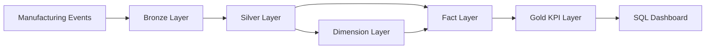

# 03 — Medallion Architecture

## Introduction

The Smart Manufacturing Intelligence Platform (SMIP) V2 implements a layered data architecture based on the **Medallion Architecture**. This architectural pattern progressively refines manufacturing data through multiple processing stages, improving data quality, business value, and analytical readiness.

Rather than transforming raw manufacturing events directly into reports, SMIP V2 separates the data lifecycle into distinct layers, each with a specific responsibility.

This layered approach improves maintainability, scalability, governance, and data quality while supporting reusable business models for manufacturing analytics.

---

# Purpose

The purpose of the Medallion Architecture is to progressively transform raw manufacturing events into trusted business information.

Each layer performs a well-defined set of transformations before passing data to the next stage.

The architecture implemented in SMIP V2 consists of:

- Bronze Layer
- Silver Layer
- Dimension Layer
- Fact Layer
- Gold Layer

Together, these layers create a complete manufacturing analytics pipeline.

---

# SMIP V2 Medallion Architecture



---

# Data Refinement Process

As manufacturing events move through the platform, their business value continuously increases.

| Layer | Primary Objective | Output |
|---------|-------------------|---------|
| Bronze | Preserve raw manufacturing events | Raw Delta tables |
| Silver | Parse, validate and standardize events | Manufacturing event tables |
| Dimensions | Store descriptive business entities | Dimension tables |
| Facts | Store measurable business processes | Fact tables |
| Gold | Calculate manufacturing KPIs | Analytical datasets |

---

# Bronze Layer

## Purpose

The Bronze Layer is responsible for ingesting raw manufacturing events exactly as they are received.

No business logic is applied.

The objective is to preserve the original event stream while making it available for downstream processing.

---

## Input

```
Manufacturing JSON Events
```

---

## Processing

The Bronze Layer performs:

- File ingestion
- Raw event storage
- Schema preservation

---

## Output Tables

The Bronze notebooks generate:

- `bronze_raw_events`
- `manufacturing_events`

---

## Benefits

- Immutable raw data
- Complete traceability
- Reliable recovery
- Simplified debugging

---

# Silver Layer

## Purpose

The Silver Layer transforms raw events into validated manufacturing datasets.

This is where most business validation occurs.

---

## Processing Activities

The Silver Layer performs:

- JSON parsing
- Schema validation
- Event filtering
- Business validation
- Data standardization
- Event classification

---

## Event Tables

SMIP V2 creates dedicated event tables for each manufacturing process.

```text
parsed_events

│

├── operation_events

├── quality_events

├── material_events

├── packaging_events

├── execution_events

└── work_order_events
```

Each event type becomes an independent dataset optimized for downstream analytical processing.

---

# Dimension Layer

## Purpose

Dimension tables provide descriptive information about manufacturing entities.

Unlike event tables, dimensions describe business objects rather than business activities.

---

## Implemented Dimensions

SMIP V2 contains four dimensions.

| Dimension | Description |
|------------|-------------|
| Machine Dimension | Manufacturing equipment |
| Operator Dimension | Factory operators |
| Product Dimension | Manufactured products |
| Material Dimension | Production materials |

---

## Benefits

Dimension tables:

- eliminate duplicated descriptive data
- improve query performance
- simplify reporting
- support Star Schema modeling

---

# Fact Layer

## Purpose

Fact tables capture measurable manufacturing activities.

Each fact represents a business process that occurred within the factory.

---

## Implemented Facts

The platform contains five analytical fact tables.

| Fact Table | Business Process |
|------------|------------------|
| Fact Operations | Manufacturing operations |
| Fact Quality | Quality inspections |
| Fact Materials | Material traceability |
| Fact Packaging | Packaging operations |
| Fact Production | Production execution |

Each fact combines manufacturing events with descriptive business information obtained from Dimension tables.

---

## Star Schema

```text
Dimensions

↓

Facts

↓

KPIs

↓

Dashboard
```

The Fact Layer serves as the analytical foundation of the platform.

---

# Gold Layer

## Purpose

The Gold Layer transforms detailed manufacturing data into business-ready KPIs.

These datasets are optimized for reporting rather than transactional analysis.

---

## KPI Tables

The Gold Layer contains:

- Machine KPIs
- Quality KPIs
- Production KPIs
- Material KPIs
- Packaging KPIs
- Factory Dashboard

These tables provide executive-level summaries of manufacturing performance.

---

# Data Quality Progression

The quality of manufacturing data increases as it progresses through each layer.

| Layer | Data Quality |
|---------|--------------|
| Bronze | Raw |
| Silver | Validated |
| Dimensions | Standardized |
| Facts | Business Modeled |
| Gold | Analytics Ready |

---

# Notebook Organization

The repository structure directly mirrors the Medallion Architecture.

```text
00_setup

↓

01_bronze

↓

02_silver

↓

03_dimensions

↓

04_facts

↓

05_gold

↓

06_sql_dashboard
```

This organization improves readability while clearly separating engineering responsibilities.

---

# Advantages of the Architecture

The implemented Medallion Architecture provides several benefits.

## Data Quality

Each layer progressively improves data reliability.

---

## Scalability

Independent processing layers support future expansion without affecting existing components.

---

## Reusability

Dimension and Fact tables can be reused by multiple dashboards and analytical workloads.

---

## Maintainability

Business logic remains isolated within the appropriate layer.

---

## Governance

Unity Catalog provides centralized governance across every dataset.

---

## Performance

Gold KPI tables eliminate repeated calculations, improving dashboard performance.

---

# Design Decisions

Several important architectural decisions were made during implementation.

### Separate Event Tables

Each manufacturing event type is stored independently to simplify transformations and improve maintainability.

---

### Independent Dimension Layer

Dimensions are created before Facts, enabling reusable business entities across multiple analytical processes.

---

### Business-Oriented Fact Tables

Each Fact represents a specific manufacturing business process rather than a technical event stream.

---

### Dedicated Gold Layer

KPIs are precomputed to minimize dashboard query complexity and improve reporting performance.

---

# Summary

The Medallion Architecture forms the foundation of the Smart Manufacturing Intelligence Platform.

By progressively refining manufacturing events through Bronze, Silver, Dimension, Fact, and Gold layers, the platform produces reliable, governed, and analytics-ready datasets that support operational reporting and executive decision-making.

The layered architecture also ensures scalability, maintainability, and clear separation of responsibilities throughout the manufacturing analytics pipeline.

---

# Next Section

## 04 — Pipeline Architecture

The next document presents the execution flow of the Lakeflow Declarative Pipelines, illustrating how notebooks, tables, and dependencies interact to transform raw manufacturing events into Gold KPI tables and the executive manufacturing dashboard.