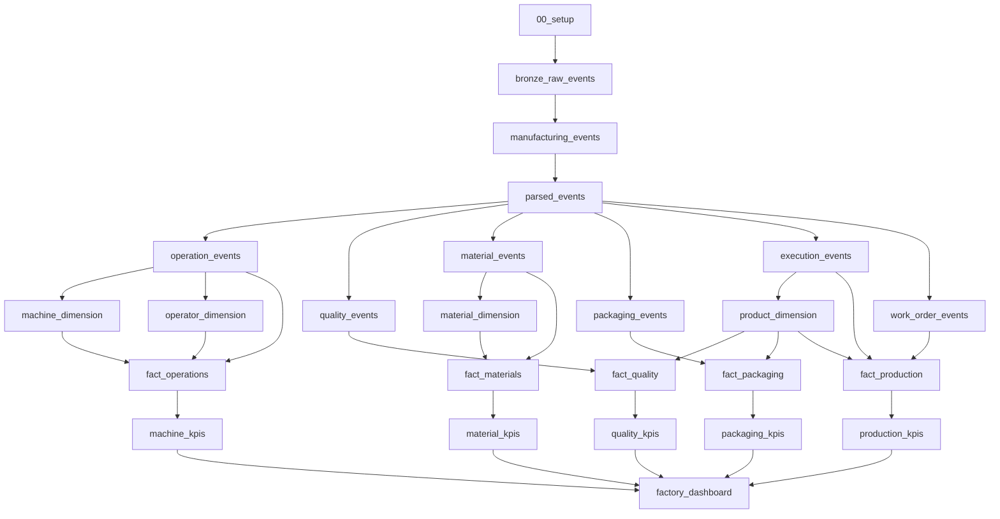

# 04 — Pipeline Architecture

## Introduction

The Smart Manufacturing Intelligence Platform (SMIP) V2 implements a modular data engineering pipeline using **Lakeflow Declarative Pipelines**.

Rather than executing a single monolithic ETL process, the platform is organized into multiple logical stages that progressively transform raw manufacturing events into business-ready analytical datasets.

Each notebook has a clearly defined responsibility and produces one or more Delta tables that are consumed by downstream transformations.

This modular architecture improves maintainability, scalability, readability, and reuse.

---

# Purpose

The purpose of the Pipeline Architecture is to describe how manufacturing data flows through the Smart Manufacturing Intelligence Platform.

This document explains:

- Notebook execution order
- Dataset dependencies
- Layer interactions
- Data transformations
- Business model construction
- KPI generation

The pipeline directly follows the Medallion Architecture while introducing dedicated Dimension and Fact layers for analytical modeling.

---

# Complete Pipeline Architecture



---

# Pipeline Layers

The complete manufacturing analytics pipeline consists of six engineering stages.

| Stage | Purpose | Output |
|--------|----------|---------|
| Setup | Configure Unity Catalog and environment | Pipeline configuration |
| Bronze | Ingest raw manufacturing events | Raw Delta tables |
| Silver | Parse and validate events | Manufacturing event tables |
| Dimensions | Build business entities | Dimension tables |
| Facts | Build analytical business processes | Fact tables |
| Gold | Calculate manufacturing KPIs | Dashboard datasets |

---

# Stage 1 — Setup

The setup notebooks initialize the Databricks environment.

Responsibilities include:

- Unity Catalog configuration
- Catalog creation
- Schema creation
- Volume configuration
- Environment initialization

No business data is processed during this stage.

---

# Stage 2 — Bronze Layer

The Bronze layer ingests manufacturing JSON events exactly as they are received.

Notebooks:

```
00_bronze

├── bronze_raw_events

└── manufacturing_events
```

Responsibilities:

- Read JSON files
- Preserve original payload
- Store immutable raw events

Output:

```
bronze_raw_events

↓

manufacturing_events
```

---

# Stage 3 — Silver Layer

The Silver layer performs the majority of data engineering transformations.

Pipeline:

```
parsed_events

│

├── operation_events

├── quality_events

├── material_events

├── packaging_events

├── execution_events

└── work_order_events
```

Responsibilities:

- JSON parsing
- Schema validation
- Data quality enforcement
- Event classification
- Business standardization

Each manufacturing event type becomes an independent analytical dataset.

---

# Stage 4 — Dimension Layer

Dimension tables provide descriptive business context.

Implemented dimensions:

```
machine_dimension

operator_dimension

product_dimension

material_dimension
```

These dimensions eliminate duplicated business information while supporting Star Schema modeling.

---

# Stage 5 — Fact Layer

Fact tables capture measurable manufacturing activities.

Implemented facts:

```
fact_operations

fact_quality

fact_materials

fact_packaging

fact_production
```

Each Fact combines manufacturing events with descriptive business entities from the Dimension layer.

This creates analytics-ready business datasets.

---

# Stage 6 — Gold Layer

The Gold layer calculates executive manufacturing KPIs.

Generated KPI tables:

```
machine_kpis

quality_kpis

production_kpis

material_kpis

packaging_kpis

factory_dashboard
```

These datasets are optimized for analytical queries rather than transactional processing.

---

# Dataset Dependencies

The pipeline follows a strict dependency hierarchy.

```
Raw Events

↓

Parsed Events

↓

Silver Events

↓

Dimensions

↓

Facts

↓

KPIs

↓

Dashboard
```

Lakeflow Declarative Pipelines automatically determine execution order based on these dependencies.

---

# Notebook Organization

The repository structure mirrors the pipeline.

```
databricks/

└── notebooks/

    00_setup/

    01_bronze/

    02_silver/

    03_dimensions/

    04_facts/

    05_gold/

    06_sql_dashboard/

    07_validation/
```

This organization allows each notebook to focus on a single engineering responsibility.

---

# Pipeline Characteristics

The pipeline follows several engineering principles.

## Modular

Each notebook performs one well-defined task.

---

## Declarative

Dependencies determine execution order rather than manual scheduling.

---

## Scalable

Independent datasets allow future expansion without redesigning the architecture.

---

## Reusable

Dimension and Fact tables support multiple dashboards and analytical workloads.

---

## Maintainable

Changes remain isolated within individual notebooks and processing layers.

---

# Benefits

The implemented pipeline provides several advantages.

| Benefit | Description |
|----------|-------------|
| Maintainability | Small independent notebooks simplify development |
| Scalability | New datasets can be integrated easily |
| Reliability | Layered validation improves data quality |
| Reusability | Curated datasets support multiple business applications |
| Transparency | Clear dependency graph simplifies debugging |
| Performance | Optimized Delta tables improve analytical queries |

---

# Summary

The Pipeline Architecture demonstrates how SMIP V2 transforms raw manufacturing events into executive business intelligence through a modular sequence of Lakeflow Declarative Pipeline transformations.

Each notebook contributes a clearly defined processing step while maintaining strong separation of responsibilities across the Bronze, Silver, Dimension, Fact, and Gold layers.

The resulting architecture is scalable, maintainable, and closely aligned with modern Data Engineering best practices.

---

# Next Section

## 05 — Technology Stack

The final architecture document presents the technologies used throughout SMIP V2 and explains how each platform, framework, and service contributes to the overall manufacturing analytics solution.