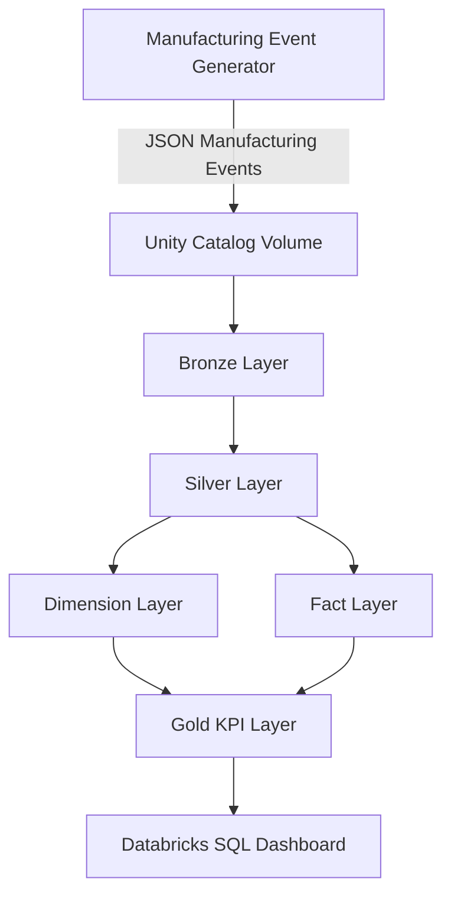

# 01 — System Architecture

## Introduction

The Smart Manufacturing Intelligence Platform (SMIP) V2 is designed as an end-to-end manufacturing analytics platform built on the **Databricks Data Intelligence Platform**.

The system transforms raw manufacturing events into business-ready information using a layered Lakehouse architecture that emphasizes scalability, governance, data quality, and analytical performance.

Rather than processing data in a single monolithic workflow, the platform separates responsibilities across multiple logical layers, allowing each component to focus on a specific stage of the data lifecycle.

This document presents the overall system architecture and explains how the major components interact to deliver manufacturing insights.

---

# Purpose

The purpose of the System Architecture is to provide a high-level view of the complete platform before exploring the individual architectural layers.

It illustrates:

- The flow of manufacturing events
- The major Databricks components
- Data processing stages
- Analytical layers
- Business intelligence outputs

Understanding this architecture helps readers see how the different notebooks and datasets work together to form a complete manufacturing analytics solution.

---

# System Architecture



---

# System Components

The Smart Manufacturing Intelligence Platform is composed of seven logical components.

| Layer | Purpose |
|---------|----------|
| Manufacturing Event Generator | Produces simulated manufacturing events |
| Unity Catalog Volume | Stores raw JSON event files |
| Bronze Layer | Ingests raw manufacturing events |
| Silver Layer | Parses, validates and standardizes events |
| Dimension Layer | Stores descriptive manufacturing entities |
| Fact Layer | Stores measurable manufacturing activities |
| Gold Layer | Calculates business KPIs for reporting |

Together, these components provide a complete manufacturing analytics pipeline.

---

# End-to-End Data Flow

The manufacturing analytics workflow follows a sequential transformation process.

## 1. Manufacturing Event Generation

Manufacturing events are generated throughout the simulated production lifecycle.

Examples include:

- Work Order Creation
- Execution Started
- Operation Completed
- Quality Completed
- Material Scanned
- Packaging Completed

Each event is produced as a structured JSON document.

---

## 2. Raw Data Storage

The generated JSON files are uploaded into a **Unity Catalog Volume**, which acts as the landing zone for raw manufacturing data.

At this stage:

- No transformations are performed.
- Data remains immutable.
- Original events are preserved for traceability.

---

## 3. Bronze Layer

The Bronze Layer ingests raw JSON files into Delta tables.

Responsibilities include:

- Raw event ingestion
- Schema preservation
- Data availability
- Immutable storage

No business logic is applied within this layer.

---

## 4. Silver Layer

The Silver Layer transforms raw events into validated manufacturing datasets.

Major processing activities include:

- JSON parsing
- Event validation
- Data standardization
- Data quality enforcement
- Event separation by business domain

This layer produces dedicated event tables for each manufacturing process.

---

## 5. Dimension Layer

Dimension tables store descriptive business information.

Examples include:

- Machines
- Operators
- Products
- Materials

These tables provide contextual information that supports analytical queries.

---

## 6. Fact Layer

Fact tables represent measurable manufacturing activities.

Each fact table corresponds to a specific business process.

Examples include:

- Manufacturing Operations
- Quality Inspections
- Material Traceability
- Packaging
- Production Execution

Fact tables form the analytical foundation of the Star Schema.

---

## 7. Gold Layer

The Gold Layer calculates manufacturing Key Performance Indicators (KPIs).

Examples include:

- Machine Performance
- Production KPIs
- Quality KPIs
- Material KPIs
- Packaging KPIs

These datasets are optimized for reporting and dashboard consumption.

---

## 8. Business Intelligence

The final layer exposes business-ready datasets through **Databricks SQL Dashboards**.

Decision makers can monitor:

- Production performance
- Machine utilization
- Product quality
- Material traceability
- Packaging readiness
- Factory performance

without interacting directly with the underlying engineering datasets.

---

# Design Principles

The architecture follows several key engineering principles.

## Layered Processing

Each architectural layer has a clearly defined responsibility.

Data quality progressively improves as manufacturing events move through the platform.

---

## Separation of Concerns

Business logic is distributed across independent layers.

This minimizes coupling between ingestion, transformation, modeling, and reporting.

---

## Reusability

Dimension and Fact tables are reusable across multiple analytical workloads, reducing duplicated transformation logic.

---

## Scalability

The architecture leverages Delta Lake and Lakeflow Declarative Pipelines to support growing manufacturing datasets.

---

## Governance

Unity Catalog provides centralized management for:

- Metadata
- Security
- Access control
- Data lineage
- Table organization

---

# Architecture Benefits

The implemented architecture provides several advantages.

| Benefit | Description |
|---------|-------------|
| Scalability | Supports increasing manufacturing data volumes |
| Maintainability | Independent processing layers simplify development |
| Data Quality | Progressive validation improves analytical reliability |
| Governance | Centralized metadata and security management |
| Reusability | Shared business models across analytical workloads |
| Performance | Optimized Delta tables improve query efficiency |

---

# Relationship to the Repository

The System Architecture directly reflects the notebook organization of the project.

```text
00_setup
      │
      ▼
01_bronze
      │
      ▼
02_silver
      │
      ▼
03_dimensions
      │
      ▼
04_facts
      │
      ▼
05_gold
      │
      ▼
06_sql_dashboard
```

This repository structure mirrors the logical flow of manufacturing data through the Lakehouse.

---

# Summary

The Smart Manufacturing Intelligence Platform follows a layered architecture that transforms raw manufacturing events into business-ready analytical datasets.

By separating ingestion, validation, dimensional modeling, KPI calculation, and visualization into distinct layers, the platform remains scalable, maintainable, and aligned with modern Data Engineering best practices.

This architecture establishes the foundation for the remaining documents in this chapter, which examine each architectural layer in greater technical detail.

---

# Next Section

## 02 — Lakehouse Architecture

The next document explains how the Databricks Data Intelligence Platform supports the implementation of SMIP V2 through Unity Catalog, Delta Lake, Lakeflow Declarative Pipelines, and Databricks SQL.