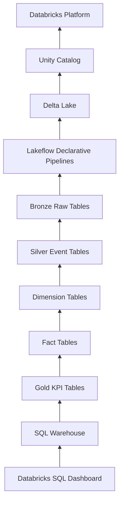

# 05 — Technology Stack

## Introduction

The Smart Manufacturing Intelligence Platform (SMIP) V2 combines modern cloud-native technologies to build a scalable manufacturing analytics platform.

Rather than relying on a single framework, the platform integrates multiple technologies, each responsible for a specific part of the data engineering lifecycle.

Together, these technologies enable reliable data ingestion, transformation, governance, storage, analytics, and visualization within a unified Lakehouse architecture.

---

# Purpose

This document presents the technologies used throughout SMIP V2 and explains the role each technology plays within the overall architecture.

The technology stack has been selected to support:

- Modern Data Engineering
- Manufacturing analytics
- Cloud-native scalability
- Data governance
- Business Intelligence
- Reproducible data pipelines

---

# Technology Stack Overview



---

# Technology Categories

| Layer | Technology |
|---------|------------|
| Cloud Platform | Databricks |
| Data Storage | Delta Lake |
| Governance | Unity Catalog |
| Pipeline Orchestration | Lakeflow Declarative Pipelines |
| Programming | Python |
| Query Language | SQL |
| Analytics | Databricks SQL |
| Data Modeling | Star Schema |
| Version Control | Git & GitHub |

---

# Databricks Platform

## Purpose

Databricks serves as the central platform that hosts every component of the Smart Manufacturing Intelligence Platform.

It provides:

- Compute
- Storage integration
- Data Engineering
- SQL Analytics
- Governance
- Pipeline execution

The unified platform reduces operational complexity by bringing ingestion, transformation, governance, and analytics together. citeturn0search2turn0search3

---

# Unity Catalog

## Purpose

Unity Catalog provides centralized governance across every manufacturing dataset.

Responsibilities include:

- Metadata management
- Table organization
- Access control
- Data lineage
- Security

Within SMIP V2, Unity Catalog organizes the complete Medallion Architecture into governed catalogs and schemas. citeturn0search1turn0search2

---

# Delta Lake

## Purpose

Delta Lake is the storage foundation of every analytical dataset.

Benefits include:

- ACID transactions
- Schema enforcement
- Schema evolution
- High-performance analytics
- Reliable streaming
- Time travel

Delta Lake ensures that manufacturing datasets remain consistent throughout the pipeline. citeturn0search1turn0search3

---

# Lakeflow Declarative Pipelines

## Purpose

Lakeflow Declarative Pipelines automate the execution of the manufacturing analytics pipeline.

Responsibilities include:

- Data ingestion
- Dependency management
- Incremental processing
- Table creation
- Pipeline orchestration

Rather than manually controlling notebook execution, Lakeflow determines execution order from dataset dependencies. citeturn0search0turn0search2

---

# Python

Python is the primary implementation language used throughout the pipeline.

Within SMIP V2, Python is used for:

- Pipeline development
- Data transformations
- Business logic
- Data validation
- KPI calculations

Python enables modular and maintainable pipeline development.

---

# SQL

SQL is used for analytical workloads.

Examples include:

- Validation queries
- KPI verification
- Dashboard queries
- Exploratory analysis

SQL provides a familiar interface for business analysts and manufacturing engineers.

---

# Databricks SQL

Databricks SQL provides the analytical layer of the platform.

Responsibilities include:

- Dashboard execution
- Interactive analysis
- High-performance reporting
- Executive KPI visualization

The SQL Warehouse separates analytical workloads from data engineering workloads.

---

# Star Schema

The analytical model follows a Star Schema.

The model consists of:

## Dimensions

- Machine
- Operator
- Product
- Material

## Facts

- Operations
- Quality
- Production
- Materials
- Packaging

This model simplifies manufacturing reporting while improving query performance.

---

# Git & GitHub

Version control is managed using Git.

The project is organized into multiple branches representing different stages of development.

Examples include:

- main
- v2.0-dev
- databricks-v2

This branching strategy separates the local manufacturing simulation from the cloud-native Lakehouse implementation.

---

# Technology Integration

The technologies interact as follows.

```text
Manufacturing Events

↓

Unity Catalog Volume

↓

Lakeflow Declarative Pipelines

↓

Delta Lake Tables

↓

Star Schema

↓

Gold KPIs

↓

Databricks SQL

↓

Executive Dashboard
```

Each technology contributes a specialized capability while remaining fully integrated within the Databricks ecosystem.

---

# Why This Technology Stack?

Several factors influenced the technology selection.

| Requirement | Technology |
|-------------|------------|
| Cloud Data Engineering | Databricks |
| Reliable Storage | Delta Lake |
| Governance | Unity Catalog |
| Pipeline Automation | Lakeflow |
| Data Transformation | Python |
| Analytics | SQL |
| Business Intelligence | Databricks SQL |
| Version Control | Git |

This combination provides a scalable and maintainable platform suitable for modern manufacturing analytics.

---

# Summary

The Smart Manufacturing Intelligence Platform leverages a carefully selected technology stack that aligns with modern Data Engineering best practices.

By combining Databricks, Delta Lake, Unity Catalog, Lakeflow Declarative Pipelines, Python, SQL, and Databricks SQL, the platform provides an integrated environment capable of transforming raw manufacturing events into governed, analytics-ready business insights.

---

# Next Section

## 03 — Data Model

The next chapter introduces the analytical data model used throughout SMIP V2, including the manufacturing event model, Star Schema, Dimension tables, Fact tables, and business relationships that support manufacturing analytics.