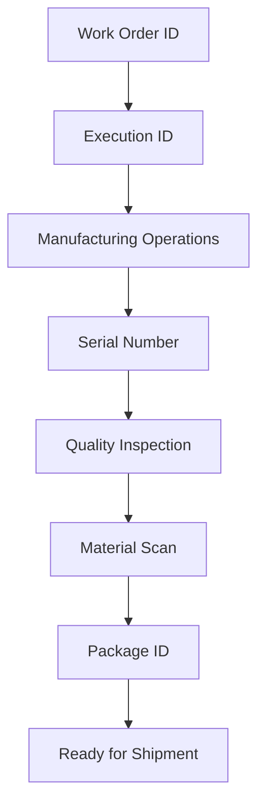
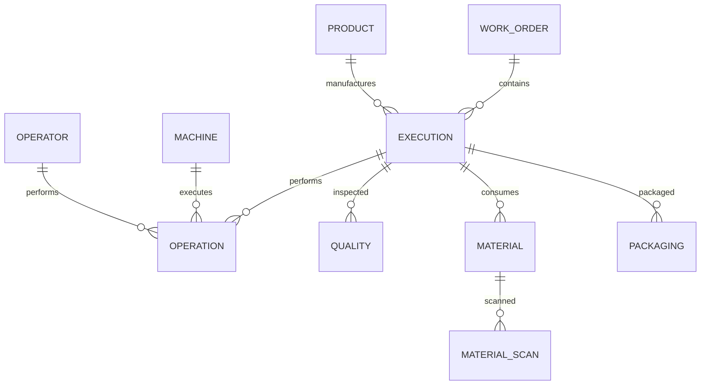

# 06 — Business Keys

## Introduction

Business Keys provide the logical relationships that connect manufacturing activities throughout the Smart Manufacturing Intelligence Platform (SMIP) V2.

Unlike surrogate keys that are generated for database optimization, Business Keys originate from the manufacturing process itself. They uniquely identify products, work orders, machines, operators, materials, and production executions.

These identifiers enable complete product traceability across the entire manufacturing lifecycle while preserving the relationships between business processes.

---

# Purpose

The objective of Business Keys is to establish consistent identifiers that connect manufacturing events, Dimension tables, and Fact tables.

Business Keys enable:

- Product traceability
- Cross-process analysis
- Business relationships
- Data consistency
- Manufacturing genealogy
- End-to-end production visibility

Without these identifiers, independent manufacturing events could not be associated with the same product or production execution.

---

# Manufacturing Traceability

The manufacturing lifecycle is connected through a series of business identifiers.



Each identifier establishes a relationship between consecutive manufacturing processes.

---

# Business Key Hierarchy

The platform organizes business identifiers according to the manufacturing process.

```text
Work Order

↓

Execution

↓

Machine

↓

Operation

↓

Serial Number

↓

Quality

↓

Material

↓

Packaging
```

This hierarchy allows complete navigation across the manufacturing lifecycle.

---

# Primary Business Keys

## Work Order ID

### Purpose

Identifies a manufacturing order.

A Work Order represents the business request to manufacture one or more products.

### Example

```
WO-000123
```

### Used In

- work_order_events
- execution_events
- fact_production
- fact_operations

---

## Execution ID

### Purpose

Identifies a production execution.

An execution represents one manufacturing instance of a Work Order.

### Example

```
EXEC-000259
```

### Used In

- execution_events
- operation_events
- quality_events
- material_events
- packaging_events

### Business Role

Execution ID is the primary identifier connecting production activities throughout the manufacturing lifecycle.

---

## Product Code

### Purpose

Identifies the manufactured product.

### Example

```
GIS-145-4000
```

### Used In

- product_dimension
- fact_production
- fact_quality
- fact_packaging

### Business Role

Product Code connects all analytical information related to a manufactured product.

---

## Serial Number

### Purpose

Uniquely identifies an individual manufactured product.

### Example

```
SN-00000729
```

### Used In

- operation_events
- quality_events
- material_events
- packaging_events

### Business Role

Serial Number enables complete product genealogy.

---

## Machine ID

### Purpose

Identifies the manufacturing equipment that performed an operation.

### Example

```
MC-001
```

### Used In

- operation_events
- machine_dimension
- fact_operations

### Business Role

Supports machine performance analysis and operational reporting.

---

## Operator ID

### Purpose

Identifies the manufacturing operator responsible for an operation.

### Example

```
OP-042
```

### Used In

- operation_events
- operator_dimension
- fact_operations

### Business Role

Supports workforce analysis and productivity reporting.

---

## Material Number

### Purpose

Identifies materials consumed during manufacturing.

### Example

```
MAT-100234
```

### Used In

- material_events
- material_dimension
- fact_materials

### Business Role

Supports supplier traceability and production genealogy.

---

## Package ID

### Purpose

Identifies the package assigned to a finished product.

### Example

```
PKG-00000729
```

### Used In

- packaging_events
- fact_packaging

### Business Role

Supports shipment preparation and logistics tracking.

---

# Business Key Relationships

The identifiers connect every analytical layer.



These relationships preserve the manufacturing process throughout the analytical model.

---

# Business Keys Across the Lakehouse

Business Keys remain consistent throughout every layer.

```text
Bronze

↓

Silver

↓

Dimensions

↓

Facts

↓

Gold KPIs
```

This consistency allows analytical queries to trace manufacturing activities back to their original business context.

---

# Traceability Example

The following example demonstrates how a single product moves through the platform.

```text
Work Order

WO-000123

↓

Execution

EXEC-000259

↓

Operation

Machine MC-001

↓

Quality Inspection

PASS

↓

Material Scan

MAT-100234

↓

Packaging

PKG-00000729

↓

Dashboard KPI
```

This chain illustrates complete manufacturing traceability from production planning through shipment preparation.

---

# Design Principles

The Business Key strategy follows several engineering principles.

## Business Meaning

Keys originate from real manufacturing processes rather than database-generated identifiers.

---

## Stability

Business identifiers remain constant throughout the product lifecycle.

---

## Traceability

Relationships between manufacturing processes are preserved across every analytical layer.

---

## Reusability

The same Business Keys are shared by multiple datasets.

---

## Consistency

Every notebook, table, and KPI references the same business identifiers.

---

# Benefits

The Business Key model provides:

- End-to-end product traceability
- Simplified analytical joins
- Reliable manufacturing genealogy
- Consistent reporting
- Reduced ambiguity
- Scalable analytical modeling

---

# Summary

Business Keys provide the connective tissue of the Smart Manufacturing Intelligence Platform.

By preserving identifiers such as Work Order ID, Execution ID, Product Code, Machine ID, Material Number, and Package ID across every stage of the Lakehouse architecture, SMIP V2 enables complete manufacturing traceability while maintaining a scalable and reusable analytical model.

These relationships ensure that every KPI, dashboard, and analytical query can be traced back to the underlying manufacturing processes that generated the data.

---

# Next Section

## 04 — Data Engineering

The next chapter explains how manufacturing events are ingested, validated, transformed, and modeled through the Bronze, Silver, Dimension, Fact, and Gold layers using Lakeflow Declarative Pipelines on the Databricks Data Intelligence Platform.