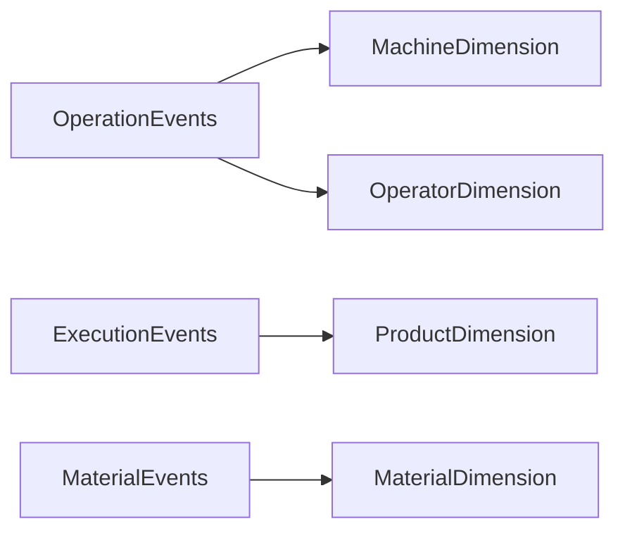
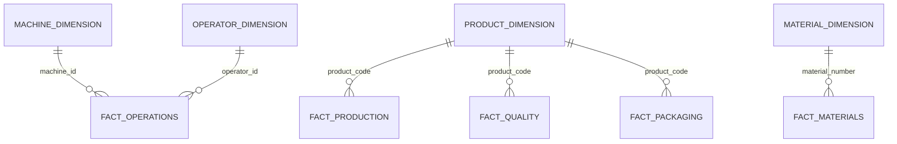

# 04 — Dimension Tables

## Introduction

Dimension tables provide the descriptive business context required for manufacturing analytics.

Unlike Fact tables, which capture measurable manufacturing activities, Dimensions describe the business entities involved in those activities.

Within the Smart Manufacturing Intelligence Platform (SMIP) V2, Dimensions are derived from validated Silver event tables and provide reusable reference data for analytical queries, KPI calculations, and executive dashboards.

The Dimension layer represents the business vocabulary of the manufacturing process.

---

# Purpose

The objective of the Dimension layer is to:

- Eliminate duplicated descriptive information
- Standardize business entities
- Improve analytical query performance
- Support the Star Schema
- Provide reusable business attributes across multiple Fact tables

Every Dimension is built once and reused throughout the analytical model.

---

# Dimension Layer Overview



The Dimension layer transforms validated manufacturing events into reusable business entities.

---

# Dimension Model

SMIP V2 contains four Dimension tables.

| Dimension | Source | Business Entity |
|------------|--------|-----------------|
| machine_dimension | operation_events | Manufacturing Machines |
| operator_dimension | operation_events | Factory Operators |
| product_dimension | execution_events | Manufactured Products |
| material_dimension | material_events | Production Materials |

Together, these Dimensions describe the factory, its personnel, products, and materials.

---

# Machine Dimension

## Business Purpose

The Machine Dimension describes every manufacturing machine participating in production.

It provides contextual information required to analyze operational performance and machine utilization.

---

## Source

```
operation_events
```

---

## Business Key

```
machine_id
```

---

## Attributes

| Attribute | Description |
|-----------|-------------|
| machine_id | Machine identifier |
| machine_name | Machine name |
| machine_type | Machine category |
| station_code | Production station |
| station_type | Station classification |

---

## Used By

- fact_operations

---

## Example Business Questions

- Which machines completed the most operations?
- Which machine has the lowest average cycle time?
- Which station produces the highest throughput?

---

# Operator Dimension

## Business Purpose

The Operator Dimension stores information about manufacturing personnel responsible for production operations.

It supports workforce analysis and operational reporting.

---

## Source

```
operation_events
```

---

## Business Key

```
operator_id
```

---

## Attributes

| Attribute | Description |
|-----------|-------------|
| operator_id | Operator identifier |
| operator_name | Operator name |
| skill_level | Operator qualification |

---

## Used By

- fact_operations

---

## Example Business Questions

- Which operators perform the highest number of operations?
- How does skill level influence cycle time?
- Which operators achieve the highest quality performance?

---

# Product Dimension

## Business Purpose

The Product Dimension represents manufactured products.

It provides common product information shared across multiple manufacturing processes.

---

## Source

```
execution_events
```

---

## Business Key

```
product_code
```

---

## Attributes

| Attribute | Description |
|-----------|-------------|
| product_code | Product identifier |
| product_name | Product description |
| family | Product family |
| rated_voltage_kv | Rated operating voltage |
| routing_version | Manufacturing routing |

---

## Used By

- fact_production
- fact_quality
- fact_packaging

---

## Example Business Questions

- Which products have the highest production volume?
- Which product family requires the most inspections?
- What is the average package weight by product?

---

# Material Dimension

## Business Purpose

The Material Dimension stores descriptive information about production materials used during manufacturing.

It enables traceability across suppliers and production batches.

---

## Source

```
material_events
```

---

## Business Key

```
material_number
```

---

## Attributes

| Attribute | Description |
|-----------|-------------|
| material_number | Material identifier |
| batch_number | Supplier batch |
| supplier | Material supplier |
| material_type | Material classification |
| material_status | Material status |

---

## Used By

- fact_materials

---

## Example Business Questions

- Which suppliers provide the largest number of materials?
- Which batches were consumed during production?
- How many materials were scanned successfully?

---

# Dimension Relationships

The Dimension layer connects business entities to manufacturing activities.



This dimensional model minimizes data redundancy while maximizing analytical flexibility.

---

# Slowly Changing Dimensions

The current implementation maintains the latest version of each business entity.

Examples include:

- Latest machine information
- Current operator attributes
- Current product definition
- Current supplier information

The architecture can be extended in future versions to support Slowly Changing Dimensions (SCD Type 2) for historical tracking.

---

# Design Principles

The Dimension layer follows several principles.

## Reusable

Dimensions are shared across multiple Fact tables.

---

## Business-Oriented

Dimensions describe real manufacturing entities rather than technical objects.

---

## Lightweight

Only descriptive attributes are stored.

No manufacturing measurements are included.

---

## Governed

Every Dimension is managed through Unity Catalog and Delta Lake.

---

# Benefits

The Dimension model provides:

- Reduced data duplication
- Consistent business terminology
- Faster analytical queries
- Reusable business entities
- Simplified dashboard development
- Scalable analytical modeling

---

# Summary

The Dimension layer provides the descriptive foundation of the Smart Manufacturing Intelligence Platform.

By organizing machines, operators, products, and materials into reusable business entities, the platform establishes a clean analytical model that supports multiple manufacturing processes while reducing redundancy and improving reporting performance.

Together, the four Dimension tables form one half of the Star Schema, while the Fact tables capture the measurable manufacturing activities.

---

# Next Section

## 05 — Fact Tables

The next document describes the analytical Fact tables, including their business grain, measures, relationships with Dimensions, and role in manufacturing analytics.