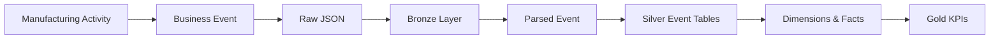
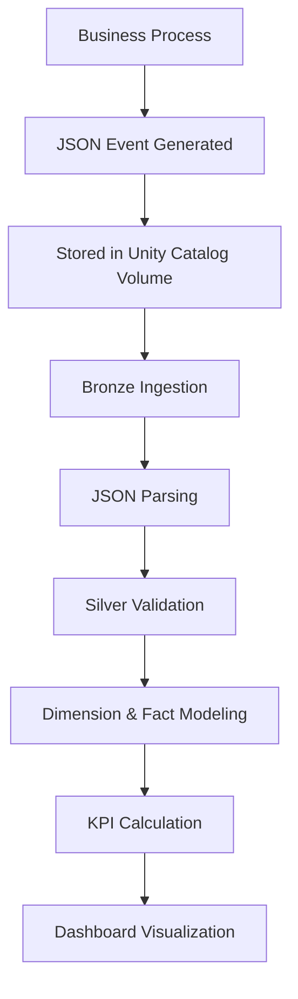
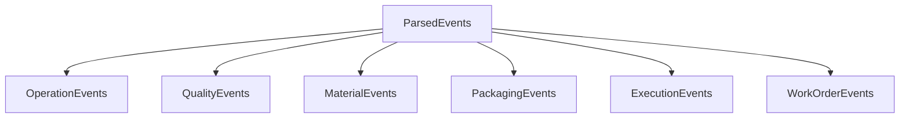
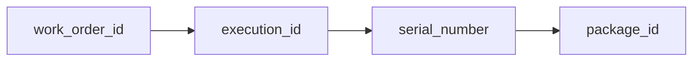

# 02 — Event Model

## Introduction

The Smart Manufacturing Intelligence Platform (SMIP) V2 follows an **event-driven architecture**, where every significant manufacturing activity generates a standardized event.

Rather than storing manufacturing information in isolated transactional tables, the platform records each business activity as an independent event that captures both operational context and business measurements.

These events become the foundation of the Medallion Architecture and are progressively transformed into analytical datasets.

---

# Purpose

The objective of the Event Model is to standardize how manufacturing activities are represented throughout the platform.

A common event structure provides several advantages:

- Consistent event processing
- Simplified data ingestion
- Standardized validation
- Reusable transformation logic
- Reliable analytical modeling

Every event follows the same high-level structure while allowing business-specific information to be stored inside the event payload.

---

# Event-Driven Architecture

The manufacturing platform is organized around business events.



Each manufacturing activity generates one event that progresses through the Lakehouse until it becomes business intelligence.

---

# Manufacturing Event Lifecycle

A manufacturing event follows a well-defined lifecycle.



Every stage progressively increases data quality and business value.

---

# Standard Event Structure

All manufacturing events share the same top-level schema.

```text
{
    event_id,
    event_timestamp,
    event_type,
    event_version,

    plant_code,

    hall_id,
    line_id,
    machine_id,

    execution_id,
    work_order_id,
    serial_number,

    operator_id,
    product_code,

    source_system,
    correlation_id,

    payload { ... }
}
```

This common structure allows all manufacturing events to be processed using a unified pipeline.

---

# Event Metadata

The event metadata identifies the business context of each manufacturing activity.

| Field | Description |
|---------|-------------|
| event_id | Unique event identifier |
| event_timestamp | Time the event occurred |
| event_type | Manufacturing activity type |
| event_version | Event schema version |
| plant_code | Manufacturing plant |
| execution_id | Production execution |
| work_order_id | Manufacturing work order |
| serial_number | Manufactured product |
| product_code | Product identifier |
| machine_id | Machine involved |
| operator_id | Operator responsible |
| correlation_id | Cross-event relationship identifier |

These fields are common across every event type.

---

# Event Payload

The payload contains business-specific information.

Unlike the metadata, the payload varies according to the manufacturing activity.

For example:

## Operation Event

```text
payload

├── operation_number

├── operation_name

├── target_force_kn

├── actual_force_kn

├── cycle_time_sec

├── displacement_mm

└── quality_result
```

---

## Quality Event

```text
payload

├── test_program_id

├── test_name

├── target_value

├── measured_value

├── unit

└── result
```

---

## Material Event

```text
payload

├── scan_id

├── material_number

├── batch_number

├── supplier

└── scan_status
```

---

## Packaging Event

```text
payload

├── package_id

├── package_type

├── package_weight_kg

├── package_length_mm

├── package_width_mm

├── package_height_mm

└── packaging_status
```

---

## Execution Event

```text
payload

├── sap_order_number

├── quantity

├── planned_shift

├── production_line

└── status
```

Each payload contains only the information required for that manufacturing activity.

---

# Manufacturing Event Types

The platform currently supports six business event types.

| Event Type | Business Process |
|-------------|------------------|
| WORK_ORDER_CREATED | Production planning |
| EXECUTION_STARTED | Production execution |
| OPERATION_COMPLETED | Manufacturing operation |
| QUALITY_COMPLETED | Quality inspection |
| MATERIAL_SCANNED | Material traceability |
| PACKAGING_COMPLETED | Product packaging |

Each event type is transformed into its own Silver event table.

---

# Event Processing Flow

The parsing notebook separates events according to their business type.



This separation simplifies downstream transformations and keeps each analytical dataset focused on a single manufacturing process.

---

# Event Relationships

Manufacturing events are connected through shared business identifiers.



Additional identifiers provide context across the platform:

- machine_id
- operator_id
- product_code
- material_number
- correlation_id

These relationships enable complete product traceability throughout the manufacturing lifecycle.

---

# Design Principles

The event model follows several engineering principles.

## Standardized

Every event shares the same metadata structure.

---

## Extensible

New manufacturing events can be added without modifying existing pipelines.

---

## Traceable

Business identifiers preserve relationships across manufacturing processes.

---

## Scalable

Independent event types allow pipelines to evolve as manufacturing processes expand.

---

## Analytics-Ready

The event model naturally supports transformation into Dimensions, Facts, and KPI tables.

---

# Benefits

The standardized event model provides:

- Consistent ingestion
- Simplified parsing
- Modular transformations
- Complete traceability
- Reduced pipeline complexity
- Reliable analytical modeling

---

# Summary

The Event Model provides the foundation of the Smart Manufacturing Intelligence Platform.

By representing every manufacturing activity as a standardized business event, SMIP V2 creates a flexible and scalable architecture capable of supporting data engineering, dimensional modeling, and business intelligence within a unified Lakehouse platform.

---

# Next Section

## 03 — Star Schema

The next document explains how manufacturing events are transformed into a dimensional Star Schema composed of Dimension tables and Fact tables, forming the analytical core of SMIP V2.