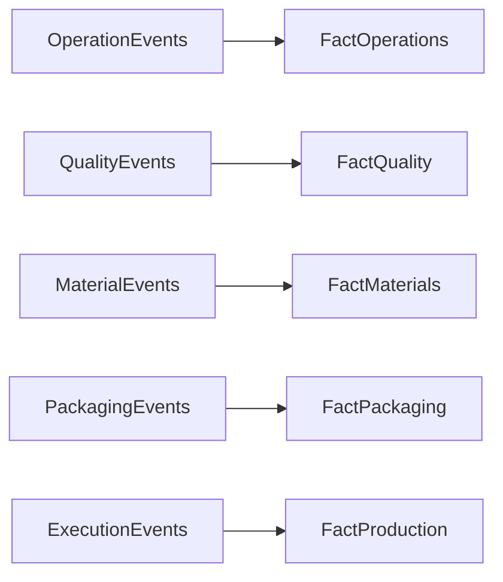
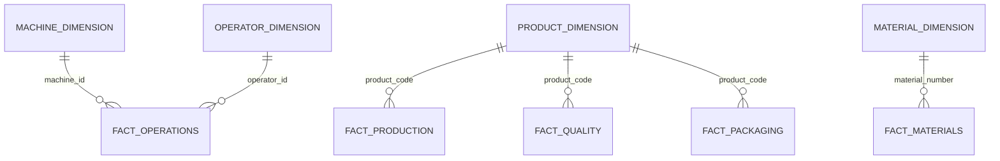

# 05 — Fact Tables

## Introduction

Fact tables capture the measurable business activities that occur throughout the manufacturing process.

Within the Smart Manufacturing Intelligence Platform (SMIP) V2, each Fact table represents a distinct manufacturing process and stores the quantitative measurements required for operational reporting and business intelligence.

Rather than describing business entities, Fact tables answer questions such as:

- What happened?
- When did it happen?
- How much?
- Which machine?
- Which product?
- Which work order?

Together, the Fact layer forms the analytical core of the manufacturing data model.

---

# Purpose

The objective of the Fact layer is to organize manufacturing measurements into analytical datasets optimized for reporting and KPI calculations.

Each Fact table has:

- A clearly defined business grain
- Business identifiers
- Numerical measures
- Relationships with Dimension tables

This design simplifies analytical queries while supporting scalable manufacturing reporting.

---

# Fact Layer Overview



Each Fact table represents a single manufacturing business process.

---

# Fact Model

SMIP V2 contains five Fact tables.

| Fact Table | Business Process | Business Grain |
|------------|------------------|----------------|
| fact_operations | Manufacturing Operations | One completed manufacturing operation |
| fact_quality | Quality Inspection | One completed quality inspection |
| fact_materials | Material Traceability | One material scan |
| fact_packaging | Packaging | One packaged product |
| fact_production | Production Execution | One production execution |

---

# Fact Operations

## Business Purpose

Stores operational measurements collected during manufacturing operations.

This Fact enables production monitoring, machine analysis, and process optimization.

---

## Source

```
operation_events
```

---

## Business Grain

> One completed manufacturing operation.

---

## Business Keys

- machine_id
- operator_id
- execution_id
- work_order_id
- product_code

---

## Measures

| Measure | Description |
|----------|-------------|
| target_force_kn | Target press force |
| actual_force_kn | Measured press force |
| force_deviation_kn | Difference between target and actual force |
| displacement_mm | Press displacement |
| cycle_time_sec | Operation duration |

---

## Related Dimensions

- Machine Dimension
- Operator Dimension

---

## Business Questions

- Which machines complete the most operations?
- Which operations exceed target force?
- What is the average cycle time?
- Which operators perform the fastest operations?

---

# Fact Quality

## Business Purpose

Stores quality inspection results for manufactured products.

---

## Source

```
quality_events
```

---

## Business Grain

> One completed quality inspection.

---

## Business Keys

- execution_id
- serial_number
- product_code

---

## Measures

| Measure | Description |
|----------|-------------|
| target_value | Expected measurement |
| measured_value | Actual measurement |

---

## Related Dimensions

- Product Dimension

---

## Business Questions

- How many inspections were completed?
- What is the inspection pass rate?
- Which products receive the most inspections?

---

# Fact Materials

## Business Purpose

Stores material traceability events generated during manufacturing.

---

## Source

```
material_events
```

---

## Business Grain

> One material scan.

---

## Business Keys

- material_number
- execution_id
- serial_number

---

## Measures

There are no continuous numerical measures.

The Fact primarily supports event counting and traceability analysis.

Derived analytical measures include:

- Material scans
- Successful scans
- Supplier usage
- Batch utilization

---

## Related Dimensions

- Material Dimension

---

## Business Questions

- Which suppliers provided the most materials?
- Which batches were consumed?
- How many material scans were successful?

---

# Fact Packaging

## Business Purpose

Stores packaging information for completed products.

---

## Source

```
packaging_events
```

---

## Business Grain

> One packaged product.

---

## Business Keys

- package_id
- execution_id
- product_code

---

## Measures

| Measure | Description |
|----------|-------------|
| package_weight_kg | Package weight |
| package_length_mm | Package length |
| package_width_mm | Package width |
| package_height_mm | Package height |

---

## Related Dimensions

- Product Dimension

---

## Business Questions

- Average package weight by product
- Packaging volume
- Products ready for shipment

---

# Fact Production

## Business Purpose

Stores production execution information.

This Fact summarizes manufacturing execution and provides production KPIs.

---

## Source

```
execution_events
```

---

## Business Grain

> One production execution.

---

## Business Keys

- execution_id
- work_order_id
- product_code

---

## Measures

| Measure | Description |
|----------|-------------|
| quantity | Production quantity |

---

## Related Dimensions

- Product Dimension

---

## Business Questions

- Total production quantity
- Production by shift
- Production by work order
- Production by product family

---

# Fact Relationships



---

# Measures Summary

| Fact | Primary Measures |
|------|------------------|
| Fact Operations | Force, Cycle Time, Displacement |
| Fact Quality | Target Value, Measured Value |
| Fact Materials | Scan Counts |
| Fact Packaging | Weight, Dimensions |
| Fact Production | Quantity |

---

# Fact Layer in the Lakehouse

```text
Silver Events

↓

Fact Tables

↓

Gold KPI Tables

↓

SQL Dashboard
```

Fact tables transform validated manufacturing events into reusable analytical datasets.

---

# Design Principles

The Fact layer follows several engineering principles.

## Business-Oriented

Each Fact models a real manufacturing process.

---

## Atomic Grain

Each Fact captures one measurable business event.

---

## Reusable

Facts support multiple KPI calculations and dashboards.

---

## Performance

Fact tables are optimized for analytical workloads.

---

## Extensible

Additional manufacturing processes can be incorporated by introducing new Fact tables without affecting the existing analytical model.

---

# Benefits

The Fact layer provides:

- Manufacturing process analytics
- KPI calculations
- Historical analysis
- Production monitoring
- Operational reporting
- Executive dashboards

---

# Summary

The Fact layer captures the measurable activities that occur throughout the manufacturing lifecycle.

By organizing manufacturing operations, quality inspections, material traceability, packaging, and production execution into dedicated Fact tables, SMIP V2 creates a scalable analytical model that supports both detailed operational analysis and executive-level reporting.

Together with the Dimension layer, the Fact tables complete the Star Schema that powers the Gold KPI layer and the Databricks SQL Dashboard.

---

# Next Section

## 06 — Business Keys

The final document in the Data Model chapter explains the business identifiers that connect manufacturing events, Dimension tables, and Fact tables, ensuring complete traceability throughout the Smart Manufacturing Intelligence Platform.