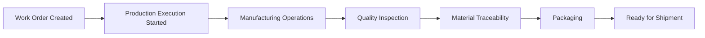

# 01 — Manufacturing Process

## Introduction

The Smart Manufacturing Intelligence Platform (SMIP) V2 models the lifecycle of a manufactured product from production planning to final packaging.

Rather than representing isolated manufacturing events, the platform captures the complete production workflow as a sequence of business processes. Each process generates operational events that become part of the analytical data model.

This event-driven approach enables complete traceability throughout the manufacturing lifecycle while supporting operational reporting and business intelligence.

---

# Purpose

The objective of this document is to describe the manufacturing workflow represented within SMIP V2.

Understanding the manufacturing process provides the business context required to interpret the event model, Dimension tables, Fact tables, and Key Performance Indicators (KPIs) developed throughout the platform.

---

# Manufacturing Overview

SMIP V2 simulates the production of **Gas Insulated Switchgear (GIS)** equipment.

The manufacturing workflow follows a linear sequence of business activities beginning with production planning and ending with shipment preparation.

Each business activity generates one or more manufacturing events that are processed through the Lakehouse architecture.

---

# Manufacturing Process Flow



The completion of each stage generates manufacturing events that become analytical records within the platform.

---

# Manufacturing Stages

## 1. Work Order Creation

Production begins with the creation of a manufacturing work order.

The work order defines:

- Product to manufacture
- Planned production quantity
- Priority
- Planned production schedule
- SAP order number

This stage establishes the business context for all subsequent manufacturing activities.

Generated Event:

```
WORK_ORDER_CREATED
```

---

## 2. Production Execution

Once production is scheduled, manufacturing execution begins.

The execution process assigns:

- Execution ID
- Production line
- Planned shift
- Manufacturing status

Each execution represents one production instance for a work order.

Generated Event:

```
EXECUTION_STARTED
```

---

## 3. Manufacturing Operations

During production, multiple manufacturing operations are performed on each product.

Typical information includes:

- Machine used
- Operator
- Tool
- Operation number
- Target force
- Actual force
- Cycle time
- Displacement
- Operation result

Each completed operation generates an event.

Generated Event:

```
OPERATION_COMPLETED
```

This stage produces the largest volume of manufacturing events and provides detailed operational measurements for process monitoring.

---

## 4. Quality Inspection

Following manufacturing operations, quality inspections verify that the product satisfies engineering requirements.

Quality tests record:

- Test program
- Test result
- Measured value
- Target value
- Measurement unit
- Inspection outcome

Generated Event:

```
QUALITY_COMPLETED
```

Quality data supports product compliance, process capability analysis, and manufacturing quality reporting.

---

## 5. Material Traceability

Manufacturing requires complete traceability of materials used during production.

Material scan events capture:

- Material number
- Batch number
- Supplier
- Scan identifier
- Scan status

Generated Event:

```
MATERIAL_SCANNED
```

Material traceability enables production genealogy and supplier analysis while supporting regulatory compliance.

---

## 6. Packaging

After successful production and inspection, finished products enter the packaging process.

Packaging records include:

- Package identifier
- Package dimensions
- Package weight
- Package type
- Packaging status

Generated Event:

```
PACKAGING_COMPLETED
```

Packaging represents the final manufacturing stage before shipment.

---

# Manufacturing Event Timeline

```text
WORK_ORDER_CREATED

↓

EXECUTION_STARTED

↓

OPERATION_COMPLETED

↓

QUALITY_COMPLETED

↓

MATERIAL_SCANNED

↓

PACKAGING_COMPLETED
```

This sequence represents the complete manufacturing lifecycle modeled by SMIP V2.

---

# Business Entities

Several business entities participate throughout the manufacturing process.

| Entity | Description |
|----------|-------------|
| Product | Manufactured equipment |
| Work Order | Production request |
| Execution | Manufacturing instance |
| Machine | Production equipment |
| Operator | Manufacturing personnel |
| Material | Components consumed during production |
| Package | Final packaged product |

These entities later become Dimension tables within the analytical model.

---

# Manufacturing Relationships

The manufacturing workflow establishes relationships between business entities.

```text
Work Order

↓

Execution

↓

Operations

↓

Quality

↓

Materials

↓

Packaging
```

These relationships are preserved throughout the Medallion Architecture and ultimately become the foundation of the Star Schema.

---

# Manufacturing Events

Each manufacturing activity produces a standardized event.

| Business Activity | Event Type |
|-------------------|------------|
| Work Order Creation | WORK_ORDER_CREATED |
| Production Start | EXECUTION_STARTED |
| Manufacturing Operation | OPERATION_COMPLETED |
| Quality Inspection | QUALITY_COMPLETED |
| Material Scan | MATERIAL_SCANNED |
| Packaging | PACKAGING_COMPLETED |

Every event follows a common structure consisting of metadata and a business-specific payload.

---

# Traceability

One of the primary goals of the manufacturing process model is complete product traceability.

Each manufactured product can be tracked throughout its lifecycle using business identifiers such as:

- Work Order ID
- Execution ID
- Product Code
- Serial Number
- Machine ID
- Material Number
- Package ID

These identifiers maintain relationships between manufacturing stages and enable complete end-to-end production history.

---

# Business Value

Modeling the manufacturing process provides several advantages.

- Complete production traceability
- Consistent business relationships
- Reliable manufacturing analytics
- Improved operational visibility
- Standardized event generation
- Reusable analytical datasets

This business representation allows engineering events to be transformed into meaningful operational insights.

---

# Summary

The manufacturing process modeled within SMIP V2 represents the complete lifecycle of a product, from work order creation through production, quality inspection, material traceability, and packaging.

Each business process generates standardized manufacturing events that are progressively transformed into Dimensions, Facts, and Gold KPI tables within the Lakehouse architecture.

Understanding this workflow provides the business foundation required for the analytical data model described throughout the remainder of this chapter.

---

# Next Section

## 02 — Event Model

The next document explains how each manufacturing activity is represented as a standardized event and describes the event-driven architecture that powers the Smart Manufacturing Intelligence Platform.