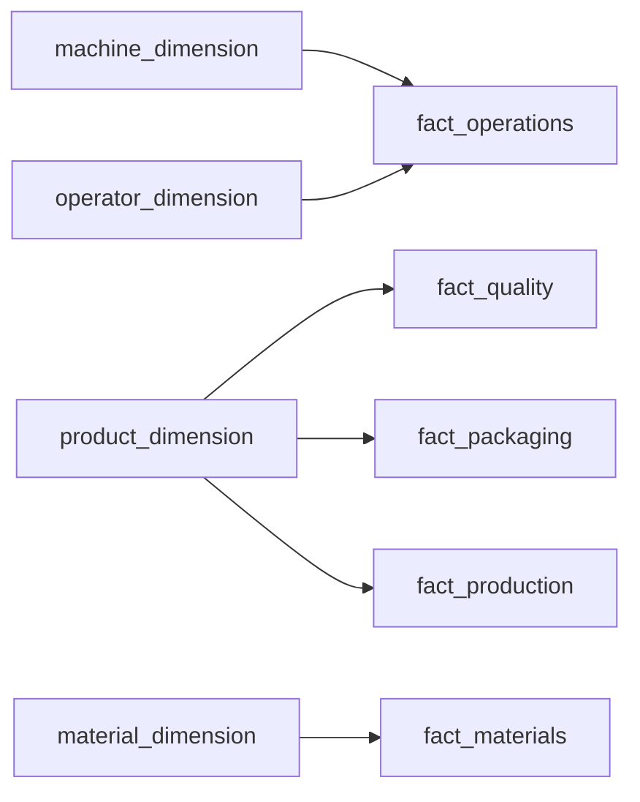
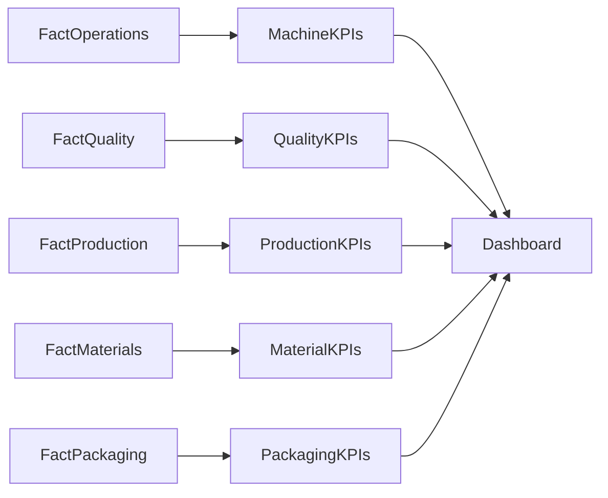

# 03 — Star Schema

## Introduction

The Smart Manufacturing Intelligence Platform (SMIP) V2 organizes manufacturing data using a **Star Schema**, a dimensional modeling technique widely adopted in enterprise data warehouses and business intelligence platforms.

Rather than querying raw manufacturing events directly, the platform separates descriptive business entities from measurable manufacturing activities.

This approach simplifies analytical queries, improves performance, and creates a reusable business model for manufacturing reporting.

The Star Schema implemented in SMIP V2 forms the analytical foundation of the Gold KPI layer and the Databricks SQL Dashboard.

---

# Purpose

The objective of the Star Schema is to organize manufacturing data into a structure optimized for analytics.

The model provides:

- Simplified SQL queries
- High-performance aggregations
- Reusable business entities
- Consistent manufacturing reporting
- Reduced data redundancy
- Clear business relationships

---

# Analytical Model

The analytical model consists of two categories of tables:

| Category | Purpose |
|-----------|----------|
| Dimension Tables | Describe manufacturing business entities |
| Fact Tables | Store measurable manufacturing activities |

Dimension tables provide context while Fact tables capture business events.

---

# SMIP V2 Star Schema



---

# Fact Tables

The Fact tables represent measurable manufacturing business processes.

## Fact Operations

Business Grain

> One completed manufacturing operation.

Primary Measures

- Target Force
- Actual Force
- Force Deviation
- Cycle Time
- Displacement

Business Purpose

Supports machine performance analysis, operator performance, production monitoring, and process optimization.

---

## Fact Quality

Business Grain

> One completed quality inspection.

Primary Measures

- Target Value
- Measured Value
- Test Result

Business Purpose

Supports quality assurance, inspection analysis, and product compliance reporting.

---

## Fact Materials

Business Grain

> One material scan.

Primary Measures

- Scan Count
- Material Traceability

Business Purpose

Supports supplier analysis, production genealogy, and inventory traceability.

---

## Fact Packaging

Business Grain

> One packaged product.

Primary Measures

- Package Weight
- Package Dimensions

Business Purpose

Supports packaging operations and shipment preparation.

---

## Fact Production

Business Grain

> One production execution.

Primary Measures

- Production Quantity

Business Purpose

Supports production monitoring, shift analysis, work order tracking, and manufacturing throughput.

---

# Dimension Tables

Dimensions describe manufacturing entities referenced by Fact tables.

---

## Machine Dimension

Represents manufacturing equipment.

Typical attributes include:

- Machine ID
- Machine Name
- Machine Type
- Station Code
- Station Type

Referenced by:

- Fact Operations

---

## Operator Dimension

Represents manufacturing personnel.

Typical attributes include:

- Operator ID
- Operator Name
- Skill Level

Referenced by:

- Fact Operations

---

## Product Dimension

Represents manufactured products.

Typical attributes include:

- Product Code
- Product Name
- Product Family
- Rated Voltage
- Routing Version

Referenced by:

- Fact Production
- Fact Quality
- Fact Packaging

---

## Material Dimension

Represents production materials.

Typical attributes include:

- Material Number
- Batch Number
- Supplier
- Material Type
- Material Status

Referenced by:

- Fact Materials

---

# Fact Relationships

Each Fact table models an independent manufacturing process.

```text
Work Order

↓

Execution

↓

Operations

↓

Quality

↓

Packaging

↓

Shipment
```

Although business processes are related, analytical calculations remain isolated within individual Fact tables.

---

# Business Keys

The analytical model uses business identifiers instead of surrogate keys.

Primary identifiers include:

| Business Key | Description |
|--------------|-------------|
| machine_id | Manufacturing equipment |
| operator_id | Factory operator |
| product_code | Manufactured product |
| material_number | Production material |
| execution_id | Manufacturing execution |
| work_order_id | Production order |
| serial_number | Product traceability |

These identifiers preserve business relationships across the platform.

---

# Gold Layer Integration

The Star Schema provides the source datasets for Gold KPI calculations.



Each KPI table aggregates one or more Fact tables into business-ready metrics.

---

# Advantages

The Star Schema provides several analytical benefits.

## Simplified Queries

Dimension tables eliminate repeated descriptive information.

---

## Improved Performance

Fact tables are optimized for aggregation and reporting.

---

## Business-Oriented

The model mirrors manufacturing processes rather than technical implementations.

---

## Reusable

Dimension tables support multiple Fact tables and analytical workloads.

---

## Scalable

Additional manufacturing processes can be incorporated by introducing new Fact or Dimension tables.

---

# Why a Star Schema?

The Star Schema was selected because it is the industry standard for analytical data warehouses.

Compared with normalized transactional models, it offers:

- Faster analytical queries
- Simpler SQL
- Better dashboard performance
- Lower query complexity
- Easier maintenance

These characteristics make it well suited for manufacturing intelligence platforms where analytical performance is prioritized over transactional updates.

---

# Relationship with the Medallion Architecture

The Star Schema is created after the Silver layer.

```text
Bronze

↓

Silver

↓

Dimension Tables

↓

Fact Tables

↓

Gold KPIs

↓

Dashboard
```

This separation ensures that business modeling remains independent from raw data ingestion and validation.

---

# Summary

The Star Schema implemented in SMIP V2 provides the analytical foundation of the manufacturing intelligence platform.

By organizing manufacturing information into Dimension tables and Fact tables, the platform enables scalable reporting, simplified analytics, and reusable business models that support executive dashboards and operational decision-making.

The dimensional model also establishes a clear separation between business entities and manufacturing activities, making the platform easier to maintain and extend.

---

# Next Section

## 04 — Dimension Tables

The next document describes each Dimension table in detail, including its business purpose, attributes, relationships, and role within the manufacturing analytical model.