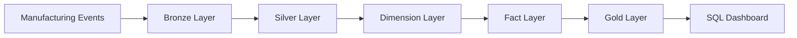
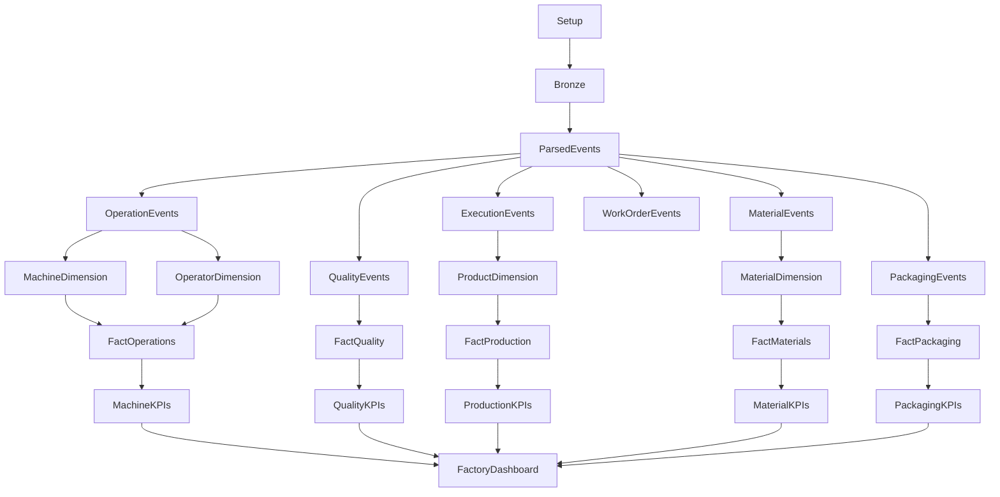

# 04 — Data Engineering

## Overview

The Smart Manufacturing Intelligence Platform (SMIP) V2 implements a modern cloud-native Data Engineering architecture using the Databricks Data Intelligence Platform.

The platform follows a layered engineering approach that progressively transforms raw manufacturing events into governed, analytics-ready datasets. Each processing stage performs a well-defined set of responsibilities while remaining independent from downstream analytical logic.

This chapter documents the complete implementation of the data pipeline, beginning with raw event ingestion and ending with business-ready KPI tables used by executive dashboards.

Rather than describing only the notebooks, this chapter explains the engineering principles, architectural decisions, and implementation patterns that underpin the Smart Manufacturing Intelligence Platform.

---

# Purpose

The objective of this chapter is to explain how manufacturing data is engineered throughout the Lakehouse.

Topics include:

- Raw data ingestion
- Event parsing
- Data validation
- Manufacturing event processing
- Dimension construction
- Fact table modeling
- KPI generation
- Pipeline orchestration
- Data quality management

Together, these processes form the end-to-end manufacturing analytics pipeline implemented in SMIP V2.

---

# Engineering Workflow

The engineering workflow follows the Medallion Architecture while introducing dedicated analytical modeling layers.



Each layer increases data quality, business value, and analytical readiness.

---

# Data Engineering Philosophy

The implementation of SMIP V2 follows several engineering principles designed to produce a scalable and maintainable manufacturing analytics platform.

## Layered Processing

Each processing layer has a single responsibility.

Rather than performing multiple transformations within a single notebook, every stage focuses on one logical engineering task before passing standardized datasets to the next layer.

---

## Modular Design

Each notebook performs one well-defined function.

For example:

- Bronze notebooks ingest raw events.
- Silver notebooks parse and validate events.
- Dimension notebooks construct business entities.
- Fact notebooks build analytical datasets.
- Gold notebooks calculate manufacturing KPIs.

This modular design improves readability, testing, and long-term maintainability.

---

## Declarative Pipelines

SMIP V2 uses **Lakeflow Declarative Pipelines** to orchestrate dataset creation.

Instead of manually scheduling notebook execution, dependencies are inferred directly from dataset relationships.

This approach simplifies pipeline management while ensuring that datasets are refreshed in the correct order.

---

## Incremental Processing

Each pipeline stage processes only newly available manufacturing events.

Incremental processing minimizes computational overhead while enabling scalable streaming ingestion.

---

## Data Quality by Design

Data quality is enforced throughout the pipeline rather than being treated as a final validation step.

Validation rules are applied as early as possible to prevent invalid records from propagating into analytical datasets.

Examples include:

- Required business identifiers
- Positive numerical measurements
- Valid manufacturing statuses
- Schema validation
- Business rule enforcement

---

# Engineering Layers

The Smart Manufacturing Intelligence Platform consists of six engineering layers.

| Layer | Purpose | Primary Output |
|--------|----------|----------------|
| Bronze | Raw event ingestion | Raw Delta tables |
| Silver | Event parsing and validation | Manufacturing event tables |
| Dimensions | Business entity modeling | Dimension tables |
| Facts | Manufacturing analytics | Fact tables |
| Gold | KPI calculation | Analytical datasets |
| SQL | Business Intelligence | Executive dashboards |

Each layer is implemented independently while maintaining clearly defined dependencies.

---

# Pipeline Overview

The complete engineering pipeline is illustrated below.



This dependency graph mirrors the implementation within the Databricks repository.

---

# Engineering Components

The platform is organized into several logical engineering modules.

| Module | Responsibility |
|---------|----------------|
| Bronze | Ingest raw manufacturing events |
| Silver | Parse, validate, and standardize manufacturing events |
| Dimensions | Create reusable business entities |
| Facts | Build analytical business processes |
| Gold | Calculate manufacturing KPIs |
| SQL | Deliver executive dashboards |

Each module produces reusable datasets that become inputs for downstream transformations.

---

# Data Flow

Manufacturing events follow a predictable transformation path.

```text
Manufacturing JSON Events

↓

Unity Catalog Volume

↓

Bronze Layer

↓

Parsed Events

↓

Silver Event Tables

↓

Dimension Tables

↓

Fact Tables

↓

Gold KPI Tables

↓

Databricks SQL Dashboard
```

This progression ensures that every analytical dataset can be traced back to its original manufacturing event.

---

# Chapter Organization

This chapter is divided into the following documents.

| Document | Description |
|----------|-------------|
| **01_bronze_layer.md** | Raw manufacturing event ingestion |
| **02_silver_layer.md** | Event parsing, validation, and standardization |
| **03_dimension_layer.md** | Construction of analytical Dimension tables |
| **04_fact_layer.md** | Creation of manufacturing Fact tables |
| **05_gold_layer.md** | KPI calculation and business metrics |
| **06_data_quality.md** | Data validation, expectations, and quality enforcement |
| **07_pipeline_execution.md** | Pipeline execution flow and dependency management |

Together, these documents describe the complete engineering implementation of SMIP V2.

---

# Expected Outcomes

After completing this chapter, readers will understand:

- How manufacturing events enter the platform.
- How data quality is enforced.
- How business entities are modeled.
- How analytical Fact tables are constructed.
- How manufacturing KPIs are calculated.
- How Lakeflow Declarative Pipelines orchestrate execution.
- How the complete manufacturing analytics pipeline operates.

---

# Summary

The Data Engineering layer transforms raw manufacturing events into governed, reusable, and analytics-ready datasets through a structured sequence of engineering stages.

By combining Medallion Architecture, Lakeflow Declarative Pipelines, Delta Lake, and dimensional modeling, SMIP V2 demonstrates a modern manufacturing data platform that is scalable, maintainable, and aligned with enterprise Data Engineering best practices.

---

# Next Section

## 01 — Bronze Layer

The next document explains how raw manufacturing events are ingested from Unity Catalog Volumes into the Bronze layer, establishing the immutable foundation of the Smart Manufacturing Intelligence Platform.