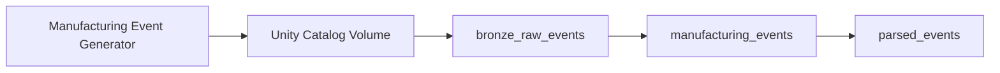
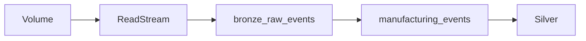

# 01 — Bronze Layer

## Introduction

The Bronze layer is the entry point of the Smart Manufacturing Intelligence Platform (SMIP) V2.

Its primary responsibility is to ingest raw manufacturing events into the Lakehouse while preserving the original data exactly as it was generated.

No business logic, validation, or transformations are performed at this stage. The objective is to establish a reliable, immutable foundation for downstream processing.

By maintaining an unmodified copy of every manufacturing event, the Bronze layer provides complete traceability, reproducibility, and recoverability throughout the data engineering pipeline.

---

# Purpose

The Bronze layer serves as the raw ingestion layer of the Lakehouse.

Its objectives are to:

- Ingest manufacturing events from the landing zone
- Preserve the original JSON payload
- Maintain an immutable historical record
- Support replay and debugging
- Provide the input for the Silver layer

The Bronze layer intentionally avoids business-specific transformations.

---

# Bronze Layer Architecture



---

# Data Source

Manufacturing events are generated externally and stored as JSON documents.

The events are written into a Unity Catalog Volume before being processed by Lakeflow Declarative Pipelines.

```
Unity Catalog Volume

/Volumes/smip_v2/manufacturing/raw_data/
```

Each file contains one manufacturing event represented as a JSON document.

---

# Bronze Notebooks

The Bronze layer consists of two notebooks.

| Notebook | Output Table |
|-----------|--------------|
| `01_bronze_raw_events.py` | `bronze_raw_events` |
| `02_manufacturing_events.py` | `manufacturing_events` |

Each notebook performs one clearly defined engineering task.

---

# Bronze Raw Events

## Purpose

The first notebook ingests raw files directly from the Unity Catalog Volume.

The ingestion process performs no parsing or validation.

Each record represents one raw manufacturing event.

---

## Input

```
Unity Catalog Volume
```

---

## Output

```
bronze_raw_events
```

---

## Processing Logic

The notebook:

- Reads raw files using Structured Streaming
- Preserves every event
- Stores each record as raw text
- Maintains ingestion order

The resulting table serves as the immutable source of truth for the platform.

---

# Manufacturing Events

## Purpose

The second Bronze notebook standardizes the ingestion format before passing events to the Silver layer.

Rather than parsing JSON, it simply exposes the raw event payload as a single string column.

---

## Input

```
bronze_raw_events
```

---

## Output

```
manufacturing_events
```

---

## Processing Logic

The notebook:

- Reads the Bronze stream
- Extracts the raw event payload
- Renames the column to `raw_event`
- Applies basic null validation
- Publishes a standardized Bronze table

No business transformations occur at this stage.

---

# Bronze Data Model

The Bronze layer intentionally maintains a minimal schema.

```text
manufacturing_events

├── raw_event
```

The complete manufacturing event remains serialized as JSON.

Parsing is deferred to the Silver layer.

---

# Streaming Architecture

The Bronze layer is implemented using **Lakeflow Declarative Pipelines** and **Spark Structured Streaming**.



Streaming ingestion provides continuous processing of newly arrived manufacturing events.

---

# Why Store Raw Data?

Preserving the original event stream offers several advantages.

## Data Lineage

Every analytical record can be traced back to its original JSON event.

---

## Recovery

If downstream processing fails, the pipeline can be replayed from the raw events.

---

## Debugging

Original payloads remain available for troubleshooting parsing or business logic issues.

---

## Auditability

The immutable Bronze layer provides a complete audit trail of manufacturing activity.

---

# Bronze Layer Characteristics

| Characteristic | Description |
|----------------|-------------|
| Processing | Streaming |
| Storage | Delta Lake |
| Input | JSON Events |
| Output | Raw Delta Tables |
| Transformations | None |
| Validation | Basic null checks |
| Update Strategy | Append-only |

---

# Relationship with the Silver Layer

The Bronze layer provides the input for event parsing.

```text
Unity Catalog Volume

↓

bronze_raw_events

↓

manufacturing_events

↓

parsed_events
```

The Silver layer is responsible for interpreting the JSON payload and constructing structured manufacturing datasets.

---

# Engineering Decisions

Several architectural decisions influenced the Bronze implementation.

## Immutable Storage

Raw events are never modified after ingestion.

---

## Deferred Parsing

JSON parsing is intentionally postponed until the Silver layer.

This separates ingestion from business processing.

---

## Minimal Schema

Only the raw event payload is stored.

This simplifies ingestion and avoids coupling with downstream schemas.

---

## Streaming First

The pipeline uses Structured Streaming from the beginning to support continuous event ingestion.

---

# Benefits

The Bronze layer provides:

- Reliable ingestion
- Immutable event storage
- Complete traceability
- Pipeline replay capability
- Simplified debugging
- Scalable streaming architecture

---

# Summary

The Bronze layer establishes the immutable foundation of the Smart Manufacturing Intelligence Platform.

By ingesting raw manufacturing events without applying business transformations, it preserves the original event stream while providing a reliable source for downstream processing.

This separation of concerns ensures that ingestion remains simple, robust, and scalable, while allowing the Silver layer to focus exclusively on parsing, validation, and business standardization.

---

# Next Section

## 02 — Silver Layer

The next document explains how raw manufacturing events are parsed, validated, classified, and transformed into structured Silver event tables that form the basis of the analytical model.