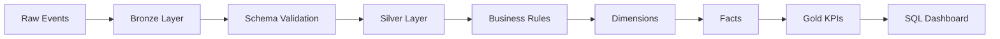
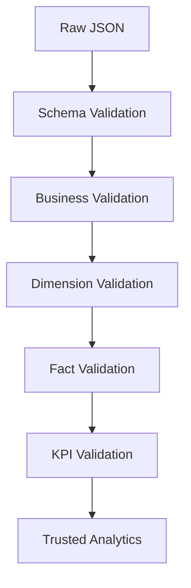

# 06 — Data Quality

## Introduction

Data quality is a fundamental requirement for any analytical platform.

Within the Smart Manufacturing Intelligence Platform (SMIP) V2, data quality is enforced throughout the entire Lakehouse pipeline rather than being treated as a final validation step.

Each processing layer contributes to improving data reliability by applying validation rules, schema enforcement, business constraints, and standardized transformations.

This layered approach ensures that only trusted and consistent manufacturing data reaches the Gold KPI layer and executive dashboards.

---

# Purpose

The objectives of the data quality strategy are to:

- Prevent invalid records from entering analytical datasets
- Enforce consistent schemas
- Validate business rules
- Improve data reliability
- Maintain trustworthy KPIs
- Simplify downstream processing

Rather than correcting incorrect data, the pipeline identifies and removes invalid records as early as possible.

---

# Data Quality Architecture



Data quality improves progressively as manufacturing events move through the pipeline.

---

# Quality Strategy

SMIP V2 follows a multi-layer validation strategy.

| Layer | Quality Responsibility |
|---------|-----------------------|
| Bronze | Raw event preservation |
| Silver | Schema validation and event parsing |
| Dimensions | Entity standardization |
| Facts | Business relationship validation |
| Gold | KPI consistency |

Each layer contributes independently to overall data quality.

---

# Bronze Layer Validation

The Bronze layer performs only minimal validation.

Typical checks include:

- Event payload exists
- File successfully ingested
- Raw event is not null

Example expectation:

```python
@dp.expect_or_drop(
    "valid_message",
    "value IS NOT NULL"
)
```

The Bronze layer intentionally avoids business validation.

---

# Silver Layer Validation

The Silver layer performs the majority of validation.

Typical checks include:

- Valid JSON structure
- Required metadata
- Event timestamp
- Event type
- Payload schema
- Supported data types

Example:

```python
@dp.expect_or_drop(
    "valid_event_timestamp",
    "event_timestamp IS NOT NULL"
)
```

This ensures only valid manufacturing events proceed through the pipeline.

---

# Business Rule Validation

In addition to schema validation, the Silver layer enforces business rules.

Examples include:

- Positive cycle time
- Positive force measurements
- Valid production quantity
- Existing business identifiers
- Supported event types

Example business rules:

```text
cycle_time_sec > 0

actual_force_kn >= 0

quantity > 0
```

These validations improve analytical reliability.

---

# Dimension Quality

Dimension tables ensure consistent business entities.

Quality activities include:

- Removing duplicate entities
- Standardizing business attributes
- Validating business keys
- Maintaining one record per entity

For example:

```
machine_id

↓

One Machine Record
```

This prevents duplicated descriptive information.

---

# Fact Quality

The Fact layer validates analytical relationships.

Examples include:

- Valid Machine IDs
- Valid Product Codes
- Valid Operator IDs
- Valid Material Numbers

Business joins ensure every Fact references valid Dimension data.

---

# Gold Layer Validation

The Gold layer validates aggregated business metrics.

Examples include:

- KPI completeness
- Aggregation consistency
- Business metric accuracy
- Dashboard readiness

Only trusted analytical datasets are exposed to business users.

---

# Lakeflow Expectations

SMIP V2 uses **Lakeflow Declarative Pipeline Expectations** to automate data quality enforcement.

Current implementation includes:

```python
@dp.expect_or_drop(
    "valid_message",
    "value IS NOT NULL"
)
```

```python
@dp.expect_or_drop(
    "valid_payload",
    "raw_event IS NOT NULL"
)
```

```python
@dp.expect_or_drop(
    "valid_event_timestamp",
    "event_timestamp IS NOT NULL"
)
```

Records that fail these expectations are automatically excluded from downstream processing.

---

# Schema Enforcement

Strong schemas are defined for every manufacturing event.

Example event structure:

```text
event_id

event_timestamp

event_type

plant_code

execution_id

payload
```

Using explicit schemas provides:

- Type safety
- Predictable transformations
- Reliable joins
- Consistent analytical datasets

---

# Data Quality Across the Pipeline



Each stage progressively improves the quality of manufacturing data.

---

# Current Validation Scope

The current implementation validates:

- JSON structure
- Required fields
- Event timestamps
- Business identifiers
- Data types
- Duplicate business entities

These validations ensure that downstream analytical datasets remain reliable.

---

# Current Simulation Scope

The current manufacturing event generator produces **successful production scenarios**.

Examples include:

| Dataset | Current Status |
|----------|----------------|
| Quality | PASS |
| Packaging | READY_FOR_SHIPMENT |
| Material Scan | Successful |
| Operations | Completed |

As a result:

- Quality pass rate is currently **100%**
- Packaging readiness is **100%**
- Material scans are **successful**

The architecture is intentionally designed to support future manufacturing scenarios such as:

- Failed inspections
- Machine downtime
- Rework operations
- Material shortages
- Packaging failures
- Scrap production

These scenarios can be introduced by extending the manufacturing event generator without modifying the Lakehouse architecture.

---

# Engineering Principles

The data quality strategy follows several principles.

## Validate Early

Errors are detected as soon as possible.

---

## Preserve Raw Data

Original manufacturing events remain unchanged in the Bronze layer.

---

## Progressive Validation

Each processing layer contributes additional validation.

---

## Automated Quality

Validation rules are executed automatically through Lakeflow Declarative Pipelines.

---

## Trusted Analytics

Only validated data reaches the Gold KPI layer.

---

# Benefits

The implemented quality strategy provides:

- Reliable analytics
- Consistent business metrics
- Reduced data errors
- Automated validation
- Simplified troubleshooting
- Trusted executive dashboards

---

# Summary

Data quality is integrated throughout every stage of the Smart Manufacturing Intelligence Platform.

By combining schema enforcement, Lakeflow Expectations, business rule validation, dimensional consistency, and KPI verification, SMIP V2 delivers trusted analytical datasets suitable for operational reporting and executive decision-making.

This layered quality strategy ensures that manufacturing insights are built upon reliable, governed, and consistent data.

---

# Next Section

## 07 — Pipeline Execution

The final document in this chapter explains how Lakeflow Declarative Pipelines orchestrate the complete manufacturing analytics workflow, from raw event ingestion through KPI generation and dashboard publication.