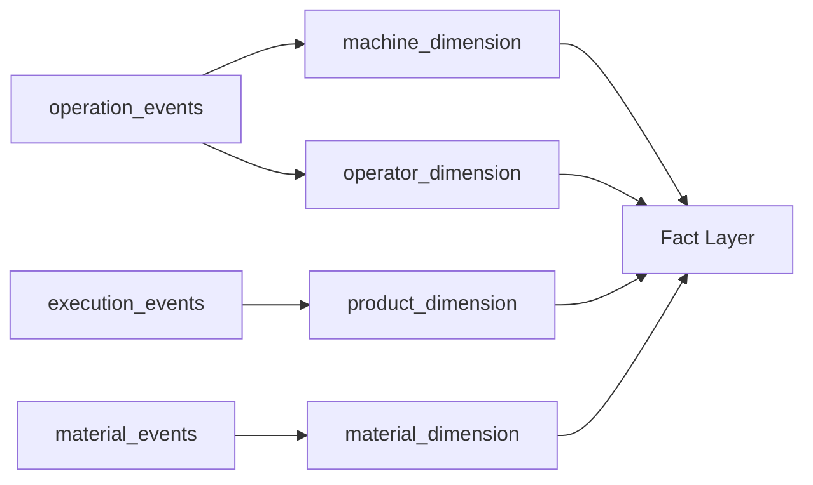
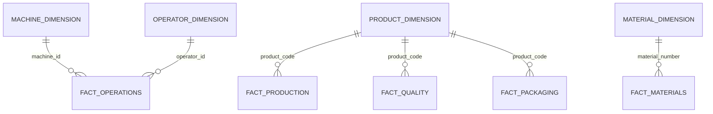

# 03 — Dimension Layer

## Introduction

The Dimension layer transforms validated manufacturing events into reusable business entities that provide descriptive context for analytical processing.

Unlike the Silver layer, which organizes manufacturing activities into event-specific datasets, the Dimension layer extracts and standardizes the business entities involved in those activities. These entities are stored once and referenced by multiple Fact tables, reducing data redundancy and improving query performance.

Within SMIP V2, the Dimension layer represents the transition from event-driven data processing to dimensional modeling.

---

# Purpose

The objectives of the Dimension layer are to:

- Extract business entities from Silver events
- Remove duplicated descriptive information
- Create reusable analytical dimensions
- Standardize business attributes
- Support the Star Schema
- Improve reporting performance

Each Dimension table represents a core entity within the manufacturing process.

---

# Dimension Layer Architecture



---

# Dimension Notebooks

The Dimension layer consists of four notebooks.

| Notebook | Output Table |
|-----------|--------------|
| `01_machine_dimension.py` | `machine_dimension` |
| `02_operator_dimension.py` | `operator_dimension` |
| `03_product_dimension.py` | `product_dimension` |
| `04_material_dimension.py` | `material_dimension` |

Each notebook creates a single business entity.

---

# Dimension Tables

The platform contains four reusable Dimension tables.

| Dimension | Source | Business Entity |
|------------|--------|-----------------|
| machine_dimension | operation_events | Manufacturing Machines |
| operator_dimension | operation_events | Factory Operators |
| product_dimension | execution_events | Manufactured Products |
| material_dimension | material_events | Production Materials |

These tables provide the descriptive context required by the analytical Fact layer.

---

# Machine Dimension

## Purpose

The Machine Dimension stores information about manufacturing equipment involved in production operations.

Each machine is represented only once, regardless of the number of operations it performs.

---

### Source

```
operation_events
```

---

### Business Key

```
machine_id
```

---

### Typical Attributes

- machine_id
- machine_name
- machine_type
- hall_id
- line_id
- station_code
- station_type

---

### Used By

- fact_operations

---

# Operator Dimension

## Purpose

The Operator Dimension stores information about manufacturing personnel.

It enables operational reporting and workforce analysis without duplicating operator information across every manufacturing operation.

---

### Source

```
operation_events
```

---

### Business Key

```
operator_id
```

---

### Typical Attributes

- operator_id
- operator_name
- skill_level

---

### Used By

- fact_operations

---

# Product Dimension

## Purpose

The Product Dimension provides standardized information about manufactured products.

Unlike machines or operators, products participate in multiple business processes including production, quality inspection, and packaging.

---

### Source

```
execution_events
```

---

### Business Key

```
product_code
```

---

### Typical Attributes

- product_code
- product_name
- family
- rated_voltage_kv
- routing_version

---

### Used By

- fact_production
- fact_quality
- fact_packaging

---

# Material Dimension

## Purpose

The Material Dimension stores reference information for production materials consumed during manufacturing.

It supports material traceability and supplier analysis.

---

### Source

```
material_events
```

---

### Business Key

```
material_number
```

---

### Typical Attributes

- material_number
- batch_number
- supplier

---

### Used By

- fact_materials

---

# Dimension Construction

Each Dimension follows the same engineering pattern.

```text
Silver Event Table

↓

Select Business Attributes

↓

Remove Duplicate Records

↓

Create Dimension Table
```

This process ensures that every business entity is stored once and reused throughout the analytical model.

---

# Deduplication Strategy

Dimension tables contain one record per business entity.

The pipeline removes duplicate entities using their natural business key.

Examples include:

| Dimension | Business Key |
|------------|--------------|
| Machine | machine_id |
| Operator | operator_id |
| Product | product_code |
| Material | material_number |

This guarantees consistent reference data across the platform.

---

# Relationship with Fact Tables

The Dimension layer enriches manufacturing events during Fact construction.



Each Fact references one or more Dimensions to provide descriptive business context.

---

# Slowly Changing Dimensions

The current implementation maintains the latest version of each business entity.

Examples include:

- Current machine information
- Current operator details
- Current product definition
- Current supplier information

Future versions of SMIP may implement **Slowly Changing Dimensions (SCD Type 2)** to preserve historical attribute changes while maintaining complete business history.

---

# Engineering Principles

The Dimension layer follows several engineering principles.

## Reusability

Dimension tables are shared across multiple analytical processes.

---

## Business-Oriented

Dimensions describe real-world manufacturing entities rather than technical objects.

---

## Minimal Redundancy

Descriptive information is stored once and referenced where needed.

---

## Consistency

Common business entities use standardized attributes across the platform.

---

## Scalability

Additional Dimensions can be introduced without modifying existing Fact tables.

---

# Benefits

The Dimension layer provides:

- Reusable business entities
- Simplified analytical joins
- Reduced data duplication
- Faster dashboard queries
- Standardized business terminology
- Improved maintainability

---

# Summary

The Dimension layer transforms validated manufacturing events into reusable business entities that provide the descriptive context required for analytical reporting.

By organizing machines, operators, products, and materials into dedicated Dimension tables, SMIP V2 establishes a clean dimensional model that improves query performance, reduces redundancy, and supports the analytical Fact layer.

---

# Next Section

## 04 — Fact Layer

The next document explains how manufacturing events and Dimension tables are combined to create the analytical Fact tables that power KPI calculations and executive dashboards.