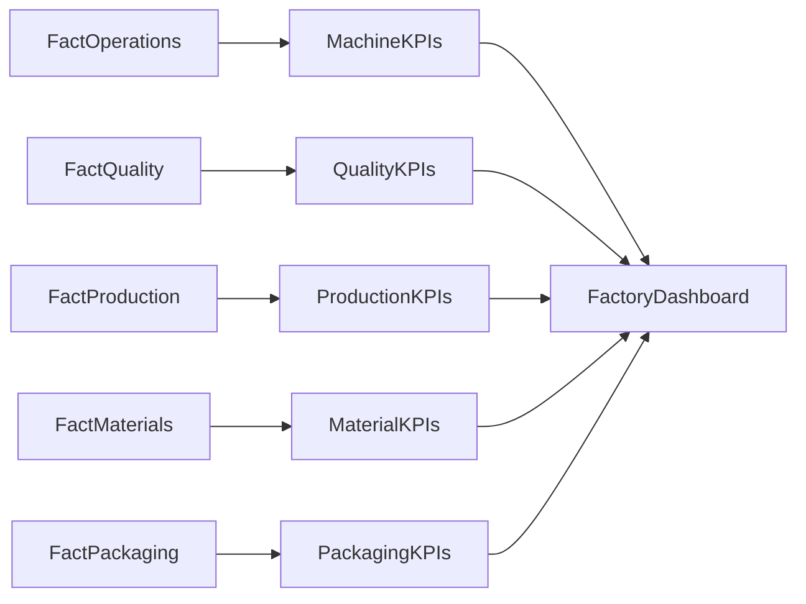

# 04 — Fact Layer

## Introduction

The Fact layer transforms validated manufacturing events into analytical datasets by combining transactional event data with descriptive business entities from the Dimension layer.

Within the Smart Manufacturing Intelligence Platform (SMIP) V2, each Fact table represents a measurable manufacturing process and serves as the foundation for KPI calculations and business reporting.

Unlike the Silver layer, which stores individual manufacturing events, the Fact layer enriches those events with business context, producing datasets optimized for analytical workloads.

---

# Purpose

The objectives of the Fact layer are to:

- Model measurable manufacturing processes
- Enrich events with business context
- Build analytical datasets
- Support the Star Schema
- Provide input for KPI calculations
- Enable executive reporting

The Fact layer represents the transition from operational events to analytical business data.

---

# Fact Layer Architecture

```mermaid
flowchart TD

OperationEvents["operation_events"]

MachineDimension["machine_dimension"]

OperatorDimension["operator_dimension"]

QualityEvents["quality_events"]

MaterialEvents["material_events"]

PackagingEvents["packaging_events"]

ExecutionEvents["execution_events"]

ProductDimension["product_dimension"]

MaterialDimension["material_dimension"]

OperationEvents --> FactOperations["fact_operations"]

MachineDimension --> FactOperations

OperatorDimension --> FactOperations

QualityEvents --> FactQuality["fact_quality"]

ProductDimension --> FactQuality

MaterialEvents --> FactMaterials["fact_materials"]

MaterialDimension --> FactMaterials

PackagingEvents --> FactPackaging["fact_packaging"]

ProductDimension --> FactPackaging

ExecutionEvents --> FactProduction["fact_production"]

ProductDimension --> FactProduction
```



---

# Fact Notebooks

Each analytical Fact table is created by an independent notebook.

| Notebook | Output Table |
|-----------|--------------|
| `01_fact_operations.py` | `fact_operations` |
| `02_fact_quality.py` | `fact_quality` |
| `03_fact_materials.py` | `fact_materials` |
| `04_fact_packaging.py` | `fact_packaging` |
| `05_fact_production.py` | `fact_production` |

Each notebook performs a dedicated analytical transformation.

---

# Fact Construction Pattern

Every Fact follows the same engineering workflow.

```text
Silver Event Table

        +

Relevant Dimension Table(s)

        ↓

Business Join

        ↓

Business Attribute Enrichment

        ↓

Fact Table
```

This standardized pattern simplifies maintenance and ensures consistency across the analytical model.

---

# Fact Operations

## Business Purpose

Represents completed manufacturing operations performed on the production floor.

---

## Source Dataset

```
operation_events
```

---

## Joined Dimensions

- machine_dimension
- operator_dimension

---

## Join Keys

| Dimension | Business Key |
|-----------|--------------|
| Machine | machine_id |
| Operator | operator_id |

---

## Output

```
fact_operations
```

---

## Measures

- Target Force (kN)
- Actual Force (kN)
- Force Deviation (kN)
- Cycle Time (sec)
- Displacement (mm)

---

## Business Questions

- Which machines perform the most operations?
- What is the average cycle time?
- Which operators achieve the shortest processing time?
- What is the average force deviation?

---

# Fact Quality

## Business Purpose

Represents completed quality inspections.

---

## Source Dataset

```
quality_events
```

---

## Joined Dimensions

- product_dimension

---

## Join Key

```
product_code
```

---

## Output

```
fact_quality
```

---

## Measures

- Target Value
- Measured Value

---

## Business Questions

- Total inspections completed
- Pass rate
- Inspection volume by product
- Product quality performance

---

# Fact Materials

## Business Purpose

Represents material traceability during manufacturing.

---

## Source Dataset

```
material_events
```

---

## Joined Dimensions

- material_dimension

---

## Join Key

```
material_number
```

---

## Output

```
fact_materials
```

---

## Measures

This Fact primarily supports counting and traceability.

Derived metrics include:

- Material scans
- Supplier usage
- Batch utilization

---

## Business Questions

- Which suppliers provide the most materials?
- Which batches were consumed?
- How many material scans were recorded?

---

# Fact Packaging

## Business Purpose

Represents completed packaging operations.

---

## Source Dataset

```
packaging_events
```

---

## Joined Dimensions

- product_dimension

---

## Join Key

```
product_code
```

---

## Output

```
fact_packaging
```

---

## Measures

- Package Weight
- Package Length
- Package Width
- Package Height

---

## Business Questions

- Products ready for shipment
- Average package weight
- Packaging volume
- Packaging activity over time

---

# Fact Production

## Business Purpose

Represents manufacturing execution and production output.

---

## Source Dataset

```
execution_events
```

---

## Joined Dimensions

- product_dimension

---

## Join Key

```
product_code
```

---

## Output

```
fact_production
```

---

## Measures

- Production Quantity

---

## Business Questions

- Total production quantity
- Production by shift
- Production by work order
- Production by product family

---

# Engineering Workflow

The engineering process is identical for every Fact table.


---

# Join Strategy

The Fact layer enriches manufacturing events using natural business keys.

| Business Key | Used For |
|--------------|----------|
| machine_id | Machine enrichment |
| operator_id | Operator enrichment |
| product_code | Product enrichment |
| material_number | Material enrichment |

The joins provide descriptive context while preserving the original manufacturing measurements.

---

# Relationship with the Gold Layer

The Gold layer consumes Fact tables to calculate manufacturing KPIs.



---

# Engineering Principles

The Fact layer follows several design principles.

## Atomic Grain

Each record represents one measurable business event.

---

## Business Context

Dimension tables enrich Facts without duplicating descriptive information.

---

## Analytical Modeling

Facts are optimized for aggregation rather than transactional processing.

---

## Reusability

Fact tables support multiple KPI calculations and dashboards.

---

## Scalability

Additional manufacturing processes can be incorporated by introducing new Fact tables while preserving the existing architecture.

---

# Benefits

The Fact layer provides:

- Analytical business datasets
- Reusable manufacturing metrics
- Optimized reporting
- Simplified KPI calculations
- Scalable Star Schema implementation
- High-performance analytical queries

---

# Summary

The Fact layer transforms validated manufacturing events into enriched analytical datasets by combining operational measurements with descriptive business entities.

This layer forms the analytical core of the Smart Manufacturing Intelligence Platform, providing the trusted datasets required for KPI generation, executive dashboards, and manufacturing performance analysis.

By following a consistent engineering pattern across all Fact tables, SMIP V2 delivers a scalable, maintainable, and extensible analytical model aligned with enterprise Data Engineering best practices.

---

# Next Section

## 05 — Gold Layer

The next document explains how analytical Fact tables are aggregated into business-ready Key Performance Indicators (KPIs) and combined to power the executive manufacturing dashboard implemented in Databricks SQL.