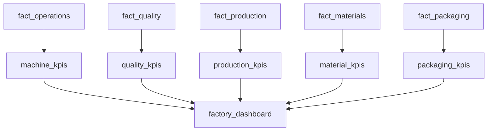

# 05 — Gold Layer

## Introduction

The Gold layer represents the final stage of the Smart Manufacturing Intelligence Platform (SMIP) V2 data engineering pipeline.

Its purpose is to transform detailed manufacturing data into business-ready Key Performance Indicators (KPIs) that support operational monitoring and executive decision-making.

Unlike the Fact layer, which stores detailed manufacturing activities, the Gold layer aggregates, summarizes, and calculates metrics optimized for dashboards, reporting, and analytical workloads.

The resulting datasets provide a simplified business view of factory performance while eliminating the need for complex calculations during report execution.

---

# Purpose

The objectives of the Gold layer are to:

- Aggregate manufacturing data
- Calculate business KPIs
- Simplify reporting
- Optimize dashboard performance
- Provide executive-level metrics
- Deliver reusable analytical datasets

The Gold layer transforms detailed manufacturing records into actionable business insights.

---

# Gold Layer Architecture



---

# Gold Notebooks

Each KPI dataset is generated by a dedicated notebook.

| Notebook | Output Table |
|-----------|--------------|
| `01_machine_kpis.py` | `machine_kpis` |
| `02_quality_kpis.py` | `quality_kpis` |
| `03_production_kpis.py` | `production_kpis` |
| `04_material_kpis.py` | `material_kpis` |
| `05_packaging_kpis.py` | `packaging_kpis` |
| `06_factory_dashboard.py` | `factory_dashboard` |

This modular organization keeps KPI calculations independent and easy to maintain.

---

# KPI Engineering Workflow

Every KPI follows the same engineering pattern.

```text
Fact Table

↓

Aggregation

↓

Business Calculations

↓

Gold KPI Table

↓

Dashboard
```

The Gold layer contains only analytical datasets.

No transactional processing occurs at this stage.

---

# Machine KPIs

## Source

```
fact_operations
```

---

## Business Purpose

Provides operational performance metrics for manufacturing equipment.

---

## Typical KPIs

- Operations completed
- Average cycle time
- Average press force
- Average force deviation
- Pass rate

---

## Business Value

Supports:

- Machine utilization analysis
- Performance monitoring
- Process optimization
- Operational efficiency

---

# Quality KPIs

## Source

```
fact_quality
```

---

## Business Purpose

Measures manufacturing quality performance.

---

## Typical KPIs

- Total inspections
- Pass rate
- Average measured value
- Average target value
- Measurement deviation

---

## Business Value

Supports:

- Product quality monitoring
- Inspection reporting
- Process capability analysis

---

# Production KPIs

## Source

```
fact_production
```

---

## Business Purpose

Measures production output.

---

## Typical KPIs

- Production quantity
- Executions completed
- Work orders processed
- Production by shift
- Production by product family

---

## Business Value

Supports:

- Production planning
- Throughput monitoring
- Capacity analysis

---

# Material KPIs

## Source

```
fact_materials
```

---

## Business Purpose

Provides visibility into material traceability.

---

## Typical KPIs

- Materials scanned
- Suppliers utilized
- Batches consumed
- Scan success rate

---

## Business Value

Supports:

- Supplier analysis
- Material genealogy
- Traceability reporting

---

# Packaging KPIs

## Source

```
fact_packaging
```

---

## Business Purpose

Measures packaging activity for completed products.

---

## Typical KPIs

- Products packaged
- Average package weight
- Packaging volume
- Shipment readiness

---

## Business Value

Supports:

- Logistics planning
- Packaging performance
- Shipment preparation

---

# Factory Dashboard

The final notebook combines all KPI tables into a unified executive dataset.

```
machine_kpis

+

quality_kpis

+

production_kpis

+

material_kpis

+

packaging_kpis

↓

factory_dashboard
```

The dashboard provides a consolidated view of manufacturing performance across the entire factory.

---

# Gold Layer Characteristics

| Characteristic | Description |
|----------------|-------------|
| Input | Fact Tables |
| Output | KPI Tables |
| Processing | Aggregation |
| Storage | Delta Lake |
| Consumers | Databricks SQL |
| Granularity | Business Metrics |

---

# Aggregation Strategy

The Gold layer aggregates detailed manufacturing data using business dimensions such as:

- Plant
- Hall
- Production Line
- Machine
- Product
- Shift
- Time

This reduces the volume of data queried by dashboards while improving performance.

---

# Relationship with Databricks SQL

The Gold layer is the primary data source for business intelligence.


Business users interact only with the Gold layer, ensuring that reporting is based on trusted, curated metrics.

---

# Engineering Principles

The Gold layer follows several design principles.

## Business-Oriented

KPIs are expressed using business terminology rather than technical fields.

---

## Aggregated

Only summarized analytical information is stored.

---

## Optimized

Precomputed metrics reduce dashboard execution time.

---

## Reusable

KPI tables can support multiple dashboards and analytical applications.

---

## Independent

Each KPI notebook can evolve independently without affecting the others.

---

# Benefits

The Gold layer provides:

- Executive reporting
- Optimized dashboard performance
- Reusable KPI datasets
- Simplified analytical queries
- Consistent business metrics
- High-performance reporting

---

# Summary

The Gold layer transforms analytical Fact tables into business-ready KPI datasets that power the Smart Manufacturing Intelligence Platform.

By precomputing manufacturing metrics and organizing them into dedicated KPI tables, the platform delivers reliable, scalable, and high-performance business intelligence while minimizing dashboard complexity.

The Gold layer represents the culmination of the Lakehouse pipeline, converting detailed manufacturing data into actionable operational insights.

---

# Next Section

## 06 — Data Quality

The next document explains how SMIP V2 ensures data reliability through schema validation, Lakeflow expectations, business rule enforcement, and quality monitoring across every stage of the data engineering pipeline.