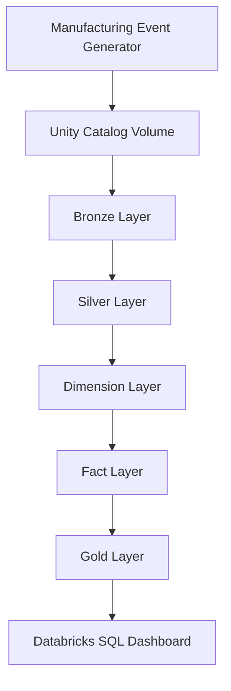
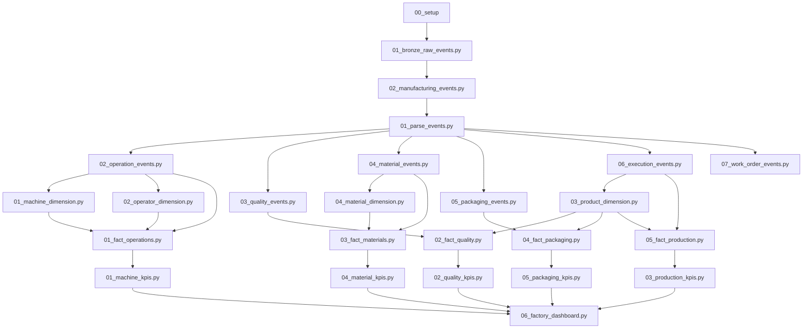
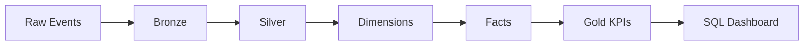

# 07 — Pipeline Execution

## Introduction

The Smart Manufacturing Intelligence Platform (SMIP) V2 implements a fully automated data engineering workflow using **Lakeflow Declarative Pipelines** on the Databricks Data Intelligence Platform.

Rather than manually executing notebooks or scheduling individual jobs, the platform defines datasets declaratively. Lakeflow automatically determines the execution order based on table dependencies, ensuring that each dataset is created only after its required upstream datasets are available.

This dependency-driven approach simplifies orchestration, improves maintainability, and enables scalable incremental processing of manufacturing events.

---

# Purpose

The objective of the pipeline execution process is to transform raw manufacturing events into trusted analytical datasets through a sequence of independent processing stages.

The execution pipeline performs:

- Raw event ingestion
- Event parsing
- Data validation
- Event classification
- Dimension construction
- Fact table creation
- KPI generation
- Dashboard publication

Each stage contributes a specific engineering responsibility while remaining independent from downstream business logic.

---

# End-to-End Pipeline



This represents the complete lifecycle of manufacturing data within SMIP V2.

---

# Pipeline Stages

The platform executes seven sequential engineering stages.

| Stage | Purpose | Output |
|--------|----------|---------|
| Event Generation | Generate manufacturing events | JSON files |
| Bronze | Raw event ingestion | Bronze tables |
| Silver | Parse and validate events | Silver tables |
| Dimensions | Business entities | Dimension tables |
| Facts | Analytical datasets | Fact tables |
| Gold | Manufacturing KPIs | KPI tables |
| SQL | Business Intelligence | Executive dashboard |

---

# Complete Notebook Execution Flow



---

# Dependency Resolution

Lakeflow Declarative Pipelines automatically resolves execution order using dataset dependencies.

For example:

```text
machine_kpis

↓

fact_operations

↓

operation_events

↓

parsed_events

↓

manufacturing_events

↓

bronze_raw_events
```

This dependency graph ensures that upstream datasets are processed before downstream transformations begin.

---

# Incremental Processing

The platform uses Structured Streaming and Delta Lake to process only newly arrived manufacturing events.

```text
New JSON Event

↓

Bronze

↓

Silver

↓

Dimensions

↓

Facts

↓

Gold
```

Previously processed data remains unchanged, reducing computational overhead and improving scalability.

---

# Pipeline Characteristics

| Characteristic | Implementation |
|----------------|----------------|
| Processing Mode | Streaming |
| Orchestration | Lakeflow Declarative Pipelines |
| Storage | Delta Lake |
| Governance | Unity Catalog |
| Programming Language | Python |
| Query Language | SQL |
| Execution Model | Dependency-based |

---

# Data Lineage

Every analytical dataset can be traced back to its original manufacturing event.



This lineage supports transparency, debugging, auditing, and regulatory compliance.

---

# Pipeline Monitoring

The execution pipeline can be monitored through Databricks.

Typical monitoring information includes:

- Pipeline status
- Execution history
- Table dependencies
- Processing duration
- Validation results
- Failed expectations
- Data freshness

These capabilities simplify operational support and troubleshooting.

---

# Error Handling

SMIP V2 isolates failures within individual processing stages.

Examples include:

- Invalid JSON events are rejected during parsing.
- Records failing quality expectations are excluded from downstream datasets.
- Dimension construction proceeds independently of unrelated business processes.
- KPI generation depends only on successfully created Fact tables.

This modular approach improves fault tolerance and simplifies recovery.

---

# Scalability

The pipeline has been designed for future expansion.

Additional manufacturing processes can be integrated by:

- Adding new event types
- Creating new Silver notebooks
- Building additional Dimension tables
- Creating new Fact tables
- Publishing new KPI datasets

Existing pipeline stages remain unchanged.

---

# Engineering Principles

The execution model follows several design principles.

## Declarative

Execution order is inferred from dataset dependencies.

---

## Modular

Each notebook performs one engineering task.

---

## Layered

Each processing layer has a clearly defined responsibility.

---

## Incremental

Only new manufacturing events are processed.

---

## Scalable

New manufacturing processes can be integrated without redesigning the architecture.

---

## Maintainable

Independent notebooks simplify testing, debugging, and future enhancements.

---

# Benefits

The implemented pipeline provides:

- Automated orchestration
- Reliable execution
- End-to-end traceability
- Scalable processing
- Simplified maintenance
- High-performance analytics
- Reusable datasets
- Trusted business intelligence

---

# Summary

The pipeline execution model implemented in SMIP V2 demonstrates a modern Data Engineering architecture based on Lakeflow Declarative Pipelines, Delta Lake, and Unity Catalog.

By organizing the platform into independent processing stages and relying on dataset dependencies for orchestration, the platform delivers a scalable, maintainable, and production-ready manufacturing analytics solution.

From raw manufacturing events to executive dashboards, every transformation is traceable, governed, and aligned with enterprise Lakehouse best practices.

---

# Chapter Complete

The **Data Engineering** chapter has described the complete implementation of the Smart Manufacturing Intelligence Platform, including:

- Bronze data ingestion
- Silver event processing
- Dimension construction
- Fact modeling
- KPI generation
- Data quality enforcement
- Pipeline orchestration

Together, these engineering components transform raw manufacturing events into trusted analytical datasets that support operational reporting and executive decision-making.

---

# Next Chapter

## 05 — Business Intelligence

The next chapter explores how the Gold KPI tables are consumed through **Databricks SQL**, presenting the executive dashboard, manufacturing KPIs, visualization strategy, and analytical insights delivered to business users.