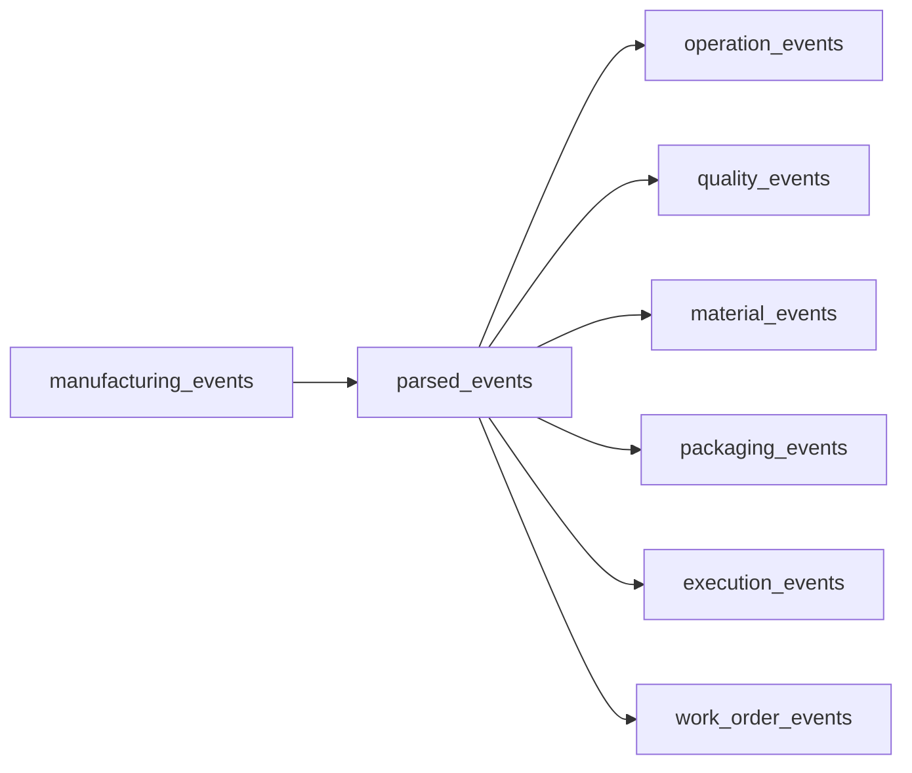

# 02 — Silver Layer

## Introduction

The Silver layer is responsible for transforming raw manufacturing events into validated, structured, and business-ready datasets.

Unlike the Bronze layer, which preserves events exactly as they are received, the Silver layer interprets the JSON payload, validates the event structure, enforces business rules, and separates manufacturing events into specialized datasets.

The Silver layer represents the core of the data engineering pipeline, where raw manufacturing data becomes structured information suitable for analytical modeling.

---

# Purpose

The objectives of the Silver layer are to:

- Parse raw JSON events
- Validate event schemas
- Apply data quality rules
- Standardize manufacturing data
- Separate events by business process
- Produce reusable datasets for Dimensions and Facts

This layer acts as the bridge between raw ingestion and analytical modeling.

---

# Silver Layer Architecture



---

# Silver Notebooks

The Silver layer consists of several notebooks, each with a dedicated responsibility.

| Notebook | Output |
|----------|--------|
| `01_parse_events.py` | `parsed_events` |
| `02_operation_events.py` | `operation_events` |
| `03_quality_events.py` | `quality_events` |
| `04_material_events.py` | `material_events` |
| `05_packaging_events.py` | `packaging_events` |
| `06_execution_events.py` | `execution_events` |
| `07_work_order_events.py` | `work_order_events` |

Each notebook focuses on a single manufacturing event type.

---

# Event Parsing

The first Silver notebook parses the JSON payload stored in the Bronze layer.

Input:

```
manufacturing_events
```

Output:

```
parsed_events
```

The notebook performs:

- JSON deserialization
- Schema enforcement
- Metadata extraction
- Payload extraction
- Timestamp generation

The parsed dataset becomes the foundation for all downstream transformations.

---

# Parsed Event Structure

Each parsed record contains:

```text
event_id

event_timestamp

event_type

event_version

plant_code

hall_id

line_id

machine_id

execution_id

work_order_id

serial_number

operator_id

product_code

payload

silver_processing_timestamp
```

The payload contains the business-specific attributes associated with the event type.

---

# Event Classification

After parsing, manufacturing events are separated according to their business purpose.

| Event Type | Silver Table |
|------------|--------------|
| OPERATION_COMPLETED | operation_events |
| QUALITY_COMPLETED | quality_events |
| MATERIAL_SCANNED | material_events |
| PACKAGING_COMPLETED | packaging_events |
| EXECUTION_STARTED | execution_events |
| WORK_ORDER_CREATED | work_order_events |

Each event type becomes an independent streaming table.

---

# Operation Events

Stores manufacturing operation data.

Typical information includes:

- Machine
- Operator
- Operation number
- Force measurements
- Cycle time
- Displacement
- Quality result

Output:

```
operation_events
```

---

# Quality Events

Stores inspection and testing information.

Typical attributes include:

- Test program
- Test name
- Target value
- Measured value
- Unit
- Result

Output:

```
quality_events
```

---

# Material Events

Stores material traceability information.

Typical attributes include:

- Material number
- Batch number
- Supplier
- Scan status

Output:

```
material_events
```

---

# Packaging Events

Stores packaging information for finished products.

Typical attributes include:

- Package ID
- Package type
- Weight
- Dimensions
- Packaging status

Output:

```
packaging_events
```

---

# Execution Events

Stores production execution information.

Typical attributes include:

- Execution ID
- Production quantity
- Production line
- Planned shift
- Routing version
- Production status

Output:

```
execution_events
```

---

# Work Order Events

Stores production planning information.

Typical attributes include:

- Work Order ID
- SAP Order Number
- Product
- Quantity
- Priority

Output:

```
work_order_events
```

---

# Data Quality

The Silver layer enforces data quality before analytical modeling.

Examples include:

- Valid JSON format
- Required event metadata
- Non-null timestamps
- Valid event types
- Business-specific field validation

Records that fail validation are excluded from downstream processing.

---

# Silver Layer Characteristics

| Characteristic | Description |
|----------------|-------------|
| Processing | Streaming |
| Input | Bronze Tables |
| Output | Structured Silver Tables |
| Storage | Delta Lake |
| Schema | Strongly Typed |
| Validation | Yes |
| Event Separation | Yes |

---

# Relationship with the Dimension Layer

The Silver layer provides curated datasets for analytical modeling.

```text
parsed_events

↓

operation_events
        ↓
machine_dimension
operator_dimension

↓

execution_events
        ↓
product_dimension

↓

material_events
        ↓
material_dimension
```

These Dimension tables enrich the analytical Fact tables built in the next stage.

---

# Engineering Decisions

Several architectural decisions influenced the Silver implementation.

## Centralized Parsing

All JSON parsing is performed once within `parsed_events`.

This prevents repeated parsing logic across downstream notebooks.

---

## Event-Based Separation

Each manufacturing event type is isolated into its own dataset.

This improves readability, maintainability, and scalability.

---

## Schema Enforcement

Strong schemas ensure consistent data types across the pipeline and simplify downstream joins.

---

## Validation Before Modeling

Business validation occurs before Dimension and Fact creation, preventing invalid data from entering the analytical model.

---

# Benefits

The Silver layer provides:

- Structured manufacturing data
- Standardized schemas
- Business validation
- Modular event datasets
- Improved data quality
- Reusable inputs for analytical modeling

---

# Summary

The Silver layer transforms raw manufacturing events into validated and structured datasets that accurately represent individual manufacturing processes.

By parsing JSON payloads, enforcing schemas, and separating events into dedicated tables, the Silver layer establishes a clean and reliable foundation for the Dimension and Fact layers that follow.

---

# Next Section

## 03 — Dimension Layer

The next document explains how validated Silver datasets are transformed into reusable Dimension tables representing machines, operators, products, and materials within the analytical model.