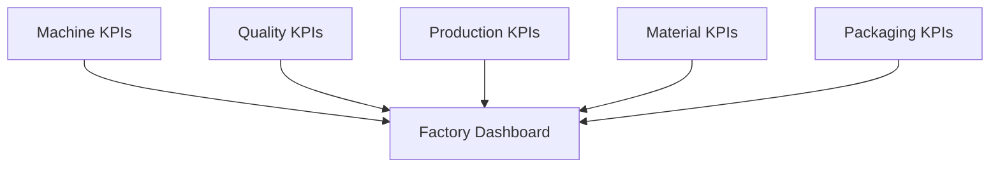

# 05 — Business Intelligence

## Overview

The Smart Manufacturing Intelligence Platform (SMIP) V2 transforms manufacturing data into actionable business intelligence through a collection of executive Key Performance Indicators (KPIs) and interactive Databricks SQL dashboards.

After raw manufacturing events have been ingested, validated, modeled, and aggregated through the Lakehouse architecture, the resulting Gold datasets provide a trusted foundation for operational reporting and decision support.

This chapter explains how analytical data is presented to business users, how manufacturing KPIs are calculated, and how Databricks SQL enables real-time visibility into factory operations.

Rather than querying engineering datasets directly, business users interact with curated KPI tables that provide a simplified view of manufacturing performance.

---

# Purpose

The objective of the Business Intelligence layer is to transform analytical datasets into meaningful information that supports operational monitoring and strategic decision-making.

This chapter describes:

- Manufacturing Key Performance Indicators (KPIs)
- Databricks SQL dashboards
- Dashboard architecture
- Executive reporting
- Business metrics
- Analytical insights

Together, these components provide a complete business intelligence solution for manufacturing operations.

---

# Business Intelligence Architecture


The Business Intelligence layer consumes Gold KPI tables to deliver interactive dashboards and executive reports.

---

# Business Intelligence Workflow

Manufacturing information progresses through several analytical stages before reaching end users.

```text
Manufacturing Events

↓

Fact Tables

↓

Gold KPI Tables

↓

Databricks SQL Warehouse

↓

Executive Dashboard

↓

Business Decision Making
```

Each stage reduces technical complexity while increasing business value.

---

# Manufacturing KPIs

The Gold layer produces dedicated KPI datasets for each major manufacturing process.

| KPI Dataset | Primary Business Focus |
|-------------|------------------------|
| Machine KPIs | Equipment performance |
| Quality KPIs | Product quality |
| Production KPIs | Manufacturing output |
| Material KPIs | Material traceability |
| Packaging KPIs | Shipment readiness |
| Factory Dashboard | Overall factory performance |

These KPI tables provide the analytical foundation for all business reporting.

---

# Dashboard Architecture

The Databricks SQL Dashboard combines multiple KPI datasets into a unified operational view.



This modular design enables each KPI to evolve independently while contributing to a consolidated executive dashboard.

---

# Business Intelligence Components

The Business Intelligence layer consists of four primary components.

| Component | Description |
|------------|-------------|
| Manufacturing KPIs | Operational performance metrics |
| Databricks SQL Dashboard | Interactive visualization layer |
| Dashboard Walkthrough | Explanation of dashboard content and navigation |
| Executive Metrics | Business interpretation of KPIs |

Together, these components transform analytical data into actionable manufacturing insights.

---

# Business Users

The platform supports multiple stakeholder groups.

| Stakeholder | Typical Use Cases |
|--------------|------------------|
| Plant Managers | Monitor factory performance |
| Production Engineers | Track manufacturing efficiency |
| Quality Engineers | Review inspection results |
| Manufacturing Engineers | Analyze machine performance |
| Operations Managers | Monitor production output |
| Executives | Review strategic manufacturing KPIs |

Each user group interacts with the same trusted analytical datasets while focusing on metrics relevant to their responsibilities.

---

# Business Intelligence Principles

The Business Intelligence layer follows several guiding principles.

## Business-Oriented

Metrics are expressed using business terminology rather than technical implementation details.

---

## Trusted Data

All dashboards consume validated Gold KPI tables, ensuring consistent and reliable reporting.

---

## Performance

KPIs are precomputed within the Gold layer, minimizing dashboard query execution time.

---

## Simplicity

Business users interact with curated metrics rather than complex analytical models.

---

## Scalability

New KPIs and dashboards can be introduced without affecting existing reports.

---

# Benefits

The Business Intelligence layer provides:

- Executive manufacturing reporting
- Operational visibility
- Interactive KPI monitoring
- Consistent business metrics
- High-performance dashboards
- Trusted decision support
- Reusable analytical datasets

---

# Chapter Organization

This chapter is organized into the following documents.

| Document | Description |
|----------|-------------|
| **01_manufacturing_kpis.md** | Manufacturing KPI definitions and calculations |
| **02_sql_dashboard.md** | Databricks SQL dashboard architecture and implementation |
| **03_dashboard_walkthrough.md** | Guided tour of the executive dashboard |
| **04_executive_metrics.md** | Business interpretation of manufacturing KPIs |

Together, these documents describe how analytical datasets are transformed into business intelligence for manufacturing operations.

---

# Expected Outcomes

After completing this chapter, readers will understand:

- The purpose of each manufacturing KPI.
- How Gold datasets support business reporting.
- How Databricks SQL dashboards are organized.
- How operational data is presented to business users.
- How executive metrics support manufacturing decision-making.

---

# Summary

The Business Intelligence layer represents the final stage of the Smart Manufacturing Intelligence Platform.

By combining curated Gold KPI tables with Databricks SQL dashboards, SMIP V2 delivers trusted, interactive, and business-oriented analytics that enable manufacturing organizations to monitor operations, evaluate performance, and make informed decisions based on reliable data.

This chapter demonstrates how the engineering and analytical components of the platform are ultimately transformed into meaningful business insights.

---

# Next Section

## 01 — Manufacturing KPIs

The next document introduces the key performance indicators implemented in SMIP V2, explaining their business purpose, calculation methodology, data sources, and role in monitoring manufacturing performance.