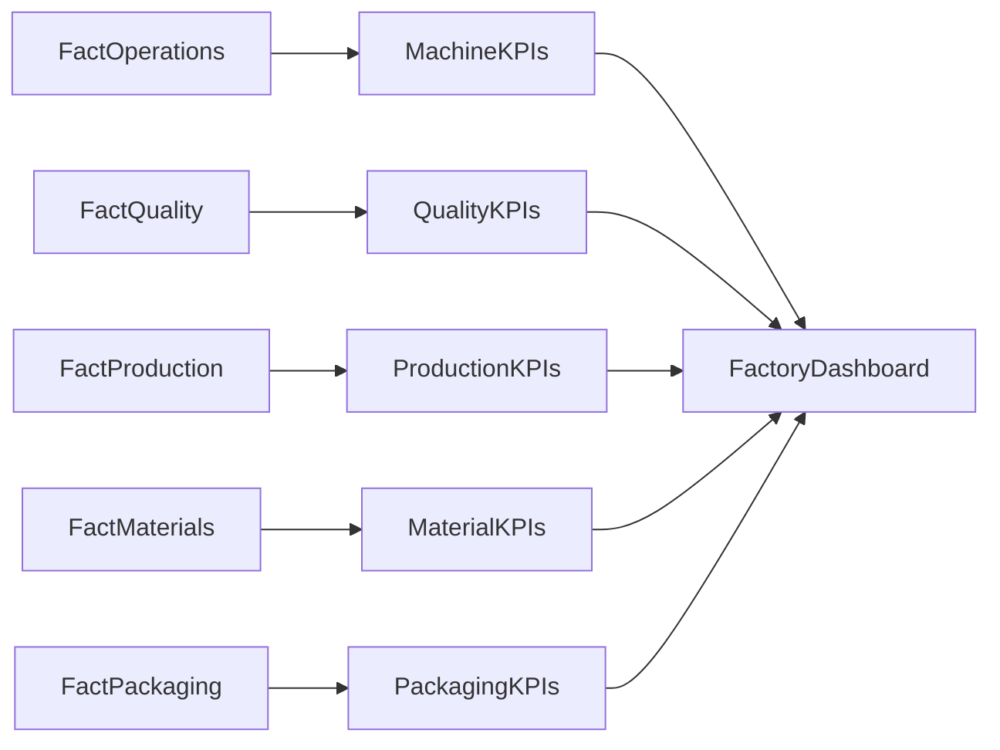

# 01 — Manufacturing KPIs

## Introduction

Key Performance Indicators (KPIs) transform manufacturing data into measurable business outcomes.

Within the Smart Manufacturing Intelligence Platform (SMIP) V2, KPIs provide a standardized view of factory performance by aggregating operational data into meaningful business metrics.

Rather than requiring business users to analyze individual manufacturing events, the platform calculates and presents curated KPIs that support production monitoring, quality assurance, material traceability, packaging operations, and overall factory performance.

These KPIs form the foundation of the Databricks SQL Dashboard.

---

# Purpose

The objectives of the Manufacturing KPI layer are to:

- Measure manufacturing performance
- Monitor operational efficiency
- Track production output
- Evaluate product quality
- Monitor material traceability
- Support executive decision-making

Each KPI is calculated from trusted Gold datasets produced by the Lakehouse pipeline.

---

# KPI Architecture



---

# KPI Categories

The platform groups KPIs according to major manufacturing processes.

| KPI Category | Source Dataset | Business Focus |
|--------------|----------------|----------------|
| Machine KPIs | fact_operations | Equipment performance |
| Quality KPIs | fact_quality | Product quality |
| Production KPIs | fact_production | Manufacturing output |
| Material KPIs | fact_materials | Material traceability |
| Packaging KPIs | fact_packaging | Shipment readiness |

---

# Machine KPIs

Machine KPIs evaluate the operational performance of manufacturing equipment.

### Source

```
fact_operations
```

---

## Operations Completed

### Business Purpose

Measures the number of completed manufacturing operations.

### Business Value

Indicates machine workload and production activity.

---

## Average Cycle Time

### Business Purpose

Measures the average duration required to complete an operation.

### Business Value

Supports process optimization and production efficiency.

---

## Average Target Force

### Business Purpose

Represents the expected press force configured for manufacturing operations.

### Business Value

Provides a reference for comparing actual machine performance.

---

## Average Actual Force

### Business Purpose

Measures the average force applied during production.

### Business Value

Supports machine calibration and process monitoring.

---

## Average Force Deviation

### Business Purpose

Measures the difference between target and actual force.

### Business Value

Helps identify equipment drift and process variation.

---

# Quality KPIs

Quality KPIs monitor manufacturing inspection performance.

### Source

```
fact_quality
```

---

## Total Quality Inspections

### Business Purpose

Counts completed quality inspections.

### Business Value

Measures inspection workload.

---

## Quality Pass Rate

### Business Purpose

Calculates the percentage of successful inspections.

### Current Simulation

The current manufacturing simulator generates only successful inspections.

Current value:

```
100%
```

### Future Scope

The KPI is designed to support failed inspections, rework, and rejected products.

---

## Average Measured Value

### Business Purpose

Calculates the average measured inspection value.

### Business Value

Supports product compliance monitoring.

---

## Average Measurement Deviation

### Business Purpose

Measures the difference between target and measured values.

### Business Value

Identifies potential quality variations.

---

# Production KPIs

Production KPIs monitor manufacturing output.

### Source

```
fact_production
```

---

## Production Quantity

### Business Purpose

Measures manufactured production volume.

### Business Value

Supports production planning and throughput analysis.

---

## Production Executions

### Business Purpose

Counts completed production executions.

### Business Value

Measures factory activity.

---

## Work Orders Processed

### Business Purpose

Measures completed production work orders.

### Business Value

Tracks manufacturing demand fulfillment.

---

## Production by Product

### Business Purpose

Aggregates production by manufactured product.

### Business Value

Supports production mix analysis.

---

# Material KPIs

Material KPIs monitor manufacturing traceability.

### Source

```
fact_materials
```

---

## Material Scans

### Business Purpose

Counts scanned production materials.

### Business Value

Measures material traceability coverage.

---

## Suppliers Utilized

### Business Purpose

Measures supplier participation in manufacturing.

### Business Value

Supports supplier performance analysis.

---

## Material Batches Consumed

### Business Purpose

Tracks production batches used during manufacturing.

### Business Value

Supports manufacturing genealogy.

---

# Packaging KPIs

Packaging KPIs monitor shipment preparation.

### Source

```
fact_packaging
```

---

## Products Packaged

### Business Purpose

Counts completed packaging operations.

### Business Value

Measures finished goods ready for shipment.

---

## Average Package Weight

### Business Purpose

Calculates the average package weight.

### Business Value

Supports logistics planning.

---

## Shipment Readiness

### Business Purpose

Measures products ready for shipment.

### Current Simulation

The current manufacturing simulator generates only:

```
READY_FOR_SHIPMENT
```

Current value:

```
100%
```

### Future Scope

Future versions will include:

- Delayed packaging
- Packaging failures
- Shipment holds
- Rework packaging

---

# Factory Dashboard KPIs

The Factory Dashboard combines all KPI categories into a unified executive view.

Typical metrics include:

- Total Operations
- Total Production
- Total Quality Inspections
- Total Material Scans
- Total Packaged Products
- Average Cycle Time
- Average Force
- Quality Pass Rate
- Shipment Readiness

These KPIs provide a comprehensive overview of factory performance.

---

# KPI Summary

| KPI Category | Primary Metrics |
|---------------|----------------|
| Machine | Operations, Cycle Time, Force, Force Deviation |
| Quality | Inspections, Pass Rate, Measurement Accuracy |
| Production | Quantity, Executions, Work Orders |
| Materials | Scans, Suppliers, Batches |
| Packaging | Products Packaged, Package Weight, Shipment Readiness |

---

# KPI Design Principles

The KPI model follows several principles.

## Business-Oriented

KPIs are expressed using manufacturing terminology familiar to business users.

---

## Reliable

All metrics are derived from validated Gold datasets.

---

## Reusable

Each KPI can be consumed by multiple dashboards and analytical applications.

---

## Extensible

Additional KPIs can be introduced without modifying existing calculations.

---

## Performance Optimized

KPIs are precomputed to reduce dashboard execution time.

---

# Current Implementation Scope

The current SMIP V2 simulation focuses on successful manufacturing scenarios.

As a result:

| Area | Current State |
|------|---------------|
| Quality | PASS only |
| Packaging | READY_FOR_SHIPMENT only |
| Material Scan | Successful |
| Operations | Completed |

Future versions of the simulator will extend KPI coverage by introducing additional manufacturing scenarios, including quality failures, machine downtime, material shortages, packaging exceptions, and production rework.

---

# Summary

The Manufacturing KPI layer converts detailed manufacturing activities into concise business metrics that enable operational monitoring and executive reporting.

By organizing KPIs into machine, quality, production, material, and packaging categories, SMIP V2 delivers a comprehensive view of factory performance while maintaining a clear separation between analytical processing and business consumption.

These KPIs form the analytical foundation of the Databricks SQL Dashboard.

---

# Next Section

## 02 — SQL Dashboard

The next document explains how the Gold KPI tables are visualized using Databricks SQL, including dashboard architecture, query organization, visualization design, and interactive business reporting.