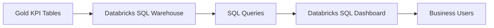

# 02 — SQL Dashboard

## Introduction

The Smart Manufacturing Intelligence Platform (SMIP) V2 delivers manufacturing insights through an interactive **Databricks SQL Dashboard**.

Rather than querying operational tables directly, business users access precomputed Key Performance Indicators (KPIs) stored in the Gold layer. The dashboard presents these metrics using interactive visualizations that support operational monitoring, performance analysis, and executive decision-making.

The dashboard is designed to provide a single, trusted view of factory performance while minimizing query complexity and maximizing analytical performance.

---

# Purpose

The objectives of the SQL Dashboard are to:

- Visualize manufacturing KPIs
- Monitor factory performance
- Support operational decision-making
- Provide executive reporting
- Deliver interactive business intelligence
- Simplify analytical exploration

The dashboard acts as the primary interface between the Lakehouse and business users.

---

# Dashboard Architecture



The dashboard consumes only trusted Gold datasets, ensuring that all reported metrics are governed and consistent.

---

# Dashboard Data Flow

Manufacturing data flows through several analytical stages before reaching the dashboard.

```text
Manufacturing Events

↓

Bronze Layer

↓

Silver Layer

↓

Dimension Tables

↓

Fact Tables

↓

Gold KPI Tables

↓

Databricks SQL Warehouse

↓

SQL Dashboard
```

Business users interact only with the final dashboard, abstracting the complexity of the underlying engineering pipeline.

---

# Dashboard Components

The dashboard consolidates information from five KPI datasets.

| Dashboard Section | Source Dataset |
|-------------------|----------------|
| Machine Performance | machine_kpis |
| Quality Monitoring | quality_kpis |
| Production Performance | production_kpis |
| Material Traceability | material_kpis |
| Packaging Performance | packaging_kpis |

These datasets are unified within the Factory Dashboard.

---

# Dashboard Layout

The dashboard is organized into logical business sections.

```text
Factory Summary

↓

Machine Performance

↓

Quality Performance

↓

Production Performance

↓

Material Traceability

↓

Packaging Performance
```

Each section focuses on a specific manufacturing domain while contributing to an overall view of factory performance.

---

# Dashboard Visualizations

The Databricks SQL Dashboard combines multiple visualization types to present manufacturing KPIs.

Typical visualizations include:

| Visualization | Business Purpose |
|---------------|------------------|
| KPI Cards | Display headline metrics |
| Tables | Detailed operational data |
| Bar Charts | Compare machines, products, or suppliers |
| Line Charts | Monitor trends over time |
| Pie Charts | Distribution by category |

The visualization strategy emphasizes clarity, consistency, and rapid interpretation.

---

# KPI Cards

The dashboard presents key operational metrics using KPI cards.

Typical indicators include:

- Total Operations
- Total Production
- Quality Inspections
- Material Scans
- Products Packaged
- Average Cycle Time
- Average Force
- Quality Pass Rate
- Shipment Readiness

These metrics provide an immediate overview of manufacturing performance.

---

# SQL Warehouse

The dashboard executes analytical queries through a Databricks SQL Warehouse.

The SQL Warehouse provides:

- High-performance query execution
- Elastic compute resources
- Interactive analytics
- Dashboard refresh support
- Secure access to Unity Catalog tables

Separating compute resources from data storage improves scalability and user experience.

---

# Query Strategy

Dashboard queries are intentionally simplified by consuming precomputed Gold KPI tables.

Instead of aggregating millions of manufacturing events during dashboard execution, the SQL layer queries summarized datasets.

```text
Fact Tables

↓

Gold KPIs

↓

Dashboard Query

↓

Visualization
```

This approach reduces execution time and improves dashboard responsiveness.

---

# Performance Optimization

Several design decisions improve dashboard performance.

## Precomputed KPIs

Business metrics are calculated in the Gold layer before dashboard execution.

---

## Delta Lake

Gold tables are stored as Delta tables to support efficient query execution.

---

## Simplified SQL

Dashboard queries operate on aggregated datasets rather than raw manufacturing events.

---

## Layered Architecture

The dashboard accesses only Gold tables, avoiding unnecessary joins with operational datasets.

---

# Security and Governance

The SQL Dashboard benefits from the governance capabilities of the Databricks Data Intelligence Platform.

Key features include:

- Unity Catalog access control
- Governed Delta tables
- Consistent business definitions
- Centralized metadata management

This ensures that all users access trusted and authorized manufacturing information.

---

# Current Dashboard Scope

The current implementation presents manufacturing KPIs generated from the simulated production environment.

Current dashboard capabilities include:

- Machine performance
- Production monitoring
- Quality metrics
- Material traceability
- Packaging performance
- Factory summary

The dashboard demonstrates the complete analytical workflow from manufacturing events to executive reporting.

---

# Future Enhancements

The dashboard architecture supports future extensions, including:

- Real-time streaming visualizations
- Historical trend analysis
- Shift-based reporting
- Machine utilization dashboards
- Predictive maintenance indicators
- OEE (Overall Equipment Effectiveness)
- Quality failure analysis
- Downtime monitoring
- Interactive drill-through reports

These enhancements can be introduced without modifying the underlying Lakehouse architecture.

---

# Dashboard Design Principles

The SQL Dashboard follows several design principles.

## Business-Oriented

Visualizations focus on business outcomes rather than technical implementation.

---

## Interactive

Users can explore manufacturing performance through filters and dashboard controls.

---

## High Performance

Precomputed KPIs minimize query execution time.

---

## Consistent

All metrics are derived from trusted Gold datasets.

---

## Scalable

Additional visualizations and KPI datasets can be incorporated as the platform evolves.

---

# Benefits

The SQL Dashboard provides:

- Real-time operational visibility
- Executive manufacturing reporting
- High-performance analytics
- Trusted business metrics
- Interactive data exploration
- Centralized manufacturing insights

---

# Summary

The Databricks SQL Dashboard represents the final presentation layer of the Smart Manufacturing Intelligence Platform.

By combining curated Gold KPI tables with interactive visualizations and the Databricks SQL Warehouse, the platform delivers a scalable and governed business intelligence solution that enables stakeholders to monitor factory operations, evaluate manufacturing performance, and make informed decisions based on trusted analytical data.

---

# Next Section

## 03 — Dashboard Walkthrough

The next document provides a guided walkthrough of the Factory Dashboard, explaining each visualization, KPI section, and how business users interpret the information presented within the dashboard.