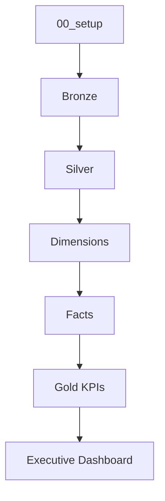

# 03 — Running the Pipeline

## Introduction

Once the Smart Manufacturing Intelligence Platform (SMIP) V2 has been deployed, the next step is to execute the Lakeflow Declarative Pipeline that processes manufacturing events from raw JSON files into business-ready analytical datasets.

The pipeline automatically executes each processing layer based on dataset dependencies, transforming raw manufacturing events into validated Bronze, Silver, Dimension, Fact, and Gold tables.

This document explains how to start the pipeline, monitor its execution, validate the generated datasets, and confirm that the Executive Dashboard is ready for use.

---

# Pipeline Overview

The SMIP V2 pipeline follows the Medallion Architecture with additional analytical modeling layers.

```text
Manufacturing JSON Events

↓

Bronze Layer

↓

Silver Layer

↓

Dimension Layer

↓

Fact Layer

↓

Gold Layer

↓

Executive Dashboard
```

Each stage depends on the successful completion of the previous stage.

---

# Pipeline Execution Flow

The complete execution order is shown below.



Lakeflow automatically determines notebook execution based on dataset dependencies.

---

# Step 1 — Verify Raw Manufacturing Events

Before running the pipeline, verify that manufacturing event files are available in the Unity Catalog Volume.

Expected location:

```text
/Volumes/smip_v2/manufacturing/raw_data/
```

The Bronze layer will automatically detect and process newly available JSON files.

---

# Step 2 — Start the Lakeflow Pipeline

Navigate to:

```text
Workflows

↓

Lakeflow Declarative Pipelines
```

Select the SMIP Manufacturing Pipeline and start execution.

Depending on the configuration, the pipeline may operate in one of two modes:

| Mode | Description |
|------|-------------|
| Triggered | Executes once and stops |
| Continuous | Continuously monitors for new manufacturing events |

The current SMIP V2 implementation is designed to support both execution modes.

---

# Step 3 — Monitor Pipeline Progress

The Lakeflow interface displays the execution status of each processing stage.

Typical execution sequence:

```text
Bronze

↓

Silver

↓

Dimensions

↓

Facts

↓

Gold
```

Each stage should complete successfully before downstream tables are created.

---

# Step 4 — Verify Bronze Tables

Confirm that the Bronze layer contains manufacturing events.

Example SQL:

```sql
SELECT COUNT(*)
FROM smip_v2.manufacturing.bronze_raw_events;
```

```sql
SELECT COUNT(*)
FROM smip_v2.manufacturing.manufacturing_events;
```

Expected result (sample dataset):

```
455,404 rows
```

---

# Step 5 — Verify Silver Tables

Confirm that the parsed manufacturing events have been generated.

```sql
SELECT COUNT(*)
FROM smip_v2.manufacturing.parsed_events;
```

Expected result:

```
455,404 rows
```

Verify event-specific tables.

```sql
SELECT COUNT(*)
FROM smip_v2.manufacturing.operation_events;
```

Expected:

```
170,067
```

```sql
SELECT COUNT(*)
FROM smip_v2.manufacturing.quality_events;
```

Expected:

```
127,526
```

```sql
SELECT COUNT(*)
FROM smip_v2.manufacturing.material_events;
```

Expected:

```
42,562
```

```sql
SELECT COUNT(*)
FROM smip_v2.manufacturing.packaging_events;
```

Expected:

```
42,497
```

```sql
SELECT COUNT(*)
FROM smip_v2.manufacturing.execution_events;
```

Expected:

```
640
```

---

# Step 6 — Verify Dimension Tables

Run the following queries.

```sql
SELECT COUNT(*)
FROM smip_v2.manufacturing.machine_dimension;
```

Expected:

```
7
```

---

```sql
SELECT COUNT(*)
FROM smip_v2.manufacturing.operator_dimension;
```

Expected:

```
73
```

---

```sql
SELECT COUNT(*)
FROM smip_v2.manufacturing.product_dimension;
```

Expected:

```
12
```

---

```sql
SELECT COUNT(*)
FROM smip_v2.manufacturing.material_dimension;
```

Expected:

The value depends on the generated manufacturing dataset.

---

# Step 7 — Verify Fact Tables

Run the following validation queries.

```sql
SELECT COUNT(*)
FROM smip_v2.manufacturing.fact_operations;
```

Expected:

```
170,067
```

---

```sql
SELECT COUNT(*)
FROM smip_v2.manufacturing.fact_quality;
```

Expected:

```
127,526
```

---

```sql
SELECT COUNT(*)
FROM smip_v2.manufacturing.fact_materials;
```

Expected:

```
42,562
```

---

```sql
SELECT COUNT(*)
FROM smip_v2.manufacturing.fact_packaging;
```

Expected:

```
42,497
```

---

```sql
SELECT COUNT(*)
FROM smip_v2.manufacturing.fact_production;
```

Expected:

```
640
```

---

# Step 8 — Verify Gold Tables

Confirm that the KPI tables have been generated.

```text
machine_kpis

quality_kpis

production_kpis

material_kpis

packaging_kpis

factory_dashboard
```

Each table should contain aggregated manufacturing metrics derived from the Fact layer.

---

# Step 9 — Validate the Executive Dashboard

Navigate to:

```text
Databricks SQL

↓

Executive Dashboard
```

Verify that the dashboard displays:

- Factory Summary
- Machine Performance
- Production Analysis
- Quality Monitoring
- Material Traceability
- Packaging Performance

Successful rendering confirms that the pipeline completed correctly.

---

# Monitoring Pipeline Health

During execution, monitor the following indicators.

| Indicator | Expected Status |
|------------|----------------|
| Pipeline State | Running / Completed |
| Bronze Tables | Populated |
| Silver Tables | Populated |
| Dimension Tables | Populated |
| Fact Tables | Populated |
| Gold Tables | Populated |
| Dashboard | Available |

Any failure in an upstream stage will prevent downstream datasets from being generated.

---

# Data Refresh

When new manufacturing events are added to the Unity Catalog Volume, the pipeline processes only the newly available data.

```text
New JSON Files

↓

Bronze

↓

Silver

↓

Dimensions

↓

Facts

↓

Gold

↓

Dashboard Refresh
```

This incremental approach minimizes processing time while ensuring that analytical datasets remain current.

---

# Successful Pipeline Execution

A successful execution produces:

- Raw manufacturing events stored in Delta Lake
- Structured Silver event tables
- Dimension tables
- Fact tables
- Gold KPI datasets
- Updated Executive Dashboard

At this point, the Smart Manufacturing Intelligence Platform is fully operational.

---

# Summary

The Lakeflow Declarative Pipeline automates the complete manufacturing analytics workflow, from ingesting raw JSON events through generating executive-level KPIs.

By validating each processing layer and confirming the successful creation of analytical datasets, users can ensure that SMIP V2 is operating correctly and that the Executive Dashboard reflects the latest manufacturing activity.

---

# Next Section

## 04 — Dashboard Usage

The next document explains how business users interact with the Executive Dashboard, interpret manufacturing KPIs, apply dashboard filters, and use the available visualizations to support operational decision-making.