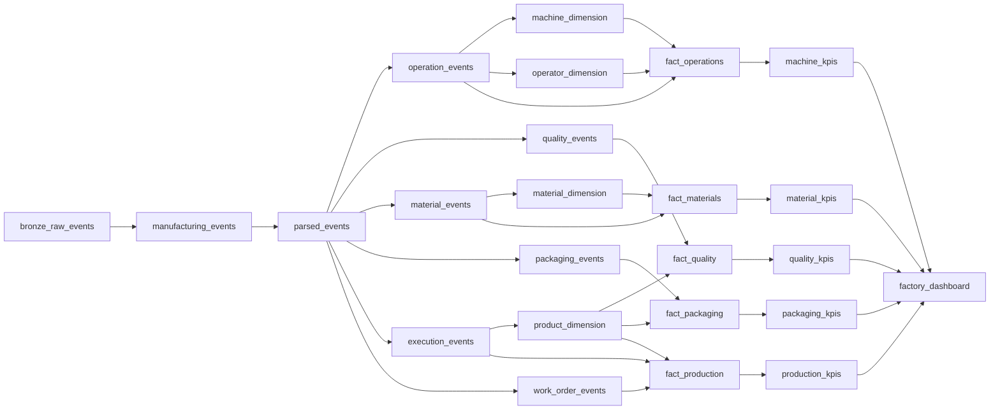

# Manufacturing Data Lineage

```mermaid
flowchart LR

BR1["bronze_raw_events"]

BR2["manufacturing_events"]

PARSED["parsed_events"]

OP["operation_events"]

QU["quality_events"]

MAT["material_events"]

PACK["packaging_events"]

EX["execution_events"]

WO["work_order_events"]

MD["machine_dimension"]

OD["operator_dimension"]

PD["product_dimension"]

MAD["material_dimension"]

FO["fact_operations"]

FQ["fact_quality"]

FM["fact_materials"]

FP["fact_packaging"]

FPR["fact_production"]

MKPI["machine_kpis"]

QKPI["quality_kpis"]

PKPI["production_kpis"]

MATKPI["material_kpis"]

PACKKPI["packaging_kpis"]

DASH["factory_dashboard"]

BR1 --> BR2

BR2 --> PARSED

PARSED --> OP

PARSED --> QU

PARSED --> MAT

PARSED --> PACK

PARSED --> EX

PARSED --> WO

OP --> MD

OP --> OD

EX --> PD

MAT --> MAD

OP --> FO

MD --> FO

OD --> FO

QU --> FQ

PD --> FQ

MAT --> FM

MAD --> FM

PACK --> FP

PD --> FP

EX --> FPR

WO --> FPR

PD --> FPR

FO --> MKPI

FQ --> QKPI

FPR --> PKPI

FM --> MATKPI

FP --> PACKKPI

MKPI --> DASH

QKPI --> DASH

PKPI --> DASH

MATKPI --> DASH

PACKKPI --> DASH
```